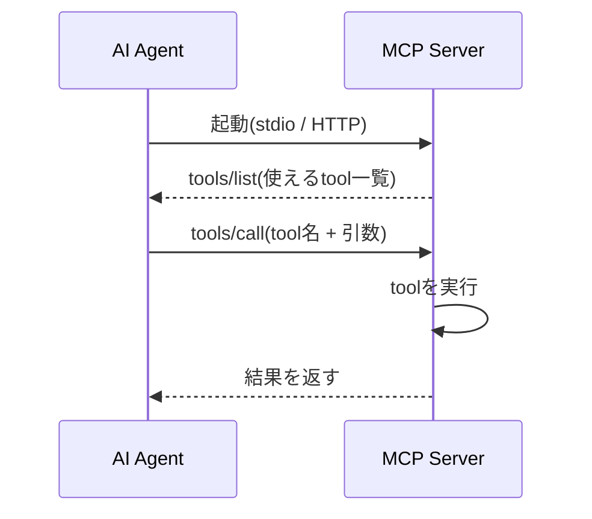
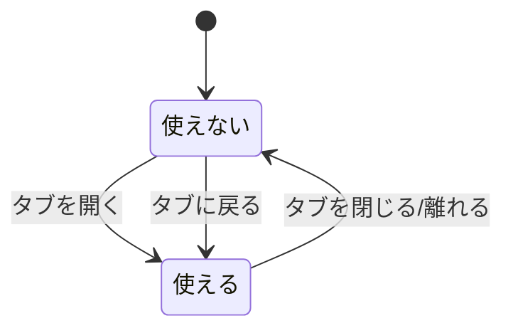
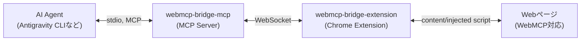
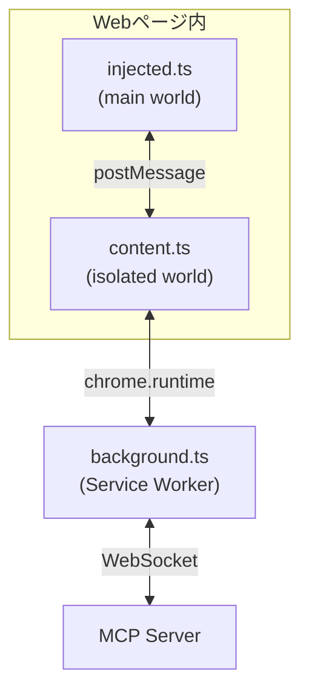

# Googleが発表した新Web標準ドラフト――WebMCP。実際どうなの？ IO Extendedで実装・登壇して分かったこと

こんにちは。

普段は `tanahiro2010` という名前で活動しています。GDG Greater Kwansaiに所属しています。

Google I/O Extended Osaka 2026のハンズオン「WebMCP を作って AI エージェントから呼び出してみよう！」で、前半登壇を担当しました。
これは、ハンズオンの内容をQiita向けにまとめたものです。

使ったコードラボはこちらです。

https://learn.gdgs.jp/webmcp-agent/

対象は、MCPは知っているけどWebMCPは聞いたことがないという人。

そして、「Googleが出してきた新しい仕様、実際どうなの？」を知りたい人です。

## WebMCPって、知ってますか？

いきなり聞きますが、WebMCPって知ってますか？

僕はハンズオンの資料を作るまで、存在すら知りませんでした。

名前を見ると、MCPのWeb版だろうと勝手に思っていました。

実際に仕様を読んで実装してみると、思っていたよりずっと癖の強い仕様でした。

この記事では、その中身と、実際に手を動かして分かったことを書いていきます。

## そもそもMCPって何?

WebMCPの話をする前に、MCP(Model Context Protocol)のおさらいをしておきます。

MCPは、AI Agentに外部ツールをつなぐための共通インターフェースです。

流れはこうです。



ポイントは、**Agentが起動している間ずっとtoolが登録されたまま**ということです。

ローカルのファイル操作でも、社内APIを叩くツールでも、Agentを落とさない限りずっと呼べます。

今回作った`webmcp-bridge-mcp`も、stdioで待ち受ける普通のMCP Serverです。

Antigravity CLIのようなクライアントから見れば、「よくあるMCP Serverの一つ」でしかありません。

特殊なのは、この後に出てくるWebMCP側です。

## WebMCPとは何か

WebMCPは、W3C Web Machine Learning Community Groupが公開しているドラフト仕様です。

https://webmachinelearning.github.io/webmcp/

2026年2月ドラフトの、まだ提案段階の仕様です。

ひとことで言うと、こうです。

> **Webページの機能を、Agent向けのtoolとしてページ自身が宣言する仕組み**

登録方法は2種類あります。

### 命令型

JavaScriptから直接toolを登録するやり方です。

```js
await document.modelContext.registerTool({
  name: "reserve_hotel",
  description: "Reserve a hotel",
  inputSchema: {
    type: "object",
    properties: { city: { type: "string" } },
    required: ["city"],
  },
  execute: async ({ city }) => ({ ok: true, city }),
});
```

`name` / `description` / `inputSchema` / `execute`という形は、MCPのtool定義とほぼ同じです。

MCPを触ったことがある人なら、見た瞬間に「あ、あれと同じ形だ」となるはずです。

### 宣言型

既存の`<form>`に属性を足すだけでtool化するやり方です。

```html
<form toolname="search_hotels" tooldescription="Search hotels">
  <input name="city" toolparamdescription="City to search hotels in" required />
  <button type="submit">Search</button>
</form>
```

`toolname` / `tooldescription`を持つフォームが見つかると、`<input>`の`name`や`required`、`toolparamdescription`(無ければ関連する`<label>`のテキスト)からJSON Schemaが自動で組み立てられます。

面白いのはここからで、宣言型は内部的には命令型と同じ`registerTool()`に正規化されます。

APIを2つ別々に持つのではなく、宣言型は命令型のシンタックスシュガーとして実装されている、という作りです。

個人的にはこの設計、素直に好きです。

送信結果は仕様通り`SubmitEvent#respondWith()`で受け取ります。

```js
form.addEventListener("submit", (event) => {
  event.preventDefault();
  if (event.agentInvoked) {
    event.respondWith(Promise.resolve({ ok: true /* ... */ }));
  }
});
```

`event.agentInvoked`で「人間がクリックしたのかAgentが送信したのか」を判定できます。

地味ですが、ここが後々効いてきます。

## MCPとWebMCP、名前は似てるけど

名前もAPIの形も似ているので、最初は「MCPのWeb版でしょ」くらいの認識でした。

でも実際に読み込んでいくと、3つの軸でハッキリ性質が違いました。

|項目|MCP|WebMCP|
|---|---|---|
|対象|AI Agent全般|仕様上はブラウザ内蔵Agent中心|
|登録タイミング|Agent起動時に一度だけ|ページを開くたびに|
|セッション期間|Agentを終了するまで|ページを開いている間だけ|
|実行場所|ローカル or サービスサーバー|そのブラウザのそのページ内|

体感で一番効いてくるのは、セッション期間の違いです。



MCPのtoolはAgentが立ち上がっていればずっと呼べます。

でもWebMCPのtoolは、「そのページが今開かれているか」に完全に紐づきます。

タブを切り替えた瞬間にそのtoolは見えなくなり、戻ればまた見えるようになります。

「タブの生存期間 = toolの生存期間」という発想は、MCPしか知らない状態で読むとかなり新鮮でした。

## 2026年8月時点でどこまで動くのか

執筆時点(2026年8月)では、WebMCPはまだ提案段階のドラフトです。

Chrome Docsでも「今後の機能」として紹介されている状態でした。

https://developer.chrome.com/docs/ai/webmcp?hl=ja

- Origin Trialは Chrome 149から参加可能
- ローカルで試すだけなら `chrome://flags/#enable-webmcp-testing`
- APIは今後変更される可能性がある、と明記されている

つまり、「ハンズオン会場の全員のブラウザでネイティブ実装が有効」という前提には立てません。

ここで、今回作ったものの出番になります。

## 作ったもの――WebMCP Bridge

ハンズオンの要件と、WebMCPの仕様には素直にやるとギャップがありました。

- 仕様の想定: WebMCPはブラウザ内蔵Agent向け
- ハンズオンの現実: 参加者はAntigravity CLIのような、既存のMCP対応Agentから呼び出したい

じゃあ、橋渡しするものを作ろう。

そう思って、Chrome ExtensionとMCP Serverをセットで自作しました。

- MCP Server: https://github.com/tanahiro2010/webmcp-bridge-mcp
- Chrome Extension: https://github.com/tanahiro2010/webmcp-bridge-extension

ここで一つ、こだわったことがあります。

**WebMCP仕様が定義するAPI(`document.modelContext` / annotated `<form>`)は、そのまま検出・実行するだけにする。**

独自プロトコルで仕様を上書きするようなことはしません。

理由は単純で、ハンズオンで学ぶ仕様と、実際に動くものの仕様がズレていたら、そもそもハンズオンをやる意味がないと思ったからです。

## Bridgeの全体像

構成はこうなっています。



MCP Server(`webmcp-bridge-mcp`)は、自分ではDOMに一切触れません。

あくまでExtensionとの間のBridge / Registry / Routerに徹していて、DOM操作は全部Extension側に投げます。

地味な役割分担ですが、責務がハッキリしていて実装していて迷いが少なかったです。

WebSocketは`ws://127.0.0.1:58787`にbindしています。

8787ではなく58787にしたのは、`wrangler dev`(Cloudflare Workers)のデフォルトポートと衝突していたからです。

Workers開発を並行して動かしていると、Extensionがこちらではなくwrangler側に接続しに行ってしまい、延々と繋がらないという地味な不具合を先に踏みました。

Extension側はMV3で、2層構造になっています。



main worldの`injected.ts`が必要な理由は、ページの`document.modelContext`にアクセスするにはmain worldで実行する必要があるからです。

isolated world(普通のcontent script)からは直接触れません。

`document.modelContext`がまだブラウザにネイティブ実装されていない場合は、`injected.ts`が`registerTool` / `getTools` / `executeTool` / `toolchange`イベントの最小限のpolyfillを提供します。

ネイティブ実装がある場合は、何もしません。

「ネイティブ実装があるなら黙って譲る」という設計にしておくと、ネイティブ実装がロールアウトされてもコードを大きく変えずに済むはずです。

## Agentから見えるtool

Agentから見えるtoolは、次の6つです。

|tool|説明|
|---|---|
|`webmcp_get_status`|Extensionの接続状態、既知タブ数、アクティブタブIDを返す|
|`webmcp_list_tabs`|ExtensionがつかんでいるWebMCP対応タブ一覧を返す|
|`webmcp_discover_tools`|指定タブのWebMCP toolを検出する|
|`webmcp_call_tool`|指定タブのtoolを実行する|
|`webmcp_submit_tool`|人間の送信待ちを、Agent側から確定させる|
|`webmcp_ping`|Extensionとの疎通確認|

入出力はこんな感じです。

```jsonc
// webmcp_discover_tools の input
{ "tabId": 123, "forceRefresh": true }
// output
{ "tabId": 123, "tools": [ { "id": "reserve_hotel", "name": "reserve_hotel", "source": "imperative" } ] }
```

```jsonc
// webmcp_call_tool の input
{ "toolId": "reserve_hotel", "args": { "city": "Osaka" } }
// output
{ "ok": true, "result": { "ok": true, "city": "Osaka", "confirmationId": "RES-12345" } }
```

少し変わっているのが`webmcp_submit_tool`です。

`toolautosubmit`の無い宣言型フォームは、仕様上「送信ボタンにフォーカスするだけで止まり、人間が内容を確認して手動送信する」ことが前提になっています。

これはWebMCP仕様が意図している安全機構です。

`webmcp_submit_tool`は、これをAgent側から明示的に上書きするためのtoolです。

**仕様が意図している人間の確認を迂回するものだと理解した上で使ってほしい**、という注意書きをREADMEにも書いています。

## 実機で動かしたら、地雷だらけだった

ここからが、この記事で一番書きたかった部分です。

ドキュメントを読んだだけでは気づけなかったことが、Chrome for Testingで実際に動かすとポロポロ出てきました。

### `getTools()`は実は非同期だった

Chromeの開発者ドキュメントの要約を読んだ印象では、同期関数に見えました。

でも実機(Chrome for Testing 150)で確認すると、`document.modelContext.getTools()`は`Promise<ModelContextTool[]>`を返しました。

さらに`executeTool()`も、tool名の文字列ではなく`getTools()`で得たtoolオブジェクトそのものを要求します。

文字列を渡すと`TypeError`になります。

ドキュメントの要約だけを見て実装すると、普通にハマるポイントでした。

### `file://`だと、handshakeが一生終わらない

`content.ts`と`injected.ts`間の`postMessage`では、`targetOrigin`に`window.location.origin`を使っていました。

`file://`で開いたページでは、これが文字列`"null"`になります。

結果、ハンドシェイクが一切成立せず、オーバーレイが表示されない不具合が出ました。

よく考えると、同じウィンドウ内のmain world ⇔ isolated world間の通信は、そもそもクロスオリジンの概念が関係ありません。

なので`targetOrigin`は`"*"`に変更し、代わりにランダムなchannel idで正当性を担保する方式に直しました。

「`file://`で試してみるまで気づかない」タイプのバグで、サンプルページを`file://`で直接開いて検証していなかったら、たぶん見逃していました。

### ネイティブ実装が、宣言型フォームを勝手に登録してくる

ネイティブ実装がある場合、宣言型フォームをブラウザ自身が自動登録することがあります。

その場合、このExtension自身の`registerTool()`呼び出しは「重複」として失敗しますが、これは正常系として扱っています。

`findAnnotatedFormByName()`でDOMを直接見て`source: "declarative"`と判定しているので、どちらが登録したかに関わらず正しく報告できます。

ネイティブ合成した`inputSchema`が、この時点のビルドでは空(`{ type: "object", properties: {} }`)を返すこともありました。

これはブラウザ側の実装状況によるもので、Extensionのバグではありません。

### toolの実行結果が、なぜか文字列で返ってくる

WebMCP仕様の`execute`は、本来「エージェント向けの文字列サマリ」を返す想定になっています。

そのため、ページ側が`{ ok: true, city }`のようなオブジェクトを返しても、ブラウザのネイティブ実装がJSON文字列化して返してくることを実機で確認しました。

ExtensionもMCP Serverも、`result`は一切加工せず素通しします。

なので、MCPクライアント側で「文字列なのか構造化データなのか」を判定する必要があります。

### Service Workerが、勝手に寝る

MV3のService Workerは、アイドル状態になるとサスペンドされます。

その間、WebSocket接続も切れます。

`chrome.tabs`イベントなどが発生すると自動的に起き上がり、再接続ロジックが働きます。

でも「起動直後に何もタブ操作がない」状態が続くと、しばらく`extensionConnected: false`のままになることがありました。

`webmcp_get_status` / `webmcp_ping`が`false`を返す場合は、対象タブを何か操作(切り替え・リロードなど)すると復帰します。

### ハンドシェイクより先にtool登録が終わって、オーバーレイが永久に出ない

宣言型only(命令型JSを一切持たない)ページで、`content.ts`とのハンドシェイクが終わるより先にtool登録が完了してしまい、オーバーレイが永久に出ない競合状態がありました。

`injected.ts`はページ内の`<form toolname tooldescription>`を`MutationObserver`で見つけ次第すぐ登録します。

なので、命令型のスクリプト実行を挟まない軽量な宣言型ページほど、この競合が起きやすくなります。

以前の実装は、「manifestを送った/送ろうとした」ことをハンドシェイク完了より前に記録してしまっていました。

その結果、ハンドシェイクが完了した後の再送要求を「差分なし」と誤判定して、黙って握りつぶしていました。

`reportManifestIfChanged()`を「channelが確立するまでは記録も送信も一切行わない」ように修正しました。

意図的に悪い順序(tool登録 → 遅延させたハンドシェイク)を再現するテストを書いて、修正前は再現・修正後は解消することを確認しています。

バグそのものより、「わざと悪い順序を再現するテストを書いて、直したことを証明する」というやり方が、地味に一番効いたと感じたポイントでした。

### 人間がクリックするまで、いつまでも返ってこないtool

仕様通り、`toolautosubmit`の無いフォームは送信ボタンにフォーカスするだけで止まります。

人間が内容を確認して、手動送信する想定です。

少なくとも一部のネイティブ実装は、この「手動待ち」の間`executeTool()`自体をブロックしたままにします。

このExtensionのpolyfillのようにすぐ`{ pending: true, ... }`を返す、という挙動ではありません。

人が操作しない自動化環境で`toolautosubmit`の無いtoolを`webmcp_call_tool`すると、タイムアウトするまで応答が返ってきません。

呼び出す前に、`webmcp_discover_tools`の結果で`requiresUserGesture: true`になっていないか確認する必要があります。

## テストは、ブラウザ無しとブラウザありの2段構え

検証したシナリオは、次の4パターンです。

1. 命令型のみのページ(`<form>`無し)
2. 宣言型のみのページ(`registerTool()`呼び出し無し)
3. 命令型・宣言型が普通に混在するページ
4. あるtoolの実行が別のtoolの有無を変えるパターン(`unlock`を呼ぶと新しいtoolが動的に出現し、`lock`で消える)

Chrome for Testing上で実際にExtensionを読み込み、全パターンPASSを確認しました。

4つ目は、`toolchange`イベントと`MutationObserver`による動的検知の確認も兼ねています。

`webmcp_discover_tools`はデフォルトでキャッシュを返すので、こうした動的変化を見るには`forceRefresh: true`が必要です。

Chrome for Testing(Playwright付属のChromium)を使っているのは、Chrome 137以降、正規ビルドのGoogle Chromeが自動化目的の`--load-extension`フラグを廃止しているからです。

手動で`chrome://extensions`から読み込む分には、通常のChromeで問題ありません。

でも自動テストで拡張機能を読み込みたい場合は、Chrome for TestingやChromiumが必要になります。

MCP Server側は、`FakeExtension`というモッククラスを使っています。

Extensionと同じWebSocketプロトコルを喋るモックで、ブラウザ無しで接続状態・discover_toolsのキャッシュ/`forceRefresh`・tool呼び出しの並行実行・切断時のクリーンアップまで検証できます。

ブラウザを起動しないぶん高速に回せるので、ブリッジのロジックはこちらで、実際のDOM操作を伴う検証はExtension側のPlaywrightテストで、という役割分担にしています。

## セキュリティに関する注意(プロトタイプ前提です)

- main world(`injected.ts`)とisolated world(`content.ts`)間の`postMessage`には、ページ読み込みごとに発行するランダムなchannel idを一度だけのハンドシェイクで共有し、以降すべてのメッセージに付与しています。無関係なページスクリプトが偽のmanifestや実行結果を送り込めないようにするためです
- MCP Server側のWebSocketサーバーは`127.0.0.1`にのみbindされるため、同一マシン以外からは接続できません

個人利用・プロトタイプ用途を前提としていて、トークン認証などの追加の認可は行っていません。

「ハンズオンで動かす分には十分」というラインで止めていて、本番運用を想定した認可設計はしていません。

## それでも、メリットはちゃんとある

ゴリ押しで作ったとはいえ、実際に触ってみて感じたメリットはあります。

- **推測が減る**: Agentが画面のボタンや入力欄の意味を想像しなくていい。サイト側がtoolとして意図を宣言できる
- **実行が短くなる**: クリックや入力を何手も再現する必要がなく、tool callとして直接処理できる
- **目で確認できる**: ブラウザ上で動くので、結果を人間がその場で見られる

## でも個人的には、いらないと思った

ここからは完全に個人の感想です。

正直なところ、実装してハンズオンで使ってみて一番強く思ったのは「ぶっちゃけ、いらなくね？」でした。

理由はいくつかあります。

まず、ブラウザ内蔵Agentを使う動機がまだ弱いです。

というか僕自身、Chromeに内蔵Agentがあること自体を、この検証をするまで知りませんでした。

たぶん同じような人は、結構多いはずです。

そしてWebMCPは、ページを開いている間だけ使えるという制約があります。

これが地味に窮屈です。

タブを切り替えた瞬間にtoolが消えるのは、慣れているMCPの感覚からするとちょっと不便でした。

実際に使ってみると、Agent経由のブラウザ操作とWebMCP経由の操作で、体感のトークン使用量や実行速度にそこまで大きな差を感じませんでした。

Claude CodeやCodexのような既存のAgentを常時開いている人にとっては、わざわざブラウザ内蔵Agentを開いてまで使う魅力が薄いと感じました。

そもそも素人目線ですが、ターゲット選定がちょっとズレているのでは、とも思いました。

「Agentからの誤操作が減る」という利点自体は魅力的です。

でも、それを実現する場所が「ブラウザ内蔵Agent」というあまり知られていない存在に限定されているのが、正直惜しいところです。

## ただし、刺さる人には刺さる

とはいえ、ブラウザ内蔵Agentを日常的に使い倒している層には、「推測が減る」「実行時間が短い」という2点は普通に強く効くはずです。

自分が今回そこまで刺さらなかったのは、単純に自分の使い方がブラウザ内蔵Agent前提になっていなかったからだと思っています。

## それでもこの記事を公開した理由

ここまで辛口なことを書いておいてなんですが、なぜこの内容で公開したのか。

理由は単純です。

せっかくExtensionとMCP Serverを作ったのに、ハンズオン当日だけ使われて終わるのはもったいないと思ったからです。

仕様としてのWebMCPに懐疑的な部分はありつつも、実装して手を動かしたからこそ気づけた技術的な知見(非同期API、origin問題、競合状態の直し方など)は、それ単体で誰かの役に立つはずだと思っています。
あと、みんながextensionやmcpを使ってくれたら私はハッピーになります。

## まとめ

WebMCPは、「Webページ自身がAgent向けにtoolを宣言する」という、方向性としては面白い仕様です。

ただし2026年8月時点ではまだドラフト段階で、ターゲットもブラウザ内蔵Agentに限定されています。

なので、既存のMCP対応Agentを使い倒している人には、現時点であまり刺さらないというのが個人的な結論です。

一方で、実装してみて分かった非同期API・origin問題・競合状態のようなハマりどころは、今後ネイティブ実装が広がっていく上でも参考になるはずです。

作ったものとリンクは、こちらです。

- Codelab: https://learn.gdgs.jp/webmcp-agent/
- WebMCP Bridge MCP: https://github.com/tanahiro2010/webmcp-bridge-mcp
- WebMCP Bridge Extension: https://github.com/tanahiro2010/webmcp-bridge-extension
- connpass: https://gdgkwansai.connpass.com/event/391029

GitHub・質問などぜひ。
