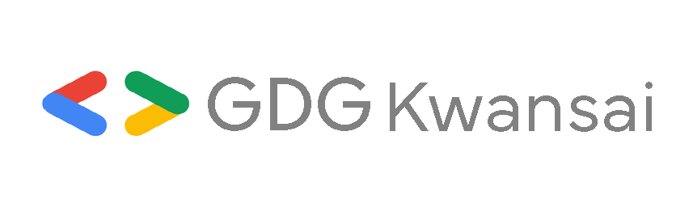

<!-- _class: title -->
<!-- _paginate: false -->

# WebMCP、 実際どうなの？

## I/O Extendedで実装・登壇して分かったこと

田中博悠 / tanahiro2010

---

## 自己紹介

<ul>
<li>田中博悠 / tanahiro2010</li>
<li>株式会社KOMPEITO</li>
<li>GDG Greater Kwansai</li>
<li>Web / AI / なんか気になったやつ / とあるサイトで契約作家</li>
</ul>

---

## 最近の課題

強制的にでも 一緒にバンジー飛んでくれる人を探してます

※ 技術的な話には関係ありません

---

<!-- _class: lead -->

# WebMCPって、 知ってますか？

---

## 今日話すこと

MCP
→

WebMCP
→

Bridge
→

個人の感想

技術解説半分、実装してみた体験談半分でいきます

---

## そもそもMCPとは？

AI Agentに外部ツールをつなぐための 共通インターフェースです

<h3>Agent</h3>
使えるtoolを見つける

<h3>Tool</h3>
必要な処理を実行する

<h3>Result</h3>
結果をAgentへ返す

---

## WebMCPとは？

Webページの機能を Agent向けtoolとして公開する仕組みです

- 宣言型: HTMLフォームにアノテーションしてtool化
- 命令型: JavaScriptからtoolを登録
- どちらも「ページの機能」をAgentに伝えます

---

## 何がうれしい？

<h3>推測が減る</h3>
<ul>
<li>Agentがボタンや入力欄の意味を想像しなくていい</li>
<li>サイト側がtoolとして意図を宣言できる</li>
</ul>

<h3>実行が短くなる</h3>
<ul>
<li>クリックや入力を何手も再現しなくていい</li>
<li>tool callとして直接処理しやすい</li>
</ul>

---

## MCPとWebMCPの違い

<table class="compare">
<thead>
<tr><th></th><th>MCP</th><th>WebMCP</th></tr>
</thead>
<tbody>
<tr><td>対象</td><td>AI Agent全般</td><td>ブラウザ内蔵Agent中心</td></tr>
<tr><td>登録</td><td>Agent起動時に登録</td><td>ページを開いた時に登録</td></tr>
<tr><td>実行場所</td><td>ローカル / サービスサーバー</td><td>そのブラウザのそのページ内</td></tr>
</tbody>
</table>

---

## つまり何が違う？

WebMCPは 「ページを開いている時だけ使える」

<h3>タブを開く</h3>
WebMCP toolが見える

<h3>タブを離れる</h3>
そのページのtoolは使えない

<h3>戻ってくる</h3>
また使えるようになる

---

## 2026年8月時点のWebMCP

<h3>提案中</h3>
GoogleがChrome docsで紹介しているWeb標準ドラフト

<h3>Origin Trial</h3>
Chrome 149から参加可能

<h3>ローカル検証</h3>
<code>chrome://flags/#enable-webmcp-testing</code>

APIは今後変更される可能性があります

---

<!-- _class: lead -->

# で、ハンズオンでは どうしたの？

---

## 作ったもの: WebMCP Bridge

WebMCP対応ページを MCP経由で既存Agentから呼べるようにしました

やっていることは、わりとゴリ押しです

---

## なぜBridgeが必要だったか

<h3>仕様の想定</h3>
WebMCPはブラウザAgent向け

<h3>ハンズオンの現実</h3>
既存Agentから呼びたい

<h3>解決策</h3>
Extension + MCP Serverで橋渡し

---

## WebMCP Bridgeの流れ

Webページ
→

Extension
→

WebSocket
→

MCP Server
→

Agent

ページ内toolを検出して、Agentから呼べるtoolとして見せます

---

## 代表tool

<h3><code>webmcp_discover_tools</code></h3>
<ul>
<li>WebMCP対応タブを調べる</li>
<li>ページ上のtool一覧を返す</li>
</ul>

<h3><code>webmcp_call_tool</code></h3>
<ul>
<li>toolIdとargsを指定する</li>
<li>Extension経由でページ内実行する</li>
</ul>

---

<!-- _class: lead -->

# ここまで作っておいて 言うのもなんですが

---

## メリットはちゃんとある

<h3>推測が減る</h3>
画面を読ませて当てるより、toolとして意図を渡せる

<h3>実行時間が短い</h3>
手順をなぞらず、目的の処理を直接呼びやすい

<h3>目で確認できる</h3>
ブラウザ上で動くので、結果を人間が見られる

---

## でも個人的には刺さらなかった

<h3>つらい</h3>
<ul>
<li>ブラウザ内蔵Agentを使う動機がまだ弱い</li>
<li>ページを開いている間だけ使える</li>
<li>既存Agent + ブラウザ操作との差が体感では大きくない</li>
</ul>

<h3>惜しい</h3>
<ul>
<li>Agent全般から使えたら印象は変わりそう</li>
<li>WebがAgentに操作方法を名乗る思想は面白い</li>
</ul>

---

<!-- _class: lead -->

# 個人的には、 いらないと思うなぁ （個人の感想）

---

## ただし

ブラウザAgentを使い倒すドパガキには かなり良いかも

推測が減る、実行時間が短くなる 
この2つは普通に強いです

---

## 作ったもの

<strong>Codelab</strong><code>learn.gdgs.jp/webmcp-agent</code>

<strong>WebMCP Bridge MCP</strong><code>github.com/tanahiro2010/webmcp-bridge-mcp</code>

<strong>WebMCP Bridge Extension</strong><code>github.com/tanahiro2010/webmcp-bridge-extension</code>

<strong>connpass</strong><code>gdgkwansai.connpass.com/event/391029</code>

---

<!-- _class: lead -->

# Thanks for listening!
