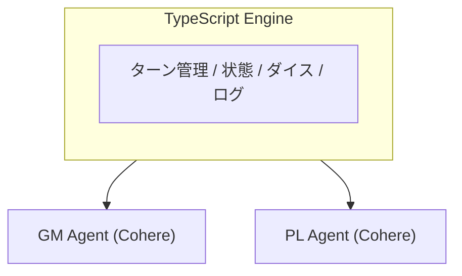
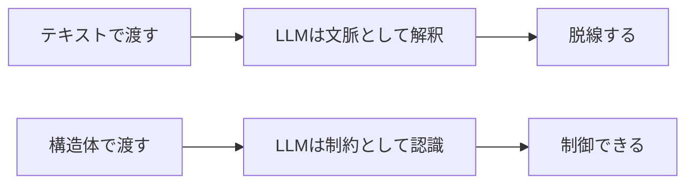

# LLM AgentでTRPGを動かしたら、Agentの地獄を（多分）全部見た

こんにちは。田中博悠です。

普段は `tanahiro2010` という名前で活動しています。三田学園高等学校の高校一年生です。

この記事は、GDGoC Osakaの「LLM Agent Build with AI」で話した「LLM AgentでTRPGを動かしたら、Agentの地獄を（多分）全部見た」という登壇内容を、Qiita向けの記事としてまとめたものです。

対象は、LLM Agentを何か作ってみたい人。

そして、「AIに自由にやらせたら思った通りに動かなかった」という失敗談に興味がある人です。

## 趣味と技術、合体させたくなったことありますか?

突然ですが質問です。

「趣味と技術、合体させたくなったことありますか?」

僕はあります。

LTのネタを探していたとき、僕はふと考えました。

TRPGが好きで、LLM Agentも触ってみたい。

じゃあ、合体させよう。

軽い気持ちでそう思って、手を動かし始めました。

そして気づいたら、一から実装していました。

正直、この時点ではまだ「なんとかなるだろう」と思っていました。

甘かったです。

## 作ろうとしたもの

作ろうとしたのは、**複数のLLM Agentが、TRPGを自律的に進行するシステム**です。

補足しておくと、**TRPG**(Table talk Role Playing Game、テーブルトークRPG)は、会話とダイス(サイコロ)を使って進行する、対面型のロールプレイングゲームです。進行役の**GM(ゲームマスター)**がシナリオを読み上げ、状況を描写します。プレイヤー役の**PL(プレイヤー)**は、自分のキャラクターとしてどう行動するかを宣言します。行動の成否は、ダイスを振って判定します。

今回は、このGMとPLの役割を、それぞれLLM Agentにやらせる、という試みです。

**LLM Agent**というのも、聞き慣れない人向けに補足しておきます。LLM(大規模言語モデル)に、単なる一問一答の応答だけでなく、状況を判断しながら一連の行動を自律的に選ばせる仕組みのことです。「次に何をするか」をLLM自身に考えさせ、その結果をプログラム側で受け取って処理する、という形で使われることが多いです。

今回は、GM役とPL役という、2種類の役割を持ったLLM Agentを用意しました。

役割分担はこうです。

```
GM Agent   : シナリオを読んで描写・進行
PL Agent   : キャラクターとして行動宣言
Rule Engine: ダイス判定・状態管理(TypeScript)
```

設計思想は、こうです。

**「AI = 演技」「TypeScript = 世界」**

LLMには喋らせるだけ。ロジックは絶対にコードで持つ。

これが、僕のこだわりでした。

我ながら、謎のこだわりだと思います。

でも、AIに何でも任せてしまうと、あとで何が起きているのか誰にもわからなくなる気がしていました。

だから最初から、「世界のルールはTypeScriptが握る」と決めていました。

## システム構成

構成は、こんなイメージです。



**Cohere**は、LLMを提供している会社の1つで、今回はそのAPIをGM/PL両方のAgentに使っています。

PL Agentの出力は、`[action]...[/action]`というタグで構造化しています。

そして、その出力を**zod**というライブラリでバリデーション(検証)しています。zodは、TypeScriptで「このデータはこういう形をしているはずだ」というルールを定義し、実際のデータがそのルール通りかどうかをチェックできるライブラリです。LLMの出力は自由な文章になりがちなので、決まった形になっているかをここでチェックしています。

この時点での僕は、「まあ、それなりに動くだろう」と、わりと楽観的でした。

## 実際に動かしたら

早速、動かしてみました。

シナリオの1ページ目はこうです。

> 「あなたがいつも通りの日常を送っていると、唐突に目の前に**どこ○もドアっぽい物**が現れる」
> → 入る? 入らない?

これに対する、GMの出力がこちらです。

> 「**夜の街を歩く探索者たちの前に**、突然、どこか異次元を思わせる扉が現れた。その扉は、無機質な白と黒の幾何学模様が織りなす不思議な光景を映し出している。」

読んで、正直「あれ?」となりました。

**夜の街、どこから来た?**

**探索者たち(複数)、誰?**

シナリオには書いていない設定が、勝手に増えていました。

一人称の日常だったはずが、いつの間にか夜の街を歩く複数の探索者パーティーの話になっています。

この時点ではまだ、「まあ、多少の脚色はご愛嬌かな」くらいに思っていました。

甘い考えでした。

## 4ターン後の状態

さらに進めてみると、状況はもっと深刻でした。

|項目|期待|実際|
|---|---|---|
|フェーズ|分岐・戦闘へ|`dialog` のまま|
|ダイス|複数回|**0回**|
|アクション|skill_check / move|`speak` のみ|
|シナリオ進行|3〜4ページへ|**1ページから動かず**|

PLが4ターン連続で、少女に話しかけ続けていました。

シナリオはまったく進行していませんでした。

僕は、ログを眺めながら、思わず声が出ました。

「いや、動け」と。

TRPGを遊んでいるつもりが、いつまで経っても自己紹介が終わらない世界線に迷い込んだような感覚でした。

## 何がなぜ壊れたか

さすがに笑い事では済まないので、原因を整理しました。

大きく3つありました。

**① GMがシナリオを「文脈」として使った**

シナリオをテキストのまま渡すと、LLMはその雰囲気だけを吸い取って、自由に創作してしまいます。分岐を「守るべき構造」としては認識してくれませんでした。

**② PLがspeak(会話)しか選ばない**

「キャラクターらしく行動せよ」という指示だけでは、LLMは安全策として、会話を選び続けます。ダイスを振ったり、移動したりといった、リスクのある行動は避けられてしまいました。

**③ Scenario Parserが未実装だった**

そもそも、「今どのページにいて、どんな選択肢があって、次はどのページに進むのか」を、エンジン側が把握できていませんでした。これでは、GMもPLも、進行の基準となる情報を持てません。

冷静に振り返ると、これは僕の設計の甘さでした。

「AIならなんとなく察してくれるだろう」という期待が、そもそもの間違いだったんだと思います。

## 学んだこと

ここから得た教訓は、こうです。

> **LLMに構造を守らせたいなら、構造化した入力を渡せ**



テキストのまま渡すと、LLMはそれを「参考にしていい素材」くらいに扱います。

一方で、こういう構造体として渡すと、LLMはそれを「守るべき制約」として認識しやすくなります。

```json
{
  "currentPage": 2,
  "choices": ["入る → 3ページ", "入らない → 4ページ"],
  "instruction": "必ずどちらかの選択肢に誘導すること"
}
```

つまり、「AIに任せる部分」と「コードで縛る部分」の境界を、どう設計するか。

これがすべてだと感じました。

言葉にすると当たり前に聞こえますが、実際に自分のシステムが壊れるところを見ないと、なかなか腹落ちしないものだなと思いました。

## まとめ・今後

動いたことは、こうです。

- Agent間の会話ループ
- 構造化出力 + zodバリデーション
- セッションログ(**JSONL**、1行に1つのJSONオブジェクトを書き並べる形式のログファイル)

これからやることは、こうです。

- Scenario Parserの実装
- ページ状態をエンジン側で管理
- 複数PL対応
- Gemini混在構成

LLM Agentに「自由にやらせる部分」と、TypeScriptで「絶対に縛る部分」の境界を、もっと詰めていきたいと思っています。

「AI = 演技、TypeScript = 世界」

……のはずでした。

正直、思っていた10倍くらい地獄を見ました。

でも、動かないシステムを目の前にして「なぜ動かないか」を考える時間は、意外と嫌いじゃなかったです。

むしろ、うまくいった話より、こういう壊れ方をした話の方が、他の人の役に立つ気がしています。

失敗ログも全部、リポジトリにコミット済みです。

https://github.com/tanahiro2010/ai_agent_trpg
