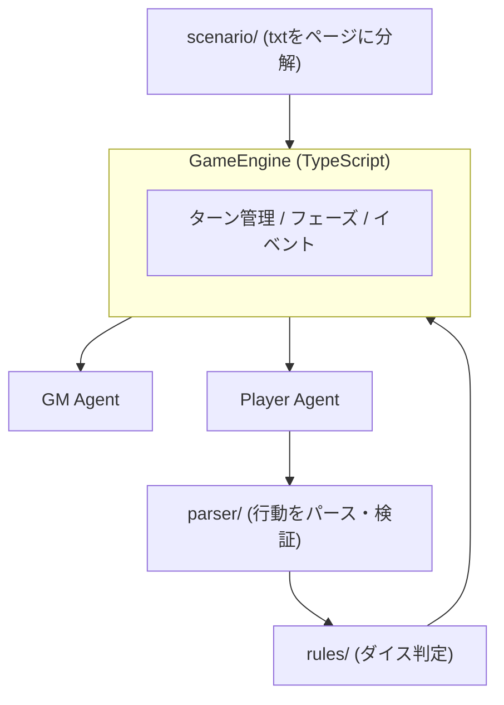

# LLM AgentでTRPGを動かしたら、Agentの地獄を（多分）全部見た

こんにちは。

普段は `tanahiro2010` という名前で活動しています。

この記事は、GDGoC Osakaの「LLM Agent Build with AI」で話した「LLM AgentでTRPGを動かしたら、Agentの地獄を（多分）全部見た」という登壇内容を、Qiita向けの記事としてまとめたものです。

対象は、LLM Agentを何か作ってみたい人。

そして、「AIに自由にやらせたら思った通りに動かなかった」という失敗談に興味がある人です。

先に白状しておくと、このプロジェクトは**今も完全には動いていません**。

この記事は、うまくいった話ではなく、実際のコードとログを見ながら「今どこで詰まっているか」を解説する記事です。

先に構成だけ触れておくと、最初にシステムの仕組みをひと通り説明したあと、実際に動かして壊れた瞬間のログを見ていきます。仕組みの説明が長いと感じたら、「実際に動かしたら(現在のログ)」まで読み飛ばしてもらっても大丈夫です。

## 趣味と技術、合体させたくなったことありますか?

突然ですが質問です。

「趣味と技術、合体させたくなったことありますか?」

僕はあります。

LTのネタを探していたとき、僕はふと考えました。

TRPGが好きで、LLM Agentも触ってみたい。

じゃあ、合体させよう。

軽い気持ちでそう思って、手を動かし始めました。

そして気づいたら、一から実装していました。

正直、この時点ではまだ「なんとかなるだろう」と思っていました。

甘かったです。

## 作ろうとしたもの

作ろうとしたのは、**複数のLLM Agentが、TRPGを自律的に進行するシステム**です。

> **用語: TRPG(Table talk Role Playing Game) / GM(ゲームマスター) / PL(プレイヤー)**
> TRPGは、会話とダイス(サイコロ)を使って進行する、対面型のロールプレイングゲームです。テレビゲームと違って、進行役である**GM**が状況やNPCの反応を読み上げ、プレイヤーである**PL**は「自分ならどうするか」を口頭で宣言しながら物語を進めます。行動の成否は、ダイスを振って判定します。

今回は、このGMとPLの役割を、それぞれLLM Agentにやらせる、という試みです。

> **用語: LLM Agent**
> LLM(大規模言語モデル)に、単なる一問一答の応答だけでなく、状況を判断しながら一連の行動を自律的に選ばせる仕組みのことです。「次に何をするか」をLLM自身に考えさせ、その結果をプログラム側で受け取って処理する、という形で使われることが多いです。

役割分担はこうです。

```
GM Agent   : シナリオを読んで描写・進行
PL Agent   : キャラクターとして行動宣言
Rule Engine: ダイス判定・状態管理(TypeScript)
```

設計思想は、こうです。

**「AI = 演技」「TypeScript = 世界」**

LLMには喋らせるだけ。ロジックは絶対にコードで持つ。

これが、僕のこだわりでした。

我ながら、謎のこだわりだと思います。

でも、AIに何でも任せてしまうと、あとで何が起きているのか誰にもわからなくなる気がしていました。

だから最初から、「世界のルールはTypeScriptが握る」と決めていました。

## システム構成

実際のディレクトリ構成は、こうなっています。

```
src/
  engine/    ターン進行・フェーズ遷移・イベント発行
  agents/    GM Agent / Player Agent
  prompts/   GM・PL向けのプロンプト組み立て
  parser/    PLの出力パース・検証
  protocols/ zodによるアクション/イベント定義
  rules/     ダイス判定・スキル解決
  scenario/  シナリオtxtのページ分解・分岐解決
  state/     GameState / PlayerState / NPCState
  llm/       Cohere Provider / Mock Provider
```

全体の流れは、こうです。



`GMAgent`と`PlayerAgent`は、Cohere Providerを共有していますが、実体は`src/agents/gm/gm-agent.ts`と`src/agents/player/player-agent.ts`の別クラスです。

> **用語: Cohere / Provider**
> Cohereは、LLMを提供している会社の1つです。ChatGPTのOpenAI、GeminiのGoogleと同じ立ち位置で、APIを叩くとテキスト応答を返してくれます。今回はGM/PL両方のAgentが、このCohereのAPIを呼び出しています。呼び出し部分は`Provider`という抽象化レイヤーの裏に隠していて、Cohereでもテスト用のMock(固定の返答を返すダミー)でも、Agent側のコードを変えずに差し替えられるようにしています。

PL Agentの出力は、`[action]...[/action]`というタグで構造化することにしています。

> **用語: zod**
> TypeScriptで「このデータはこういう形をしているはずだ」というルール(スキーマ)を定義し、実際のデータがそのルール通りかどうかをチェックできるバリデーションライブラリです。LLMの出力は自由な文章になりがちなので、決まった形になっているかをここでチェックしています。

実際のスキーマは、こうなっています(`src/protocols/action.ts`)。

```ts
export const moveActionSchema = z.object({
  type: z.literal("move"),
  location: z.string().min(1),
  reason: z.string().min(1),
  branchId: z.string().min(1).optional(),
});

export const playerActionSchema = z.discriminatedUnion("type", [
  skillCheckActionSchema,
  speakActionSchema,
  moveActionSchema,
  waitActionSchema,
]);
```

> **用語: discriminatedUnion(判別可能なユニオン型)**
> zodの機能の1つで、「`type`フィールドの値によって、必要な残りのフィールドが変わる」データ構造を表現できます。`type: "move"`なら`location`が必須、`type: "speak"`なら`message`が必須、というふうに、1つの型の中で複数のパターンを安全に扱えます。

行動の種類ごとに必須項目が変わる、というのを型レベルで保証できるのは、地味に便利です。

この時点での僕は、「まあ、zodで弾けばそれなりに動くだろう」と、わりと楽観的でした。

## シナリオは、どうやって「ページ」になるのか

最初の実装では、シナリオをテキストのまま丸ごとGM Agentに渡していました。

これだと、GMがシナリオの先を勝手に読んで話を進めてしまう問題がありました。

なので今は、シナリオtxtを事前にページ単位へ分解する`page-parser.ts`を用意しています。

```ts
const PAGE_HEADER = /^#\s*(\d+)ページ\s*$/gm;
const BRANCH_TARGET = /^(\d+)ページへ\s*$/;
```

シナリオが`# 2ページ`のような見出しで区切られていることを前提に、正規表現でページごとの本文を切り出します。

さらに、本文中に出てくる「入る / 3ページへ」のような選択肢の並びから、分岐(`branches`)も抽出します。

```ts
function keywordsFromLabel(label: string): string[] {
  const base = [label.trim()];
  const extras: string[] = [];

  if (/入る|入って|中へ|扉/.test(label)) {
    extras.push("入る", "扉", "進む", "中に", "入って");
  }
  if (/敵対/.test(label)) {
    extras.push("敵対", "敵ね", "攻撃", "戦う", "斬る", "殺して");
  }
  // ...
  return [...new Set([...base, ...extras])];
}
```

正直に言うと、これは「シナリオパーサー」というより「キーワード辞書」です。

選択肢のラベルから、それっぽい類義語を手で足しているだけです。

`docs/scenario-and-actions.md`にも書いていますが、AIによるシナリオ理解ではなく、**正規表現とキーワード一致だけでページ遷移を決めている**のが今の実態です。

GMやPLがどんなに自由に喋っても、次のページに進むかどうかは、この`navigator.ts`が判定します。

```ts
if (action.type === "speak" && page.id === "page-6") {
  const allow = page.branches.find((b) => b.targetPageId === "page-9");
  const deny = page.branches.find((b) => b.targetPageId === "page-10");
  if (deny && /ダメ|拒|いけない|無理|通さない/.test(text)) {
    return deny.targetPageId;
  }
  if (allow && /いい|OK|通して|許|構わ|説明/.test(text)) {
    return allow.targetPageId;
  }
}
```

見てわかる通り、`page.id === "page-6"`のように、**ページIDを直接ハードコードして分岐条件を書いています**。

汎用的なシナリオパーサーではなく、「今回のシナリオ専用の分岐表」に近いです。

「Scenario Parserを実装する」という当初の目標に対しては、正直まだ道半ばだと思っています。

## GMを暴走させないための、プロンプトの縛り

初期のバージョンでは、GMがシナリオ本文を丸ごと読んで、勝手に設定を膨らませる問題がありました。

今のGMプロンプト(`src/prompts/gm.ts`)は、その反省からかなり厳しく縛っています。

> **用語: SAN(値)**
> クトゥルフ神話TRPGなど、ホラー系TRPGでよく使われる「正気度」のパラメータです。恐ろしい出来事に遭遇すると、判定によってこの値が減っていき、0に近づくほどキャラクターは精神的に追い詰められます。HPが体力なら、SANは心の体力だとイメージしてください。今回のシナリオもこの仕組みを使っているので、次のプロンプトにも「AIが勝手にSANを変更しないように」という一文が入っています。

```ts
export function buildGMSystemPrompt(): string {
  return [
    "あなたはTRPGのGM（ゲームマスター）です。",
    "",
    "役割:",
    "- 現在シーンの状況・NPCの台詞・雰囲気のみを描写する",
    "- プレイヤーキャラクターのセリフや行動は絶対に書かない",
    "",
    "厳守:",
    "- シナリオ全文の先読み・ページ先取り禁止（渡された現シーンのみ）",
    "- ダイス結果の決定禁止（[result]があるときのみ従う）",
    "- HP/SAN変更・新規NPC大量追加禁止",
    "- [T1 GM] などのメタ表記禁止",
    "- 「探索者たち」ではなくプレイヤー名で二人称（あなた）",
    "",
    "分量: 150〜400字。",
  ].join("\n");
}
```

「シナリオ全文の先読み禁止」「ダイス結果の決定禁止」「HP/SAN変更禁止」と、GMがやりがちな暴走を1つずつ名指しで禁止しています。

さらに、プロンプトだけでは防ぎきれない部分は、後処理でも軽く矯正しています(`src/utils/sanitize-narration.ts`)。

```ts
export function sanitizeGmNarration(text: string): string {
  let result = text.trim();
  result = result.replace(/\[T\d+\s*GM\]\s*/gi, "");
  result = result.replace(/^探索者たち/g, "あなた");
  result = result.replace(/探索者たち/g, "あなた");
  return result.trim();
}
```

「探索者たち」という、GMがよく使いがちな三人称複数の表現を、正規表現で「あなた」に強制的に置き換えています。

プロンプトで指示して、それでも守られない部分は、最後にコードで殴る。

地味な処理ですが、こういう「プロンプトで9割縛って、残り1割はコードで矯正する」の積み重ねが、今の安定度を支えています。

## PLの行動を、パースして検証する

PL Agentの出力は、`[action]...[/action]`の中に`key: value`の行を並べる形式です。

```text
[action]
type: move
location: page-3
reason: 扉に入る
[/action]
```

これを受け取る`command-parser.ts`は、大まかにこういう流れで処理します。

```ts
export function parseAndValidateAction(
  text: string,
  options?: { repair?: boolean },
): PlayerAction | null {
  let action = parseActionFromText(text);
  if (action) return action;

  if (options?.repair !== false) {
    const wrapped = `[action]\n${text.trim()}\n[/action]`;
    action = parseActionFromText(wrapped);
    if (action) return action;
  }

  return null;
}
```

1. `[action]...[/action]`を正規表現で抜き出す
2. 中身を1行ずつ`key: value`として辞書化する
3. `investigate`→`skill_check`のような軽い表記ゆれを修復する
4. zodスキーマで検証する

PlayerAgent側では、これが失敗した場合に最大3回まで再プロンプトするリトライも組んでいます(`src/agents/player/player-agent.ts`)。

```ts
for (let attempt = 1; attempt <= MAX_PARSE_RETRIES; attempt++) {
  const response = await withRetry(/* ... */);
  const action = parseAndValidateAction(response.text);
  if (action) return action;

  user = [
    buildPlayerUserPrompt(ctx),
    "",
    "前回の出力は不正でした。必ず [action]...[/action] 形式で再出力。",
    `参考分岐:\n${branchHint}`,
  ].join("\n");
}
```

パースに失敗したら、「前回の出力は不正でした」と伝えて、もう一度出力させる。

ここまでは、割と真っ当な設計だと自分では思っています。

## ダイス判定は、ちゃんとTypeScript側にある

「AI = 演技、TypeScript = 世界」の思想通り、ダイス判定はAgentに一切触らせていません。

> **用語: d100 / クリティカル / ファンブル**
> `d100`は「100面ダイスを1回振る」ことで、1〜100の乱数を1つ出す判定方式です。自分のスキル値以下が出れば成功、というのがTRPGでよくあるルールです。`クリティカル`は、出た目が非常に低く「大成功」となる特別な成功で、`ファンブル`は逆に「大失敗」を意味します。今回はどちらもTypeScript側でルールとして固定しています。

`resolveSkillCheck()`(`src/rules/dice/dice-engine.ts`)が、d100(1〜100のダイス)を振って成否を決めます。

```ts
export function resolveSkillCheck(input: RollInput): DiceResult {
  const target = Math.min(100, Math.max(1, Math.floor(input.skillValue)));
  const roll = rollD100();
  const criticalThreshold = Math.max(1, Math.floor(target / 5));
  const critical = roll <= criticalThreshold;
  const fumble = roll >= 96;
  const success = critical || (roll <= target && !fumble);

  return { roll, target, success, critical, fumble, skill: input.skillName };
}
```

見ての通り、しきい値は全部数値としてコードにハードコードされていて、Agentが割り込む余地はありません。

GM・PLどちらのAgentも、この結果を**決定できません**。結果はTS側で確定し、その結果をプロンプトに埋め込んでAgentへ伝える、という一方通行にしています。

ここは狙い通り動いていて、今のところAgentが判定結果を捏造したことは一度もありません。

## 実際に動かしたら(現在のログ)

ここからが本題です。

`--cohere`オプションで、実際にCohereのAPIを使ってセッションを回してみます。

```bash
bun run src/index.ts --scenario scenarios/test.txt --cohere --turns 4 --include-raw
```

1ターン目、GMのオープニング描写は、ちゃんと出ました。

> 「あなたがいつも通り、穏やかな日常を過ごしていたその時、突然、目の前に不思議な扉が現れる。（中略）入る勇気はありますか？」

ここまでは狙い通りです。プロンプトの縛りが効いていて、「探索者たち」のような暴走もありません。

問題は、この直後のPL Agentの出力でした。

```json
"text": "[action]move location=page-3[/action]\n\nbranchId: page-2-to-page-3"
```

一見、ちゃんとした形式に見えます。

でも、ログにはこう出ました。

```json
{"level":"warn","category":"parser","message":"unknown action type","data":{"record":{"move location":"page-3"}}}
```

`type`ではなく`"move location": "page-3"`という、変なキーで辞書化されていました。

## 何が起きていたか

原因は、`parseActionBlock()`の行パース処理にありました。

```ts
if (colonIndex !== -1) {
  // key: value 形式
} else if (equalsIndex !== -1) {
  // key=value 形式（インライン）
  const key = line.slice(0, equalsIndex).trim();
  const value = line.slice(equalsIndex + 1).trim();
  if (key && value) result[key] = value;
} else if (VALID_ACTION_TYPES.has(line)) {
  // 単独のtype行
  result.type = line;
}
```

このコードは、1行に`:`か`=`のどちらか1つが入っている前提で書かれています。

でもLLMが実際に返してきたのは、`move location=page-3`という**1行に`type`と`key=value`が両方乗っている**行でした。

`equalsIndex`は見つかるので、`key=value`形式の分岐に入ります。

そして`line.slice(0, equalsIndex)`は、`=`より前の文字列を丸ごと`key`にするので、結果は`"move location"`という1つの変な文字列になります。

`type`というキー自体が、どこにも存在しないレコードができあがるわけです。

`recordToActionPayload()`は`record.type`が無いと`null`を返すので、ここでパース失敗になります。

## リトライした結果、もっと悪くなった

パース失敗を受けて、Agentは再プロンプトされ、もう一度出力します。

2回目も、まったく同じ`move location=page-3`をそのまま繰り返してきました。

3回リトライの上限に達し、最終的にPL Agentが返してきたのはこれです。

```json
"text": "[action]speak[/action]\n\n「この扉はどこに繋がっているのですか？ 危険はありませんか？」"
```

`type: speak`だけは単独行として認識されるので、今度はパース自体は成功します。

でも、実際に話した内容(「この扉はどこに繋がっているのですか？」)は`[action]`タグの**外**に書かれているので、パーサーからは見えません。

結果、記録されたPLの行動はこうなりました。

```json
{"type":"speak","target":"npc","message":"...","reason":"会話する"}
```

`message`は、スキーマを満たすためのプレースホルダである`"..."`です。

LLMが実際に考えた台詞は、ログ上どこにも残っていません。

つまり、**リトライという仕組みが、「壊れた出力を直す」のではなく「内容を諦めて空の出力に寄せる」方向に働いてしまっていた**わけです。

## 2ターン目以降、沈黙が始まった

1ターン目はギリギリ言葉を絞り出しましたが、2ターン目からは様子が変わります。

PLはこう返してきました。

```json
"text": "[action]move[/action]\n\nbranchId: page-2-to-page-3"
```

今度は`branchId`のおかげでpage-3への移動自体は成功します。

でも`location`フィールドは提供されていないので、`recordToActionPayload()`のデフォルト値がそのまま入ります。

```json
{"type":"move","location":"unknown","reason":"移動する"}
```

移動は成功しているのに、記録上の行き先は`"unknown"`という、ちぐはぐな状態です。

そして3ターン目・4ターン目は、こうなりました。

```json
"text": "[action]speak[/action]"
```

タグの中身すら、もう何もありません。

刀を構えた少女がプレイヤーに斬りかかってくる場面で、PLはただ「...」と言い続け、`skill_check`で回避することも、`move`で逃げることもなく、4ターン上限に達してセッションは終了しました。

```json
{"level":"info","category":"engine","message":"session end","data":{"finalState":{"turn":4,"phase":"exploration","sceneId":"page-3",...}}}
```

刀を振りかぶった少女を前に、プレイヤーは最後まで「...」しか言わずに終わる。

TRPGとしては、なかなかシュールな結末です。

4ターンの流れを、表にまとめておきます。

|ターン|PLの出力|記録された行動|結果|
|---|---|---|---|
|1|`move location=page-3`(パース失敗を3回繰り返した末に`speak`へフォールバック)|`speak, message: "..."`|台詞は消失、移動もせず|
|2|`move`(branchIdのみ)|`move, location: "unknown"`|移動自体は成功、記録は破綻|
|3|`speak`(中身なし)|`speak, message: "..."`|沈黙|
|4|`speak`(中身なし)|`speak, message: "..."`|沈黙のまま4ターン上限|

## 何がなぜ、まだ壊れているか

整理すると、原因は大きく2つです。

**① パーサーが「1行1情報」を前提にしすぎている**

`type: move`と`location: page-3`が別行なら動きますが、`move location=page-3`のように1行にまとまると、途端に壊れます。

LLMは毎回同じ書式で書いてくれるわけではないので、この前提はそもそも脆いです。

**② リトライが「直す」のではなく「諦めさせる」方向に効いてしまう**

「不正な形式だったので再出力してください」という指示だけでは、LLMは「安全に通る、より短い出力」に寄せていきます。

その結果、1回目より2回目、2回目より3回目の方が、内容が薄くなるという逆効果が起きていました。

冷静に振り返ると、これは「GMの暴走を止める」ときと同じ構造の問題です。

GMのときは、プロンプトの縛り+後処理の矯正でなんとかなりました。

でも今回のパーサー周りは、「LLMの出力揺れをどこまでコード側で吸収するか」の設計自体が甘かったんだと思います。

## 学んだこと

前に一度、同じような教訓を書いたことがあります。

> **LLMに構造を守らせたいなら、構造化した入力を渡せ**

今回はその続きで、もう1つ加えるならこうです。

> **LLMの出力揺れは、リトライで「やり直させる」だけでなく、パーサー側で「多少崩れても拾う」余地を作っておく**

`move location=page-3`のような1行表記は、人間が見れば意図は明らかです。

`type`らしきトークンと、`key=value`らしきトークンが同じ行に並んでいるだけです。

でも今のパーサーは「1行1情報」という前提でしか読めないので、これを拾えません。

「リトライで完璧な形式を出させる」より、「多少崩れた形式でも、意図を汲んで拾う」パーサーにする方が、たぶん現実的です。

つまり、「AIに任せる部分」と「コードで縛る部分」の境界だけでなく、「コード側がAIの揺れをどこまで許容するか」という、もう1段階細かい設計判断が必要だったということです。

言葉にすると当たり前に聞こえますが、実際に自分のシステムが壊れるところを見ないと、なかなか腹落ちしないものだなと改めて思いました。

## まとめ・今後

動いていることは、こうです。

- GMのシーン描写(暴走の抑制込み)
- ページ単位でのシナリオ分解と、TS側での分岐確定
- ダイス判定・スキル解決(AIは一切関与しない)
- 構造化出力 + zodバリデーション
- セッションログ(JSONL形式での保存)

> **用語: JSONL(JSON Lines)**
> 1行に1つのJSONオブジェクトを書き並べる形式のログファイルです。普通のJSONと違って、ファイル全体を1つの配列として読み込まなくても、1行ずつ読み進めるだけでログを追記・処理できます。この記事で引用したログの断片も、すべてこの形式のファイルの中の1行です。

まだ動いていないことも、正直に書いておきます。

- PLの行動パーサーが、1行に情報が詰まった出力に弱い
- リトライが、内容を諦めさせる方向に効いてしまうケースがある
- シナリオの分岐解決が、ページIDのハードコードとキーワード一致に依存していて、汎用的なシナリオパーサーには程遠い
- 複数PL対応、Gemini混在構成などは未着手

LLM Agentに「自由にやらせる部分」と、TypeScriptで「絶対に縛る部分」の境界を、もっと詰めていきたいと思っています。

「AI = 演技、TypeScript = 世界」

……のはずでした。

正直、思っていた10倍くらい地獄を見ましたし、今もまだ完全には抜け出せていません。

でも、動かないシステムを目の前にして「なぜ動かないか」を考える時間は、意外と嫌いじゃなかったです。

むしろ、うまくいった話より、こういう壊れ方をした話の方が、他の人の役に立つ気がしています。

失敗ログも全部、リポジトリにコミット済みです。

https://github.com/tanahiro2010/ai_agent_trpg
