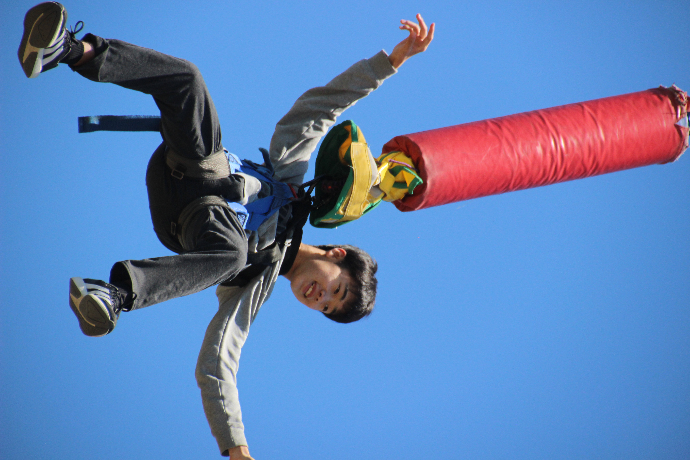

<!-- _class: title -->
<!-- _paginate: false -->

# LTできたら **バンジー飛べる**

tanahiro2010 / 田中博悠

---

<!-- _class: profile -->

<h1>田中博悠</h1>

<ul>
  <li>tanahiro2010</li>
  <li>三田学園高等学校 1年生</li>
  <li>株式会社KOMPEITO</li>
  <li>Alpha+ Project</li>
  <li>趣味: バンジー / 読書</li>
  <li>最近: スカイダイビングに思いを馳せています</li>
</ul>

---

<!-- _class: lead -->

# LTしたことって、 ありますか?

---

<!-- _class: lead -->

# 僕はあります

というか、今してます

---

<!-- _class: lead -->

# そこで思ったんです

LTって、バンジーと似てるよねって

---

<!-- _class: photo -->

# 人前に立つワクワク

## 下を見るワクワク

---

# 感覚の正体

  
LT前

  
たぶん 緊張

  
バンジー前

  
たぶん 恐怖

---

<!-- _class: lead -->

# でも僕には

どっちもワクワクです

---

<!-- _class: lead statement -->

# LTできる人は、 バンジーも飛べる

---

<!-- _class: compare -->

# まず、LTとバンジー

| 観点 | LT | バンジー |
| --- | --- | --- |
| 始まる前 | 緊張がピーク | 恐怖がピーク |
| 始まった後 | 体感は一瞬 | 体感は一瞬 |
| 終わった後 | またやりたい | また飛びたい |

---

<!-- _class: equality -->

# `===` は成立しなくても `==` は成立します（たぶん）

  
LT !== バンジー

  
厳密には違います

  
LT == バンジー

  
ワクワクは同じです

---

<!-- _class: compare -->

# 他の登壇活動と比べます

| 種類 | 長さ | 始まる前 | 終わった後 |
| --- | --- | --- | --- |
| LT | 5〜10分 | ピーク | またやりたい |
| セミナー / カンファレンス登壇 | 30分〜2時間 | だんだん薄れる | じっくり達成感 |
| ハンズオン講師 | 1時間〜 | 運用が始まる | 無事に終えたい |

---

# 一番近いのは、LT

短い

始まる前が ピーク

終わると またやりたい

---

<!-- _class: lead -->

# バンジーを飛ぶコツ

先に人前で「飛べる」と宣言します

後に引けなくなるので、面白い!

---

<!-- _class: qr -->

# 宣言受付

このあと懇親会で、バンジー行く宣言を受け付けます

半分ネタ、半分本気です

---

<!-- _class: thanks -->

# Thank you!

一緒にバンジー飛んでくれる人探してます

飛ばなくても懇親会で話しかけてください

