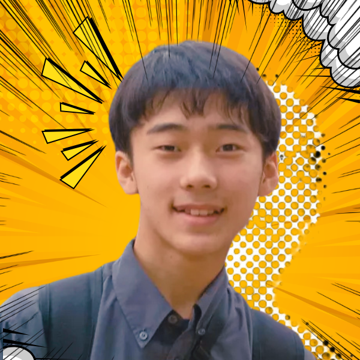
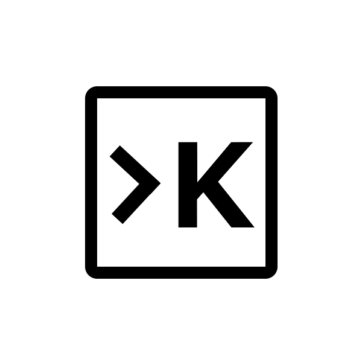
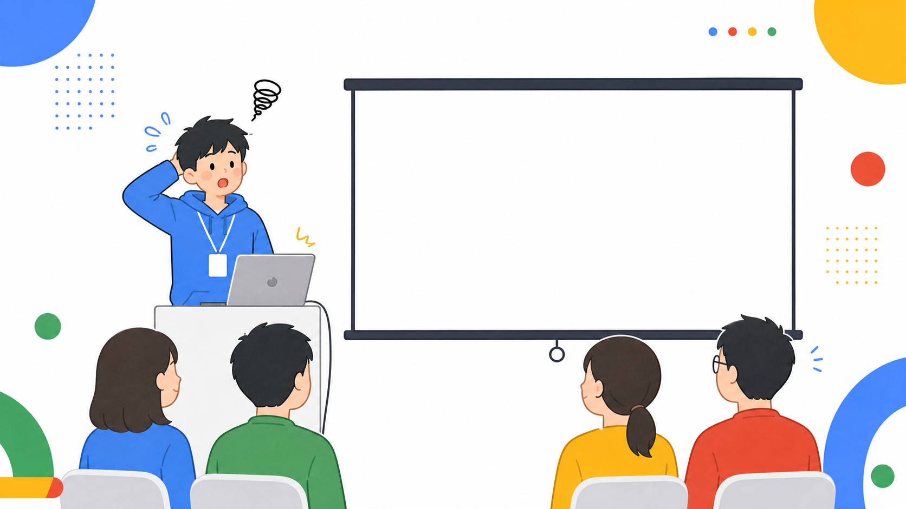
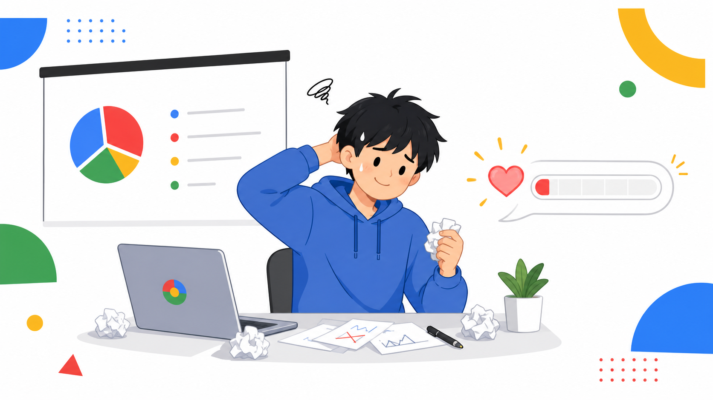
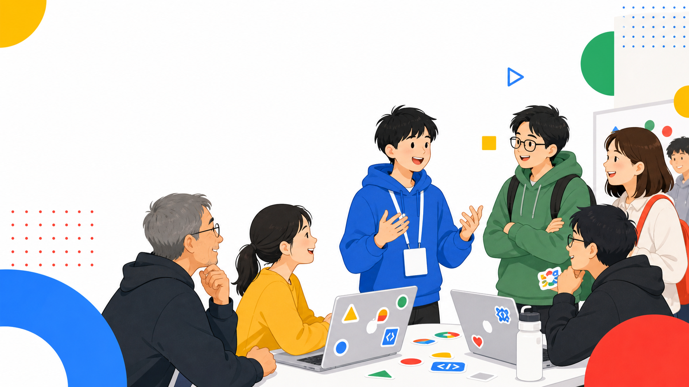
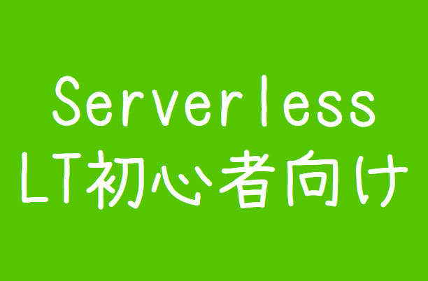
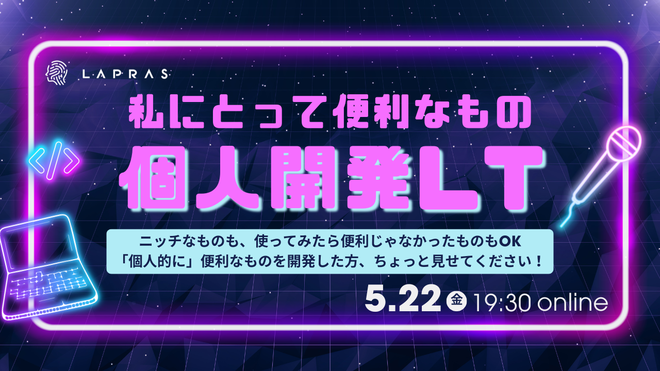
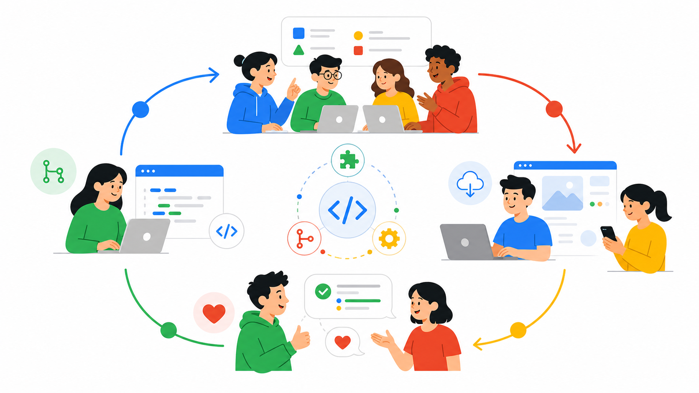

<!-- _class: title -->
<!-- _paginate: false -->

# OSSコミュニティが くれた 「**人との繋がり**」

## 高校生の僕が登壇する理由

オープンソースカンファレンス2026 Kyoto  
田中博悠 / tanahiro2010

---

<!-- _class: lead -->

# 高校生の僕が 登壇する理由

---

## 今日話すこと

登壇から始まったOSSの話です

登壇
→
出会い
→
OSS

---

## 自己紹介

<ul>
<li>田中博悠</li>
<li>tanahiro2010</li>
<li>三田学園高等学校</li>
<li>高校一年生</li>
</ul>

---

<!-- _class: lead -->

# 高校生です

---

## いらない情報

- 趣味: イベントにプロポーザルを出す
- 最近: 高槻でハッピーバンジー
- 座右の銘: **なければ作ればいいじゃない**
- 失敗しても別に死なん

---

<!-- _class: lead -->

# 恐れを知らず 継続を知らない

---

## 得意分野

<h3>Web</h3>
メインはWeb系

<h3>OSS</h3>
最近かなり寄り道中

<h3>CLI / AI</h3>
気になったら触る

---

## KotobというOSSを作っています

僕と友人で作っているOSSです

今日ブースで実物を触れます

---

## Kotobとは

Gemini APIを使ったCLI翻訳ツール

---

## 今日ブースも出しています

あなたの初OSSコントリビュート、 Kotobでやってみませんか?

気になったら触りに来てください

---

## まだ単純な機能しかない

だからこそ

ポテンシャルがでかい

感想もIssueも、機能案も、かなり助かります

---

<!-- _class: lead -->

# 登壇する人って 怖くないですか?

---

## 登壇者のイメージ

度胸がすごそう

---

## そして思う

ネタ、どこから持ってきてるの?

---

## 登壇そのものも怖い

- 失敗したらどうしよう
- 話が飛んだらどうしよう
- スライド事故ったらどうしよう

---

## ここで普通なら

僕も最初は怖かったです

---

<!-- _class: lead -->

# そんなことは 言わないぜ

---

## 僕の場合

怖さより好奇心が先に走った

---

<!-- _class: lead -->

# ただし 失敗は普通にしました

---

<!-- _class: with-image -->

## 失敗その1

画面が共有されていませんでした

---

## 失敗その2

話につまりました

---

## 失敗その3

後半を先輩に交代しました

---

## 他にも

- 噛む
- 資料が未完成
- アドリブで押し切る
- そして反省する

---

<!-- _class: with-image -->

## 正直へこむ

心が折れる一歩手前くらい

---

<!-- _class: lead -->

# でも 登壇って楽しい

---

## 感想がもらえる

聞いてくれた人が反応してくれる

---

<!-- _class: with-image -->

## 話が弾む

懇親会で会話が生まれる

未成年なので飲酒はしていません

---

## 失敗の見方

失敗はあとで話せるネタになる

---

<!-- _class: lead -->

# 最初に登壇した きっかけは?

---

## 技術イベント参加

今年3月からでした

---

<!-- _class: with-image -->

## Build with AI

初参加はGDG Greater Kwansaiのイベント

---

## イベント後

運営って面白そう

---

## チラチラ作戦

運営してみたいな

---

## そして

GDGスタッフになりました

---

## スタッフの仕事

登壇もあるらしい

---

## 面白そう

じゃあLT会を探そう

---

<!-- _class: with-image -->

## 初登壇

Serverless LT会

---

## 初登壇の結果

事故は起きませんでした

---

<!-- _class: with-image -->

## 2回目の登壇

個人開発紹介LT会

---

## そこでトラブル

ラスト1分で気づく

---

<!-- _class: lead -->

# もちろん 私は憤りました

---

<!-- _class: lead -->

# でも そこで出会いがありました

---

## 出会った人

Bokuchiの開発者さん

---

## きっかけの形

登壇したから出会えた

---

## 気になった

そのOSSを見に行った

---

## すると

脆弱性っぽいものを見つけた

---

## ここから

登壇
→
出会い
→
OSS貢献

---

## 報告しました

見つけたものを開発者へ伝えました

---

## 受理されました

GHSAをもらいました

---

<!-- _class: lead -->

# でも大事なのは 中身より繋がりです

---

## 詳細は話しません

悪用できる話はしません

---

<!-- _class: lead -->

# 脆弱性報告は 相手を殴ることではない

---

## 最低限の線引き

- 勝手に攻撃しない
- 必要以上に触らない
- 公開前に晒さない
- 報告先のルールを見る
- わからなければ詳しい人へ

---

<!-- _class: lead -->

# OSS貢献って なんだろう

---

## 昔のイメージ

PRを出すこと?

---

<!-- _class: lead -->

# 実際は 入口はもっと広い

---

## 報告も貢献

バグ報告も貢献です

---

## 脆弱性報告も

直すための情報を渡す

---

## ドキュメントも

誤字修正も翻訳も貢献です

---

## 感想も

使った感想は開発者に届く

---

## 紹介も

使ったものを誰かに伝える

---

## スターは?

スターは応援

---

## Issueは?

Issueは貢献の入口

---

## PRは?

PRはその先の一歩

---

## つまり

使う人もOSSの一部です

---

<!-- _class: lead -->

# 学生でも 実績がなくても入れます

---

## 最初の一歩

気づいたことを1つ伝える

---

## Kotobの場合

感想だけでも嬉しい

---

<!-- _class: lead -->

# これも OSS貢献なんだ

---

<!-- _class: section yellow -->

# OSS活動で得たもの

---

## もらえたもの

感謝状をもらえた

---

## コントリビューター

5人のうちの1人になった

---

## 一番大きい物

BokuchiのTシャツ

---

<!-- _class: lead -->

# でも 本当に大きいのは人でした

---

## 斉田さん

OSS開発者と繋がれた

---

## 誘われる

イベントに行く理由ができた

---

## OSCも

この登壇も繋がりの延長です

---

## さらに出会う

面白いOSSにまた出会う

---

## さらに貢献

また報告する

---

## 知り合いが増える

会いに行く理由が増える

---

## 無限ループ

出会う
→
触る
→
伝える
→
また会う

---

## 楽しくなる

開発がひとりじゃなくなる

---

## 相談できる

困った時に聞ける人が増える

---

## 人生の先輩

少し先を歩く人に会える

---

## 実利もある

機会が増えることもあります

---

## 本音

未来の自分が少し楽になるかも

---

<!-- _class: lead -->

# 一番大きいのは

一緒に笑える人  
相談できる人  
人生の先輩

---

<!-- _class: section green -->

# タイトル回収

---

## 最初は

好奇心でした

---

## 今は

繋がった人に会いたい

---

## 驚かせたい

登壇して知り合いを驚かせたい

---

## 話しかけてほしい

自分から話すのは苦手なので

---

## そして本音

あわよくば見つけてください

---

<!-- _class: lead -->

# でも戻る

一緒に開発を楽しむために

---

<!-- _class: lead -->

# OSSは 人と繋がる場所です

---

## 明日できる一歩

触れる
→
気づく
→
伝える

---

## Kotobなら

Starも立派な貢献です

共同創設者の僕が認めます

---

## ブースにも

初OSSコントリビュート、 Kotobでどうですか?

Kotobで何か作る / 感想をIssueで投げる  
まずはStarでも大歓迎です

---

<!-- _class: lead -->

# Thank you!

ありがとうございました
