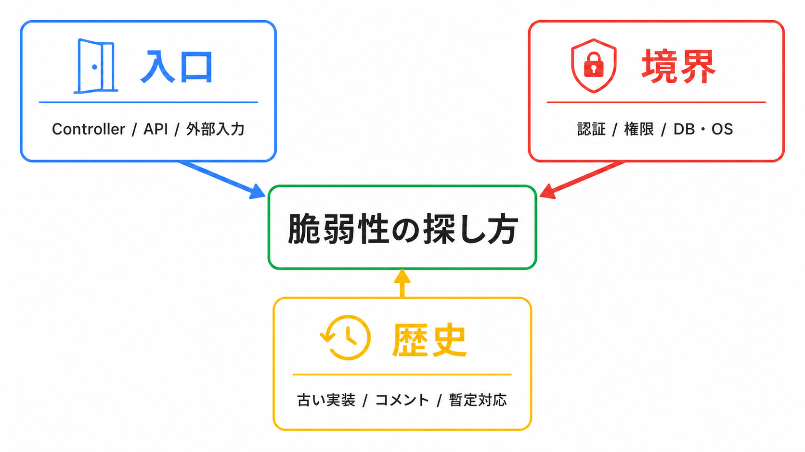

<script>
/* PowerPoint-style auto-shrink: iteratively reduce a slide's font size
   until its content stops overflowing. Also keeps the explicit opt-in
   <div class="fit">…</div> wrapper for finer-grained scaling. */
(() => {
  const MIN_FONT_PX = 12;
  const CODE_MIN_FONT_PX = 9;
  const STEP = 0.96;
  const MAX_ITERS = 40;
  const TOLERANCE = 1;
  let scheduled = false;

  const overflows = (el) =>
    el.scrollHeight > el.clientHeight + TOLERANCE ||
    el.scrollWidth  > el.clientWidth  + TOLERANCE;

  const shrinkElement = (el, minFontPx, shouldShrink = () => overflows(el)) => {
    if (!shouldShrink()) return;
    const base = parseFloat(getComputedStyle(el).fontSize) || 18;
    let size = base;
    for (let i = 0; i < MAX_ITERS && shouldShrink() && size > minFontPx; i++) {
      size *= STEP;
      el.style.fontSize = `${size}px`;
    }
  };

  const shrinkCodeBlocks = (section) => {
    for (const pre of section.querySelectorAll("pre")) {
      shrinkElement(pre, CODE_MIN_FONT_PX, () => overflows(pre) || overflows(section));
    }
  };

  const shrinkSection = (section) => {
    if (section.dataset.autofit === "skip") return;
    shrinkElement(section, MIN_FONT_PX, () => overflows(section));
  };

  const scaleFitBlocks = (root) => {
    for (const fit of root.querySelectorAll(".fit")) {
      if (!fit.scrollHeight) continue;
      const ratio = Math.min(1, fit.clientHeight / fit.scrollHeight);
      fit.style.transformOrigin = "top left";
      fit.style.transform = `scale(${ratio})`;
    }
  };

  const processSection = (section) => {
    if (!section.clientWidth || !section.clientHeight) return;
    scaleFitBlocks(section);
    shrinkCodeBlocks(section);
    shrinkSection(section);
  };

  const processVisibleSections = () => {
    scheduled = false;
    for (const section of document.querySelectorAll("section")) processSection(section);
  };

  const schedule = () => {
    if (scheduled) return;
    scheduled = true;
    requestAnimationFrame(() => requestAnimationFrame(processVisibleSections));
  };

  window.addEventListener("load", schedule);
  window.addEventListener("resize", schedule);
  new MutationObserver(schedule).observe(document.documentElement, {
    subtree: true,
    attributes: true,
    attributeFilter: ["class"],
  });
  schedule();
})();
</script>

<style>
:root { --gdg-university: 'KOMPEITO'; }

/* This is a KOMPEITO internal talk, not a GDG deck. */
section::before,
section.title::before,
section.title::after {
  content: none !important;
  background-image: none !important;
  display: none !important;
  visibility: hidden !important;
  opacity: 0 !important;
  width: 0 !important;
  height: 0 !important;
  padding: 0 !important;
}

section:not(.title):not(.lead):not(.section) {
  justify-content: center;
  padding: 72px 92px 72px;
  font-size: 25px;
}

section.title {
  text-align: center !important;
  align-items: center !important;
  padding: 86px 96px !important;
  background-image: none !important;
}

section.title h1 {
  font-size: 60px !important;
  font-weight: 780 !important;
  line-height: 1.14 !important;
  max-width: 980px !important;
}

section.title p {
  font-size: 24px !important;
  line-height: 1.5 !important;
}

section.split {
  align-content: center;
  align-items: center;
  row-gap: 28px;
}

h1, h2, h3, h4 {
  font-weight: 760;
}

h2 {
  font-size: 42px;
  margin-bottom: 0.55em;
}

h3 {
  font-size: 28px;
  font-weight: 720;
}

li {
  margin: 0.28em 0;
}

pre {
  font-size: 0.9em;
}

.mini {
  font-size: 0.76em;
  opacity: 0.78;
}

.cards {
  display: grid;
  grid-template-columns: repeat(3, 1fr);
  gap: 20px;
  margin-top: 28px;
}

.card {
  border: 3px solid var(--gdg-blue);
  border-radius: 20px;
  padding: 28px;
  min-height: 220px;
  background: #fff;
}

.card.red { border-color: var(--gdg-red); }
.card.yellow { border-color: var(--gdg-yellow); }
.card.green { border-color: var(--gdg-green); }

.card h3 {
  margin: 0 0 12px;
  font-size: 1.35em;
}

.flow {
  display: flex;
  align-items: stretch;
  justify-content: space-between;
  gap: 14px;
  margin-top: 28px;
}

.flow .box {
  flex: 1;
  border: 3px solid var(--gdg-blue);
  border-radius: 18px;
  padding: 26px 22px;
  text-align: center;
  background: #fff;
}

.flow .arrow {
  display: flex;
  align-items: center;
  color: var(--gdg-blue);
  font-size: 2.1em;
  font-weight: 800;
}

.matrix {
  display: grid;
  grid-template-columns: 1fr 1fr;
  gap: 18px;
  margin-top: 20px;
}

.matrix .cell {
  border-left: 10px solid var(--gdg-blue);
  border-radius: 14px;
  padding: 24px 26px;
  background: #f8fbff;
}

.matrix .cell.red { border-color: var(--gdg-red); background: #fff8f7; }
.matrix .cell.yellow { border-color: var(--gdg-yellow); background: #fffdf3; }
.matrix .cell.green { border-color: var(--gdg-green); background: #f6fff9; }

.codepath {
  font-family: ui-monospace, SFMono-Regular, Menlo, Monaco, Consolas, monospace;
  font-size: 0.78em;
}

.profile {
  width: 420px;
  border-radius: 32px;
  border: 6px solid var(--gdg-yellow);
  display: block;
  margin: 0 auto;
}

.big-role {
  font-size: 96px;
  font-weight: 850;
  line-height: 1.05;
}

.big-role-sub {
  font-size: 38px;
  margin-top: 24px;
}
</style>

<!-- _class: title -->
<!-- _paginate: false -->

# PHP5.6・Zend Framework製サービスから学ぶ、<br>既存サービスの脆弱性の探し方

株式会社KOMPEITO 社内登壇  
2026/08/06  
田中博悠 / tanahiro2010 / サブカル性癖博士

---

<!-- _class: split -->

## 自己紹介

- 田中博悠 / tanahiro2010 / サブカル性癖博士
- 株式会社KOMPEITO  
  システム開発グループ インターン
- GDG Greater Kwansai
- 趣味: 読書 / バンジージャンプ / プログラミング
- 最近: 一緒にバンジー飛んでくれる人を探してます


---

<!-- _class: lead -->

<div class="big-role">Security Researcher</div>

<div class="big-role-sub">っぽいこともしています</div>

---

## TL;DR

実際に見つけた脆弱性の種類

<div class="cards">

<div class="card red">

### SQLi

入力がSQLに届くまでの経路を追う

</div>

<div class="card yellow">

### RCE

任意コード実行につながる問題

</div>

<div class="card green">

### 認証バイパス

入口と権限のズレを見る

</div>

</div>

<p class="mini">※ 公開資料にするため、実サービス名・再現手順・具体パラメータは扱いません</p>

今日は攻撃手法ではなく、見つけ方に絞って話します

---

<!-- _class: lead -->

# 今、脆弱性って<br>どう探していますか？

レビュー？ 診断ツール？ 勘？ ログ？ 怪しいコードを読む？

---

<!-- _class: split -->

## 私はまず、3つを見ます



- **入口**  
  Controller / API / 外部入力
- **境界**  
  認証 / 権限 / DB・OSコマンド
- **歴史**  
  古い実装 / コメント / 暫定対応

---

<!-- _class: section yellow -->

# 02. Controller継承を見る

---

## MVCの入口はControllerに集まりやすいです

<div class="flow">

<div class="box">

### Request

ユーザー / API / 管理画面

</div>

<div class="arrow">→</div>

<div class="box">

### Controller

認証・権限の前提

</div>

<div class="arrow">→</div>

<div class="box">

### Service / DB

重要な処理

</div>

</div>

<p class="mini">PHP5.6 + Zend Framework のようなMVC構成では、ここが探索の起点になります</p>

---

## 継承元には「前提」が埋まりやすいです

<div class="matrix">

<div class="cell green">

### AdminController

管理者であることを前提にした処理

</div>

<div class="cell">

### MemberController

ログイン済みユーザーを前提にした処理

</div>

<div class="cell yellow">

### UserController

登録すれば通れる入口

</div>

<div class="cell red">

### BaseController

認証なしでも動く可能性がある入口

</div>

</div>

---

## 探すのは「前提のズレ」です

<div class="flow">

<div class="box">

### ゆるい入口

誰でも通れる  
登録だけで通れる

</div>

<div class="arrow">→</div>

<div class="box" style="border-color:var(--gdg-red);">

### 重要な処理

決済 / 個人情報 / 管理操作

</div>

</div>

<p class="mini">人を責める話ではなく、構造としてズレが起きやすい場所を見に行く話です</p>

---

## Controllerで見るチェックポイント

- API Controllerの継承元を一覧します
- 認証なし / ゆるい認証のControllerを見つけます
- その子クラスが重要処理に到達しないか確認します
- テスト用・暫定用の分岐が残っていないか見ます
- 「本番では無効」のつもりが、本当に無効か確認します

<p class="mini">例: 開発用ショートカットやデバッグ分岐が、本番で有効になっていないか、など</p>

---

<!-- _class: section green -->

# 03. スキャナで候補を増やす

---

## php-vuln-scanner

未完成だけど、KOMPEITO向けに育てているOSSスキャナ

```bash
pipx run --spec https://github.com/tanahiro2010/php-vuln-scanner.git \
  php-vuln-scanner <target_path>
```

- 検出結果は「答え」ではなく「調査開始地点」です
- 過検知もあります
- 単一ファイルで見える範囲を中心に見ます
- PR歓迎です

---

## 出力をAIに渡すなら、丸投げしない

```bash
pipx run --spec https://github.com/tanahiro2010/php-vuln-scanner.git \
  php-vuln-scanner <target_path> > security.txt
```

- `security.txt` をそのまま渡すだけだと、ざっと見で終わりがちです
- 人間が「見る観点」を先に渡します
- AIには依存関係の確認・見落としチェックを手伝ってもらいます

---

## 古いファイルは「危険」ではなく「歴史」です

長く動いているサービスには、コメント・命名・実装・実際の利用状況のズレが蓄積します

<div class="matrix">

<div class="cell yellow">

### コメント

「この関数は未使用」  
でも現役で使われている

</div>

<div class="cell red">

### 暫定対応

テスト用・一時対応の分岐が残る

</div>

<div class="cell">

### 認証前提

昔の入口を前提にした処理が残る

</div>

<div class="cell green">

### 古い関数

今の設計と合わない処理が残る

</div>

</div>

---

## Gitのログで優先度をつけます

```bash
git log --pretty=format:'%ad %h' --date=short -- path/to/file.php
```

- 更新が古いファイルをいくつか選びます
- 行数が多いファイルは、重要そうな関数から肉眼で見ます
- 依存関係が深いところはAIにも手伝ってもらいます
- 最後はUnitTestや再現手順で確認します

<p class="mini">「古い = 危険」ではなく、「仕様と実装がズレているかもしれない」です</p>

---

## AIに渡すプロンプト例

```text
<path> と、その依存関係を調査してください
このファイルは最終更新が古く、現在の認証・権限モデルと
ズレている可能性があります

外部入力が DB / ファイル / OSコマンド / eval 系処理に
到達する経路がないか確認してください
```

<p class="mini">ファイル全部を雑に投げるより、観点を絞った方が検出率が上がります</p>

---

## デモ用リポジトリ

意図的に脆弱な学習用プロジェクトです  
本番環境に置かないでください

```bash
git clone git@github.com:tanahiro2010/php-vuln.git
```

<p class="mini">SQLi講義の資料・環境を使い回しているため、今回使わないファイルも含まれています</p>

---

## スキャナを実行します

```bash
pipx run --spec https://github.com/tanahiro2010/php-vuln-scanner.git \
  php-vuln-scanner ./php-vuln/sandbox/sqli-training-site-php
```

期待する流れ

1. いくつかの候補ファイルが出ます
2. ファイルパスを見に行きます
3. 外部入力がSQLへ届く経路を追います
4. SQL Injectionが成立する箇所を確認します

---

## 今日1時間だけやるなら

1. Controller継承を一覧します
2. 認証がゆるい入口から重要処理に行けないか見ます
3. 古いファイルを数個選びます
4. コメント・実装・現仕様のズレを見ます
5. スキャナやAIで候補を増やします
6. 最後はテストで確認します

---

<!-- _class: lead -->

# Thanks for Listening!

聞いてくれてありがとう
