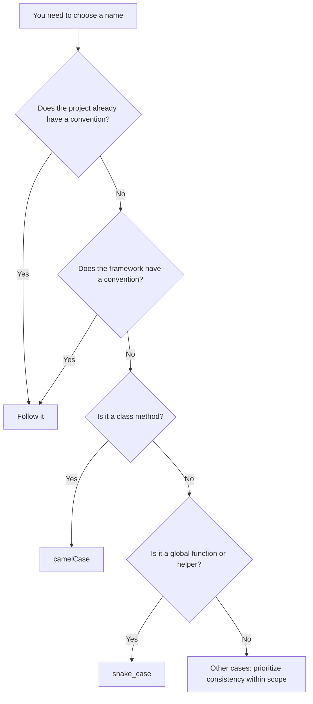

# Why PHP Uses snake_case Functions but camelCase Methods

Built-in functions are usually snake_case.
Modern framework code is usually camelCase.

That is PHP: a language where naming conventions can feel oddly split.

So which naming convention is actually "correct" in PHP?

I'm tanahiro2010, and this is one of those small-but-persistent questions that keeps coming back whenever I write PHP.

Let me say this up front: this article is not about declaring either camelCase or snake_case the one true style. Instead, it looks at why PHP's naming conventions appear to differ by layer, traces that split through PHP's history, and offers a practical way to decide how to name things in your own code.

While writing this, I tried not to rely only on memory or second-hand explanations. Where possible, I checked primary sources such as the official PHP manual, the PHP-FIG website, and the PEAR manual. For historical details I could not fully verify, especially around early PHP-FIG membership and some framework-specific context, I explicitly mark them as unconfirmed or inferential.

> **A note on terminology**
> This article includes a few terms that may be unfamiliar if you are new to PHP or web development. When that happens, I add a short explanation in a blockquote like this. You can skip these blocks if you already know the terms; the main argument should still be readable without them.

## Have you seen code like this?

When writing PHP, you often run into functions like these:

```php
str_replace($search, $replace, $subject);
array_map($callback, $items);
json_encode($payload);
file_get_contents($path);
```

As you can see, these names use `snake_case`: words connected with underscores.

But modern PHP code, especially framework-based code, often looks more like this:

```php
$request->getParsedBody();
$response->getStatusCode();
$userRepository->findById($id);
```

This time, the names use `camelCase`: words joined together, with later words starting with uppercase letters.

Inside the same language, PHP, two very different-looking styles coexist. This article traces where that split came from.

## Table of Contents

1. The conclusion first
2. Why PHP built-in functions look like snake_case
3. PHP 3 and the spread of function-based web programming
4. PEAR: shared conventions before PSR
5. PHP 5 and the rise of OOP PHP
6. Framework culture in the late 2000s
7. A side note on Symfony helpers
8. PHP-FIG and PSR
9. What PSR-1 says, and what it does not say
10. Why naming still hurts
11. Practical guidelines for modern PHP
12. Summary

## 1. The conclusion first

Before getting into the history, here is the conclusion of this article:

- Regular functions, including global functions, helper functions, and procedural APIs: `snake_case`
- Class methods: `camelCase`

After looking through PHP's history, this feels like the most natural compromise to me.

That said, this is not an absolute law. Always prioritize the following when they apply:

- If an existing project already has a convention, follow it.
- If your framework has a convention, such as Laravel, Symfony, or WordPress, follow it.
- If you are naming a public API, preserving backward compatibility matters more than stylistic purity.

> **What is PSR?**
> PSR stands for PHP Standard Recommendation. PSRs are standards created by PHP-FIG, a group that defines coding styles and shared interfaces for the PHP ecosystem. PSR-1 and PSR-12 are examples. PSRs are not part of the PHP language specification itself; they are community standards.

One important premise: PHP does not enforce naming style at the syntax level. Whether you write names in `snake_case`, `camelCase`, or something else, the PHP interpreter will usually run the code just fine. In other words, PHP lets you write code that works even if it ignores naming conventions. This becomes important later when we talk about why naming still causes pain.

So why does "functions use snake_case, methods use camelCase" feel natural in PHP? Let's go back to 1995.

## 2. Why PHP built-in functions look like snake_case

### PHP did not begin as a carefully designed language

PHP began as a small set of CGI binaries written by Rasmus Lerdorf in 1994 to track visits to his online resume. It was called "Personal Home Page Tools" or "PHP Tools". The source code was released in June 1995 ([PHP: History of PHP - Manual](https://www.php.net/manual/en/history.php.php)).

> **What is CGI?**
> CGI stands for Common Gateway Interface. It is a mechanism that lets a web server call an external program and return the program's output to the browser. In the 1990s, CGI programs written in languages like Perl were a common way to generate dynamic web pages. PHP started in this world as a set of C-based executables.

In September 1995, PHP evolved into "FI" or "Forms Interpreter". In April 1996, the two were combined as "PHP/FI". Then in 1997, Andi Gutmans and Zeev Suraski, who were in Tel Aviv at the time, rewrote the parser and worked with Rasmus Lerdorf to create a new language. In June 1998, PHP 3 was released as the official successor to PHP/FI 2.0. The name also changed to the recursive acronym "PHP: Hypertext Preprocessor" ([PHP: History of PHP - Manual](https://www.php.net/manual/en/history.php.php)).

In other words, PHP was not born from the sequence "design a complete language specification, then implement it." It grew from practical personal tools into a language because people needed it. Nobody was designing API naming conventions in anticipation of a massive global ecosystem thirty years later. That is the first point to keep in mind.

### A function culture grew from there

Useful web development features, such as string handling, array operations, file operations, and database access, were added as functions.

Many functions that still exist in PHP today are part of that lineage:

```php
str_replace();
array_map();
json_encode();
file_get_contents();
mb_strlen();
mysqli_connect();
array_filter();
preg_match();
htmlspecialchars();
```

As you can see, many of them use `snake_case`.

### A technical note: why snake_case was likely natural

PHP's implementation is written in C. The core runtime is called the Zend Engine.

> **What is the Zend Engine?**
> The Zend Engine is the internal engine that parses and executes PHP code. It was developed by Andi Gutmans and Zeev Suraski and has been the execution foundation of PHP since PHP 3.

In C and its standard library ecosystem, function names are traditionally lowercase and often use underscores, although not always. Examples include names such as `strcpy`, `memcpy`, and `time`. Many early PHP built-in functions were thin wrappers around C functions or C libraries, so it is reasonable to think that C naming culture influenced PHP's function names.

I do not mean this as a claim that every PHP function directly follows C naming rules. I have not exhaustively verified that. It is better understood as a general tendency.

### But it is not completely consistent

If the story ended here, we might say "PHP built-ins are all snake_case." But that would not be accurate. Standard classes in PHP often have camelCase or PascalCase-style method names:

```php
$reflectionClass->getName();
$reflectionMethod->getParameters();
$dateTime->setTimezone($timezone);
```

> **What is Reflection?**
> `ReflectionClass` and `ReflectionMethod` are part of PHP's built-in Reflection API. Reflection lets a program inspect information about classes, methods, parameters, modifiers, and more at runtime. Frameworks and testing tools often use it internally.

So we need to distinguish between "global function culture" and "standard class/method culture". That difference connects directly to the later spread of object-oriented PHP.

> **What is OOP?**
> OOP stands for object-oriented programming. It is a way of designing programs around classes, where data and behavior are grouped together as properties and methods. The idea that "class methods use camelCase" comes up repeatedly later in this article.

The PHP manual also has a page called [Userland Naming Guide](https://www.php.net/manual/en/userlandnaming.rules.php). It states that function names should use underscores between words, and that both camelCase and PascalCase appear in class names. It also names `strpos()` as an example of an old naming mistake because it does not follow the recommended extension prefix rule.

So if PHP naming feels inconsistent, you are not imagining it. The official manual itself acknowledges historical inconsistency.

My summary for this section is: PHP's built-in functions look snake_case not because of a perfectly planned language design, but because early PHP grew out of practical C-based implementation culture.

## 3. PHP 3 and the spread of function-based web programming

PHP 3 was released in June 1998 as the official successor to PHP/FI. Around this point, PHP development expanded from a personal project into a broader multi-person effort. Features were added rapidly through extension modules.

> **What is an extension module?**
> An extension adds functionality to PHP itself. For example, the `curl` extension provides HTTP communication through the cURL library, and the `mysqli` extension provides MySQL access. Many PHP built-in functions are grouped by extensions like these.

During this period, practical web development needs such as database access, form handling, and session management drove PHP's growth. Functions were added as needed. There was not yet a strong centralized process for reviewing naming consistency. Functionality and usefulness came first; naming consistency came later, if at all.

### Once a name is public, changing it is hard

Once a function name is public and widely used, it becomes difficult to change. This is a backward compatibility problem.

> **What is backward compatibility?**
> Backward compatibility, often abbreviated BC, means code written for an older version of software keeps working in newer versions. Renaming or removing a function can break every existing codebase that uses it, so many languages and frameworks treat public API names as something that should not be changed casually.

PHP's old `mysql_*` functions, such as `mysql_query`, are a good example. They went through deprecation and were eventually removed, but that took a long time. This illustrates how hard it is to change names and APIs after they become widely used. I am keeping this example at a high level here because I did not fully verify the detailed year-by-year timeline for this article.

### Naming is not decided by philosophy alone

So far, we can see that naming depends on several axes:

| Axis | Example |
| --- | --- |
| When it was created | Pre-2000 PHP built-ins vs post-PSR code |
| Who created it | Rasmus Lerdorf individually vs a group such as PHP-FIG |
| Which culture it came from | C-style function culture vs OOP framework culture |
| Whether compatibility can be broken | Global functions with huge compatibility cost vs new framework APIs |
| Which API layer it belongs to | Built-in language functions vs userland classes |

It is easy to say PHP naming is inconsistent because the design philosophy was inconsistent. But in practice, PHP's naming style is the result of several historical layers overlapping.

## 4. PEAR: shared conventions before PSR

### What is PEAR?

Before PSR, PHP already had shared coding conventions. They came from PEAR.

> **What is PEAR?**
> PEAR stands for PHP Extension and Application Repository. It is a repository and package distribution system for reusable PHP libraries.

One fact-checking note: in an earlier draft, I wrote that PEAR was released in December 2002. After checking multiple sources, I found that PEAR was started around 1999 by Stig Bakken. It is said to have grown out of discussions at the PHP Developers' Meeting in Tel Aviv in January 2000. I could not find a primary source confirming the 2002 date, so this article treats PEAR as a project that began around 1999. I have not pinned down the exact founding date or release timeline.

### PEAR naming conventions

PEAR had clear naming conventions more than a decade before PSR ([PEAR Manual: Naming Conventions](https://pear.php.net/manual/en/standards.naming.php)).

| Target | Rule | Example |
| --- | --- | --- |
| Class names | Initial uppercase, hierarchy expressed with underscores | `Log`, `Net_Finger`, `HTML_Upload_Error` |
| Method names | Lowercase first word, then studly caps | `connect()`, `getData()`, `buildSomeWidget()` |
| Global functions | Package name prefix, then studly caps | `XML_RPC_serializeData()` |
| Constants | Uppercase with underscores | `DB_DATASOURCENAME`, `SERVICES_AMAZON_S3_LICENSEKEY` |

The interesting part is that PEAR recommended a camel-like style even for global functions. So the simple story "PHP functions have always been snake_case" is not quite true. Even before PSR, there was already a separate naming culture inside the PHP community that differed from PHP built-in function style.

### PEAR class names as pseudo-namespaces

Class names such as `Net_Finger` and `HTML_Upload_Error` may look strange today, but they had a technical reason.

> **What is a namespace?**
> A namespace is a way to prevent name collisions by giving classes and functions a kind of address. PHP introduced the `namespace` keyword in PHP 5.3 in 2009. Before that, PHP did not have native namespaces.

In the PEAR era, PHP did not have namespaces, so libraries avoided class-name collisions by encoding hierarchy in the class name itself: package name, underscore, class name. Today you might write `Net\Finger`; back then, `Net_Finger` served a similar purpose through naming convention alone.

### What this section tells us

The important point is that the "built-in function layer" and the "library distribution layer" belonged to different cultures.

Also, my conclusion in this article, "regular functions use snake_case", does not come from PEAR. PEAR actually recommended camel-like global function names. My conclusion comes from PHP's built-in function culture and practical modern PHP context, not directly from PEAR.

## 5. PHP 5 and the rise of OOP PHP

### What Zend Engine 2.0 changed

PHP 5 was released in July 2004. It introduced Zend Engine 2.0 and a new object model ([PHP: History of PHP - Manual](https://www.php.net/manual/en/history.php.php)). The biggest technical change was how objects behaved.

- In PHP 4, passing or assigning objects could internally copy them.
- In PHP 5, objects were handled through handles, closer to references in many object-oriented languages.
- Access modifiers such as `private`, `protected`, and `public` were introduced.
- `interface` and `abstract class` were introduced.
- Magic methods such as `__construct` and `__destruct` were clarified.

> **What are magic methods?**
> Magic methods are special methods that begin with two underscores, such as `__construct()`. PHP calls them automatically at specific moments, such as when an object is created.

These changes made PHP a language where serious class design became practical. This became the foundation for object-oriented PHP culture.

### From calling functions to writing methods

The look of PHP code also started changing around this period.

```php
// PHP 4-ish: calling functions
array_map($callback, $items);
json_encode($payload);
```

```php
// PHP 5 and later: writing methods
$request->getParsedBody();
$response->getStatusCode();
```

Method names such as `getParsedBody()`, `getStatusCode()`, `findById()`, `setCreatedAt()`, `hasPermission()`, and `isPublished()` became common. The `get` / `set` / `is` / `has` patterns are common not only in PHP, but also in many object-oriented programming communities.

PHP 5 is where PHP really started to develop a culture of thinking about names at the method level.

## 6. Framework culture in the late 2000s

### Frameworks that adopted camelCase methods

After PHP 5, frameworks and libraries such as CakePHP, Symfony, Zend Framework, Doctrine, and CodeIgniter appeared and grew.

Here is a rough summary of their method naming tendencies, based on what I was able to check. This is not an exhaustive verification of every version or module.

| Project | Type | Method naming tendency | General character |
| --- | --- | --- | --- |
| CakePHP | Full-stack framework | camelCase | Convention-over-configuration MVC framework |
| Symfony | Full-stack framework | camelCase | OOP-oriented components and framework |
| Zend Framework | Framework / library collection | camelCase | Enterprise-oriented design |
| Doctrine | ORM library | camelCase | Maps database tables to objects |
| CodeIgniter | Lightweight framework | More snake_case-oriented | Simplicity closer to procedural PHP |

<a id="glossary-orm"></a>
> **What is an ORM?**
> ORM stands for Object-Relational Mapping. It maps database tables to program objects. Doctrine is one of the best-known ORM libraries in PHP.

As this table suggests, many major frameworks except CodeIgniter leaned toward camelCase method names. CodeIgniter is an important counterexample: not everything in that era was camelCase. It kept a style closer to procedural PHP and PHP's built-in function culture. I could not fully verify an official primary-source statement for that design intent, so I am treating it as a broad tendency rather than a definitive claim.

### From here on, some of this is circumstantial

Next comes the question: why did PSR-1 choose camelCase for methods?

To be honest, I could not find a primary source that directly explains the reasoning behind that choice. So from here, I am presenting a hypothesis based on circumstantial evidence.

### Hypothesis: camelCase culture was already widespread

My hypothesis is this:

PSR-1 did not introduce camelCase to PHP from nowhere. Instead, it formalized and stabilized a camelCase culture that had already spread through object-oriented PHP frameworks by the late 2000s.

To support that hypothesis, we need to look at PHP-FIG.

## 7. A side note on Symfony helpers

Symfony 1.x code and documentation reveal an interesting detail. In the Symfony 1.x coding standards, class names and variable names were generally expected to use UpperCamelCase, also called PascalCase, but there were two exceptions: core classes prefixed with lowercase `sf`, such as `sfController` and `sfRequest`, and template variables, which used underscore-separated notation ([Symfony 1.4 legacy documentation: Exploring Symfony's Code](https://symfony.com/legacy/doc/gentle-introduction/1_4/en/02-Exploring-Symfony-s-Code)).

I want to be careful here. In an earlier draft, I had written a more specific anecdote: that the Symfony documentation explained helper functions were not camelCase because helpers were functions, and therefore followed PHP core functions. When I rechecked primary sources, I could not confirm that specific Q&A-style explanation. What I did find was the documented rule about underscore notation for template variables.

So I will avoid stating that helper explanation as fact.

Still, the verified fact is useful: Symfony 1.x mostly used camelCase/PascalCase conventions for classes and variables, while some areas followed different conventions. This shows that two cultures coexisted even within the same framework:

- a procedural, PHP-built-in-function-like culture
- an OOP framework, camelCase-oriented culture

That coexistence supports the way this article separates functions and methods.

## 8. PHP-FIG and PSR

### What is PHP-FIG?

The group behind PSRs is PHP-FIG.

> **What is PHP-FIG?**
> PHP-FIG stands for PHP Framework Interop Group. It is a group created by PHP framework developers to improve interoperability across the PHP ecosystem.

According to the official PHP-FIG FAQ, the group was formed in 2009 at the php|tek conference by several framework developers. It started with around five members and later grew through a voting process to include more than twenty member projects ([PHP-FIG FAQ](https://www.php-fig.org/faqs/)).

> **What is php|tek?**
> php|tek is a conference for the PHP community.

Here is another fact-checking note. In an earlier draft, I listed specific founding members and associated projects, such as Matthew Weier O'Phinney for Zend Framework, Fabien Potencier for Symfony, Paul M. Jones for Solar/Aura, Jonathan Wage for Doctrine, and Nate Abele for Lithium. However, I could not find a primary source on the PHP-FIG website that explicitly identifies the original five people.

After additional research, I found a retrospective explanation by a participant on the early `php.standards` mailing list. It says that the group that became PHP-FIG included representatives from projects such as Agavi, CakePHP, PEAR, Phing, Solar, Symfony, and Zend Framework.

Combining that information with individual profiles and project histories, such as official Zend/Laminas pages and interviews, gives us this rough argument:

1. People associated with early PHP-FIG were involved in these projects.
2. Many of those projects already leaned toward camelCase method names.
3. Therefore, the early PHP-FIG ecosystem was already strongly connected to camelCase-oriented OOP PHP culture.

| Person | Project associated at the time | Method naming tendency |
| --- | --- | --- |
| Matthew Weier O'Phinney | Zend Framework | camelCase |
| Paul M. Jones | Solar | camelCase |
| Nate Abele | CakePHP at the time, later Lithium | camelCase |
| Fabien Potencier | Symfony | camelCase |
| Representative names not fully confirmed | PEAR / Phing / Agavi | PEAR recommended camel-like global functions; Phing and Agavi not verified here |

Two cautions:

First, this is not a definitive mapping of the original five founding members in 2009. It is a combination of early project names and people known to be associated with them.

Second, I removed the Jonathan Wage / Doctrine pairing from the table because I could not verify it from primary sources during this research.

Even with those cautions, the evidence I could confirm still supports the idea that early PHP-FIG was surrounded by projects where camelCase methods were already common.

### Interoperability was the keyword

PHP-FIG's goal was interoperability.

> **What is interoperability?**
> Interoperability is the ability of different software systems to work together. In PHP-FIG's context, it means code written for one framework should be easier to combine with code from another framework.

The goal was to make shared PHP code, cross-framework libraries, and reusable components easier to mix together. One of the first topics PHP-FIG worked on was coding style, which later became PSR-1 and PSR-12.

PHP-FIG has produced many standards beyond naming and formatting. PSR-3 defines a logging interface, PSR-4 defines an autoloading standard, and PSR-7 defines common HTTP message interfaces. PHP-FIG is not only about coding style; it is about interoperability across the PHP ecosystem.

## 9. What PSR-1 says, and what it does not say

### The purpose of PSR-1

PSR-1, formally called "Basic Coding Standard", describes its purpose like this ([PSR-1: Basic Coding Standard](https://www.php-fig.org/psr/psr-1/)):

> This section of the standard comprises what should be considered the standard coding elements that are required to ensure a high level of technical interoperability between shared PHP code.

In other words, PSR-1 defines basic coding elements needed for shared PHP code to interoperate well.

### What PSR-1 defines

PSR-1 defines the following naming conventions:

| Target | Rule |
| --- | --- |
| Class names | `StudlyCaps` |
| Class constants | `UPPER_CASE_WITH_UNDERSCORES` |
| Method names | `camelCase()` |

> **What is StudlyCaps?**
> StudlyCaps means writing words together with each word starting with an uppercase letter. It is roughly equivalent to what many people call PascalCase, for example `HttpClient`.

For property names, PSR-1 does not require one specific convention. It says `$StudlyCaps`, `$camelCase`, and `$under_score` are all acceptable, but whichever convention is used should be applied consistently within a reasonable scope.

PSR-12, "Extended Coding Style", adds more detailed rules for indentation, line breaks, class and method declarations, control structures, and so on. But it does not add a new rule such as "variables must be camelCase."

### What PSR-1 does not define

This distinction is the most important point for this article. PSR-1 does not define naming rules for:

- regular global functions
- variable names
- existing PHP built-in functions

So the claim "Because PSR exists, PHP functions should be camelCase" does not follow from PSR-1 itself.

### Why built-in functions do not look like PSR

The reason is simple: many built-in functions existed long before PSR. Renaming them now would break backward compatibility. Also, PSR-1 was never meant to impose naming rules on PHP's built-in functions.

### Why PSR does not look like built-in functions

This part cannot be proven definitively from the sources I found. But based on the evidence from sections 6, 7, and 8, I think the most natural reading is:

PSR-1 did not invent camelCase from scratch. It formalized the camelCase method culture already common in userland OOP frameworks at the time.

As a side note, PSR-1 has a Meta Document that lists Paul M. Jones as an editor ([PSR-1 Meta Document](https://www.php-fig.org/psr/psr-1/meta/)). According to Paul M. Jones's own blog post from June 4, 2012, PSR-1 and PSR-2 were accepted by vote, with PSR-1 passing 17 to 0 ([Paul M. Jones: PHP-FIG: PSR-1 and PSR-2 Accepted](https://paul-m-jones.com/post/2012/06/04/php-fig-psr-1-and-2-accepted/)).

In an earlier draft, I wrote that PSR-1 was released on June 5, 2012. The primary source I confirmed is the June 4, 2012 blog report, and I could not confirm the exact vote closing date. So this article uses the more cautious phrasing "accepted in early June 2012." It is also more accurate to say "PHP-FIG created PSR-1, and Paul M. Jones was one of its editors" than to say simply "Paul M. Jones created PSR-1."

## 10. Why naming still hurts

PHP does not enforce naming conventions at the syntax level. Variables, functions, and methods can be snake_case, camelCase, PascalCase, or something else, and PHP will usually run the code.

This has both benefits and costs.

- Benefit: Beginners can start writing PHP without worrying about naming rules, which lowers the learning barrier.
- Cost: Once code is written by a team, naming inconsistencies become visible in code review and hurt readability.

Personally, I have often been confused by code whose naming style was mixed, especially code written without knowledge of PHP's history or PSR, including code I wrote myself in the past.

I do not think this means the original author was bad. It is a consequence of PHP itself: you can write working code without knowing the conventions.

That is why it helps to know the history and then decide what your own project should do.

## 11. Practical guidelines for modern PHP

Based on the history above, here are the factors I would consider in real projects:

- PHP built-in function culture
- OOP culture
- PSR rules
- project consistency
- framework conventions
- public API compatibility

### Common arguments from both sides

In practice, this debate usually produces arguments like these. Both sides have reasonable points. This article is not trying to prove one style superior to the other.

| Camp | Common argument |
| --- | --- |
| snake_case | Matches PHP built-in functions; word boundaries are visually clear; less worry about uppercase/lowercase typos |
| camelCase | Matches PSR-1 for methods; aligns with OOP culture in Java, JavaScript, C#, and others; fits major framework conventions |

My position is that we can reconcile both sides by separating the layer: inside classes or outside classes.

Here is the concrete recommendation:

- Use `snake_case` for global functions, helper functions, and procedural APIs.
  - Reason: This aligns with PHP's built-in function culture and keeps procedural code visually consistent with the standard library.
- Use `camelCase` for class methods.
  - Reason: This follows OOP PHP culture and PSR-1.
- For properties and variables, PSR-1 does not prescribe one rule, so prioritize consistency within the relevant scope.

And again, always prioritize these rules when they apply:

- If a project already consistently uses snake_case methods, follow that project.
- Respect the conventions of the surrounding ecosystem, such as Laravel, Symfony, or WordPress.
- For public APIs, preserving backward compatibility comes first.

### Before and after

Suppose you have a class with mixed naming:

```php
// Before: inconsistent method names
class UserRepository
{
    public function find_by_id($id) { /* ... */ }
    public function GetAll() { /* ... */ }
    public function delete_user($id) { /* ... */ }
}
```

Applying this article's guideline, class methods become camelCase:

```php
// After: methods unified as camelCase
class UserRepository
{
    public function findById($id) { /* ... */ }
    public function getAll() { /* ... */ }
    public function deleteUser($id) { /* ... */ }
}
```

But helper functions outside a class remain snake_case:

```php
// Plain helper functions outside classes stay snake_case
function format_currency($amount) { /* ... */ }
```

The practical rule is: separate by whether the name belongs inside a class or outside one.

Here is the decision flow:



These conventions can also be checked mechanically instead of relying only on human review.

> **What is static analysis?**
> Static analysis means analyzing source code without running it, usually to detect possible bugs, type issues, or style violations. In PHP, PHPStan is one of the most widely used static analysis tools.

Tools such as PHP_CodeSniffer, which can detect and automatically fix coding style violations, and PHPStan, which performs static analysis, can help teams enforce PSR-1/PSR-12 and other style rules consistently.

## 12. Summary

To summarize:

- PHP naming conventions are not one single unified system.
- PHP built-in function culture, PEAR/library culture, OOP framework culture, and PSR culture exist as historical layers.
- Looking at that history, "functions use snake_case, methods use camelCase" feels like a natural practical guideline.
- But it is not an absolute rule. Existing project conventions, framework conventions, and backward compatibility always come first.

I was never especially good at history classes in school, but researching PHP's history was genuinely fun. If this article made you a little more curious, I would be happy. And if it makes you want to dig into the later history of PSR-2 to PSR-12, or the changes brought by PHP 7 and PHP 8, that would be even better.

## References

- [PHP: History of PHP - Manual](https://www.php.net/manual/en/history.php.php)
- [PHP-FIG: PSR-1 Basic Coding Standard](https://www.php-fig.org/psr/psr-1/)
- [PHP-FIG: PSR-1 Meta Document](https://www.php-fig.org/psr/psr-1/meta/)
- [PHP-FIG: Frequently Asked Questions](https://www.php-fig.org/faqs/)
- [PHP-FIG: Personnel](https://www.php-fig.org/personnel/)
- [PEAR Manual: Naming Conventions](https://pear.php.net/manual/en/standards.naming.php)
- [PHP Manual: Userland Naming Guide](https://www.php.net/manual/en/userlandnaming.rules.php)
- [Symfony 1.4 legacy documentation: Exploring Symfony's Code](https://symfony.com/legacy/doc/gentle-introduction/1_4/en/02-Exploring-Symfony-s-Code)
- [Paul M. Jones: PHP-FIG: PSR-1 and PSR-2 Accepted (2012-06-04)](https://paul-m-jones.com/post/2012/06/04/php-fig-psr-1-and-2-accepted/)
- [php.standards mailing list: Re: The How and the Why of this group as I remember it.](https://news-web.php.net/php.standards/30)
