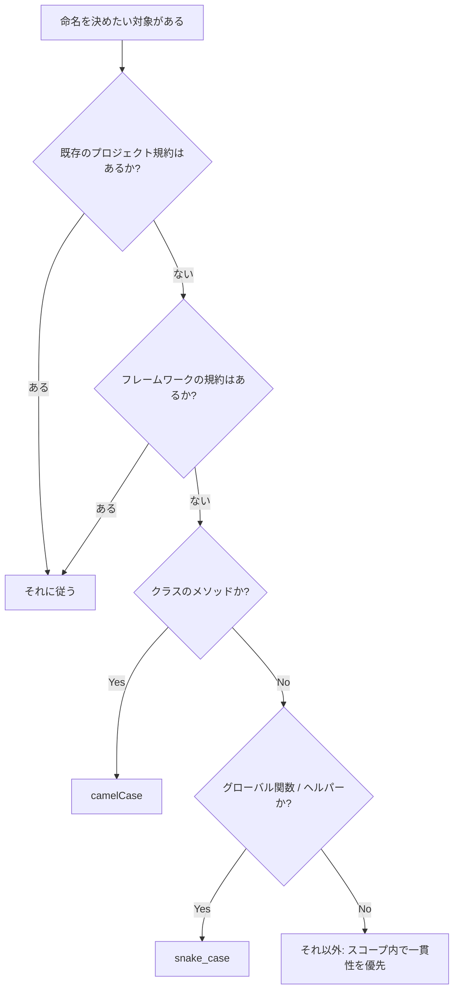

# PHPの命名規則、結局camelCaseとsnake_caseどっちなんだ

標準実装されてる関数はスネークケース。
最近のモダンな実装はキャメルケース。
こんな、あやふやな命名規則の言語――PHP。

果たして、PHPの命名規則はどちらが正しいのでしょうか？

PHPを書きながら、この手の命名規則でちょくちょく悶えているtanahiro2010です。

先に言っておくと、この記事は「camelCase派とsnake_case派、どっちが正義か」を決める記事ではありません。PHPの命名規則がなぜ層ごとに分かれて見えるのか、その理由を歴史から辿って、明日から自分のコードでどう命名するかを考える材料を持ち帰ってもらうための記事です。

執筆にあたって、自分の記憶や又聞きだけに頼らず、できる範囲で一次資料（PHP公式マニュアル、PHP-FIG公式サイト、PEARマニュアルなど）にあたってファクトチェックをしています。ただし、歴史の細部（特にPHP-FIGの創設メンバーの氏名や、当時の一部フレームワークの内部事情）については一次資料が見つけきれなかった部分もあり、その場合は「確認できていません」「推測です」とはっきり書くようにしています。

> **この記事で使う言葉について**
> 記事の途中で、PHPやWeb開発に詳しくない人には馴染みが薄いかもしれない単語が出てきます。そうした単語は都度、こういう引用ブロックで簡単に補足します。読み飛ばしても記事の大筋は追えるようにしているので、知っている単語のブロックは飛ばしてもらって大丈夫です。

## こんなコード、見たことないですか？

PHPを書いていると、こういう関数によく出会います。

```php
str_replace($search, $replace, $subject);
array_map($callback, $items);
json_encode($payload);
file_get_contents($path);
```

見ての通り、単語をアンダースコアでつなぐ `snake_case` です。

でも、最近のコード――特にフレームワークを使ったコード――は、こう見えたりもします。

```php
$request->getParsedBody();
$response->getStatusCode();
$userRepository->findById($id);
```

今度は、単語の先頭を大文字にしてつなげる `camelCase` です。

同じ「PHP」という言語の中に、見た目のまったく違う2つの書き方が同居しています。この「見た目の分裂」がどこから来たのかを、この記事では歴史から辿っていきます。

## 目次

1. 先に結論
2. PHP標準関数はなぜsnake_caseっぽく見えるのか
3. PHP 3で広がる関数ベースのWeb言語
4. PSR以前のPEARという共通規約
5. PHP 5でOOP PHPが強くなる
6. 2000年代後半のフレームワーク文化
7. Symfony helperの余談
8. PHP-FIGとPSR
9. PSR-1が言うこと、言わないこと
10. それでも命名で悶える
11. 現代の実装判断
12. まとめ

## 1. 先に結論

歴史の話を始める前に、この記事の結論を先に出しておきます。

- 普通の関数（グローバル関数・ヘルパー関数・手続き的なAPI）は `snake_case`
- クラスのメソッドは `camelCase`

これが、PHPの歴史をたどった上で自然に見える落としどころだと考えています。ただし、これは「絶対にこうすべき」というルールではありません。次の条件がある場合は、そちらを優先してください。

- 既存プロジェクトにすでに規約がある場合は、それに従う
- 使っているフレームワーク（Laravel、Symfony、WordPressなど）に規約がある場合は、それに従う
- 公開APIの命名は、後方互換性を壊さないことを最優先する

> **PSRとは**
> PHP-FIGという団体が策定している、PHPのコーディングスタイルや共通インターフェースに関する規約群の総称です。「PSR-1」「PSR-12」のように番号が振られています。後で詳しく説明しますが、PSRはPHP本体の言語仕様（構文や実行時の挙動）ではなく、あくまでPHPコミュニティ内の「共通ルール」です。

ここで一つ、地味に重要な前提を置いておきます。PHPは、変数名や関数名の書き方を構文として強制しません。`snake_case`で書こうが`camelCase`で書こうが、PHPの処理系（インタプリタ）はエラーを出さずに実行してしまいます。つまり「命名規則を守らなくても動くコードが書けてしまう」というのがPHPの性質です。この性質が、後半で話す「それでも命名で悶える」という話に効いてきます。

それでは、なぜ「関数はsnake_case、メソッドはcamelCase」が自然に見えるのか、PHPの歴史を1995年まで遡って見ていきます。

## 2. PHP標準関数はなぜsnake_caseっぽく見えるのか

### PHPは「言語」として設計されて始まったわけではない

PHPの始まりは、Rasmus Lerdorf氏が1994年に書いた、自分のオンライン履歴書へのアクセスを追跡するための小さなCGIバイナリ群でした。名前は「Personal Home Page Tools（PHP Tools）」。1995年6月にこのソースコードが公開されています（[PHP: History of PHP - Manual](https://www.php.net/manual/en/history.php.php)）。

> **CGIとは**
> Common Gateway Interfaceの略で、Webサーバーが外部のプログラムを呼び出してその実行結果をブラウザに返す仕組みのことです。1990年代のWebでは、Perlなどで書かれたCGIプログラムがWebページを動的に生成するための主流の手段でした。PHPも、もとはこの仕組みの上で動くCの実行ファイル群として始まっています。

その後1995年9月に「FI（Forms Interpreter）」として発展し、1996年4月に両者を組み合わせた「PHP/FI」という名前になります。そして1997年、Andi Gutmans氏とZeev Suraski氏（当時イスラエル・テルアビブ在住）がパーサー（構文解析器）を全面的に書き直し、Rasmus Lerdorf氏と協力して新しい言語を作り上げ、1998年6月にPHP/FI 2.0の正式な後継として発表されたのが「PHP 3」です。ここで名前も「PHP: Hypertext Preprocessor」という再帰的頭字語に変わりました（[PHP: History of PHP - Manual](https://www.php.net/manual/en/history.php.php)）。

つまりPHPは、最初から「言語仕様をきちんと設計してから実装する」という順番で生まれた言語ではなく、「個人用の便利ツール群が、必要に迫られて言語に育っていった」という経緯を持っています。「30年後に世界中で使われる巨大なエコシステムになることを想定して、API命名規則を整えていた」わけではない、というのがまず押さえておきたいポイントです。

### ここで関数文化が育つ

Web開発で便利な処理――文字列処理、配列操作、ファイル操作、DB接続など――が、どんどん関数として追加されていきました。今のPHPにも残っている `str_replace`, `array_map`, `json_encode`, `file_get_contents`, `mb_strlen`, `mysqli_connect`, `array_filter`, `preg_match`, `htmlspecialchars` といった関数群は、こうした「実用に応じて増えていった関数ベースのAPI」の延長線上にあります。見ての通り、単語をアンダースコアでつなぐ `snake_case` が多く見られます。

### 技術的な補足: なぜsnake_caseになりやすいのか

PHPの内部実装（言語処理系そのもの）はC言語で書かれています。処理系の中核は「Zend Engine」と呼ばれています。

> **Zend Engineとは**
> PHPのソースコードを解釈して実行する、PHP本体の内部エンジンのことです。Andi Gutmans氏とZeev Suraski氏によって開発され、PHP 3以降のPHPの実行基盤になっています。私たちが書くPHPのコードは、最終的にこのZend Engineによって処理されます。

C言語の標準ライブラリ（`libc`など）の関数名は、伝統的に小文字とアンダースコアで書かれることが多いです（例: `strcpy`, `memcpy`, `time`）。PHPの初期の組み込み関数の多くは、こうしたCの関数やライブラリを薄くラップする形で作られたため、Cの命名文化がそのまま持ち込まれた側面があると考えられます。ただし、これは「PHPの全関数がCの命名規則にそのまま従っている」と断言できるほど網羅的に検証したわけではないので、あくまで一般的な傾向として捉えてください。

### 完全に統一されているわけではない

ここまでの話だけを見ると「PHP標準関数 = 全部snake_case」と思われるかもしれませんが、それは正確ではありません。標準で用意されているクラスのメソッドには、camelCase/PascalCase系の名前も普通にあります。

```php
$reflectionClass->getName();
$reflectionMethod->getParameters();
$dateTime->setTimezone($timezone);
```

> **Reflectionとは**
> `ReflectionClass`や`ReflectionMethod`は、PHPに標準で組み込まれている「Reflection API」というしくみの一部です。実行中のクラスやメソッドの情報（名前、引数、修飾子など）をプログラムから調べるための機能で、フレームワークやテストツールの内部でよく使われています。

つまり「グローバル関数の文化」と「標準クラス・メソッドの文化」は分けて見る必要があります。この違いは、後の章で話すOOP文化の話につながっていきます。

> **OOP（オブジェクト指向プログラミング）とは**
> データ（プロパティ）とその操作（メソッド）を「クラス」という単位にまとめて設計するプログラミングの考え方です。「クラスのメソッドはcamelCase」という話がこの後何度も出てくるので、先にこの言葉を押さえておきます。PHPでこの考え方が本格的に広まっていく経緯は、5章で詳しく扱います。

さらに、PHP公式マニュアルには「[Userland Naming Guide](https://www.php.net/manual/en/userlandnaming.rules.php)」というページがあり、関数名は単語間にアンダースコアを使うこと、クラス名はcamelCaseとPascalCaseの両方が使われていることが明記されています。面白いのは、このページの中で `strpos()` という関数名が、拡張機能のプレフィックスを付けるという命名規則に従っていない「過去の命名ミスの例」として名指しされている点です。本来なら他の拡張関数のようにプレフィックスが付くべきところ、そうなっていない、ということですね。PHPを書いていて命名に一貫性のなさを感じるのは、気のせいではなく、公式マニュアル自身がそれを認めているわけです。

この章のまとめとして、「PHP標準関数がsnake_caseに見えるのは、緻密な言語設計の結果というより、C言語ベースの実装文化がそのまま持ち込まれた結果に近い」という見立てを置いておきます。

## 3. PHP 3で広がる関数ベースのWeb言語

PHP 3は、1998年6月にPHP/FIの正式な後継としてリリースされました。ここから開発体制も個人開発から複数人の体制へと広がり、拡張モジュールという形でどんどん機能が追加されていきます。

> **拡張（モジュール）とは**
> PHP本体に機能を追加するための仕組みです。例えば `curl` 拡張はcURLライブラリを使ったHTTP通信機能を、`mysqli` 拡張はMySQLへの接続機能を提供します。PHPの標準関数の多くは、こうした拡張ごとにまとめて追加されてきました。

この時期、Web開発の実用上の要求（DB接続、フォーム処理、セッション管理など）に応じて関数がどんどん追加されていきました。当時、命名の一貫性をレビューするような統制の仕組みはまだ存在していません。「機能拡張と実用が先、命名の一貫性は後回し」という状態だったと考えられます。

### 一度公開された名前は、あとから変えにくい

一度公開されて広く使われるようになった関数名は、簡単には変更できません。これは「後方互換性（BC）」という考え方に関わります。

> **後方互換性（Backward Compatibility, BC）とは**
> 新しいバージョンのソフトウェアでも、古いバージョン向けに書かれたコードがそのまま動き続けることを指します。関数名を変えたり削除したりすると、その関数を使っている既存のコードがすべて動かなくなってしまうため、多くの言語やフレームワークで「一度公開したAPIの名前は簡単に変えない」という原則が重視されます。

実際、PHPでは古くからあった `mysql_*` 系関数（例: `mysql_query`）が非推奨化を経て最終的に削除されるまで、長い年月がかかりました。命名や設計を後から変えるのがいかに大変か、という実例の一つとして挙げられます（この経緯の詳細な年表は本記事では検証しきれていないため、大まかな傾向として紹介するに留めます）。

### 命名は「設計思想」だけでは決まらない

ここまでの話を整理すると、ある関数やメソッドの命名は、次のような軸によって変わってくることが見えてきます。

| 軸 | 例 |
| --- | --- |
| いつ作られたか | 2000年以前のPHP標準関数 vs PSR以降のコード |
| 誰が作ったか | Rasmus Lerdorf氏個人 vs PHP-FIGのような団体 |
| どの文化圏か | C言語の関数文化 vs OOPフレームワークの文化 |
| 互換性を壊せるか | グローバル関数（維持コスト大） vs 新規フレームワークのAPI（維持コスト小） |
| どの層のAPIか | 言語組み込み関数 vs ユーザーランドのクラス |

「PHPの命名規則がバラバラなのは、設計思想が一貫していないから」と片付けてしまうのは簡単ですが、実際にはこうした複数の軸が絡み合った結果として、今のPHPの命名の見た目ができあがっている、と捉えるとしっくりきます。

## 4. PSR以前のPEARという共通規約

### PEARとは何か

PHPには、PSRより前から共通のコーディング規約がありました。それが「PEAR」です。

> **PEARとは**
> PHP Extension and Application Repositoryの略で、PHP向けの共有ライブラリを配布するためのリポジトリ／パッケージ管理システムです。

ここで一つ、当初のdraftにあった情報をファクトチェックした結果を共有します。draftの段階では「PEARは2002年12月にリリースされた」としていましたが、複数の資料を確認したところ、PEARはStig Bakken氏によって1999年ごろに立ち上げられたプロジェクトであることがわかりました。PHP開発者の集まりである「PHP Developers' Meeting」（2000年1月、テルアビブ）での議論から生まれたとされています。2002年という日付の一次資料は見つからなかったため、本記事では「1999年前後に始まったプロジェクト」として扱います（正確な創設日・バージョンごとのリリース日は、記事執筆時点で一次資料を確定しきれていません）。

### PEARの命名規約

PEARには、PSRより10年以上前から、はっきりとした命名規約がありました（[PEAR Manual: Naming Conventions](https://pear.php.net/manual/en/standards.naming.php)）。

| 対象 | 規則 | 例 |
| --- | --- | --- |
| クラス名 | 先頭大文字、階層はアンダースコアで表現 | `Log`, `Net_Finger`, `HTML_Upload_Error` |
| メソッド名 | 先頭小文字のcamel系（studly caps） | `connect()`, `getData()`, `buildSomeWidget()` |
| グローバル関数 | パッケージ名を先頭に付けたcamel系 | `XML_RPC_serializeData()` |
| 定数 | 大文字とアンダースコア | `DB_DATASOURCENAME`, `SERVICES_AMAZON_S3_LICENSEKEY` |

面白いのは、PEAR規約ではグローバル関数についても「studly caps」、つまりcamel系の命名を推奨していた点です。「PHPの関数は昔からsnake_caseで決まっていた」という単純な図式ではなく、この時点ですでに「PHP標準関数のsnake_case文化」とは別系統の命名文化がPHPコミュニティ内に存在していたことになります。

### PEARのクラス名が「疑似名前空間」だった話

`Net_Finger` や `HTML_Upload_Error` のような、アンダースコアで区切られたクラス名を見ると、今の感覚では少し奇妙に見えるかもしれません。これには技術的な背景があります。

> **名前空間（namespace）とは**
> 同じ名前のクラスや関数が別々のライブラリで定義されていても衝突しないようにする、名前の「住所」のような仕組みです。PHPに`namespace`というキーワードが導入されたのはPHP 5.3（2009年）からで、それ以前のPHPにはこの仕組みがありませんでした。

PEARが活躍していた時代のPHPには名前空間がなかったため、クラス名の衝突を避ける手段として、`Net_Finger`のように「パッケージ名 + アンダースコア + クラス名」という命名で疑似的に階層を表現していました。今であれば `Net\Finger` と書くところを、当時は命名規則だけでその役割を代替していた、というわけです。

### この章の整理

この章で押さえておきたいのは、「標準関数の層」と「ライブラリ配布の層」がそもそも別の文化圏だった、という点です。そして、この記事の結論（「普通の関数はsnake_case」）は、PEAR規約から導かれたものではありません。PEARはむしろグローバル関数もcamel系を推奨していたので、結論の根拠にはしていません。あくまでPHP標準関数の文化と、現代のPHPコミュニティの実務的な文脈から出している結論だということを、ここではっきりさせておきます。

## 5. PHP 5でOOP PHPが強くなる

### Zend Engine 2.0がもたらした変化

PHP 5は2004年7月にリリースされ、「Zend Engine 2.0」という新しいエンジンと新しいオブジェクトモデルを導入しました（[PHP: History of PHP - Manual](https://www.php.net/manual/en/history.php.php)）。技術的に大きかったのは、オブジェクトの扱われ方の変更です。

- PHP 4まではオブジェクトを関数に渡したり変数に代入したりすると、内部的にコピーが発生していました
- PHP 5からはオブジェクトが「ハンドル（参照）」として扱われるようになり、他の多くのオブジェクト指向言語に近い挙動になりました
- `private` / `protected` / `public` といったアクセス修飾子が導入されました
- `interface`（インターフェース）や `abstract class`（抽象クラス）が導入されました
- `__construct` / `__destruct` などのマジックメソッドが整理されました

> **マジックメソッドとは**
> `__construct()`のように、先頭に`__`（アンダースコア2つ）が付く特別なメソッドのことです。PHPの言語機能によって特定のタイミング（インスタンス生成時など）で自動的に呼び出される、という特殊な役割を持っています。

これらの変更によって、PHPは「まともにクラス設計ができる言語」になりました。これが、2章で触れたOOP（オブジェクト指向プログラミング）文化がPHPで本格的に育っていく土台になります。PHP 5以降、この考え方に基づいたコードがPHPコミュニティで急速に広まっていきました。

### 関数を呼ぶPHPから、メソッドを書くPHPへ

コードの見た目もこの時期から変わっていきます。

```php
// PHP 4的な、関数を呼ぶPHP
array_map($callback, $items);
json_encode($payload);
```

```php
// PHP 5以降で広まる、メソッドを書くPHP
$request->getParsedBody();
$response->getStatusCode();
```

メソッド名の例をもう少し挙げると、`getParsedBody()`, `getStatusCode()`, `findById()`, `setCreatedAt()`, `hasPermission()`, `isPublished()` のように、`get`/`set`/`is`/`has`といった接頭辞を使ったcamelCaseの命名パターンが広まっていきます。この「get/set/is/has」で始めるメソッド名の付け方は、PHPに限らず他の多くのオブジェクト指向言語のコミュニティでも一般的に見られる書き方です。

PHP 5によって、はじめて「メソッドという単位で命名を考える文化」がPHPに根付き始めた、というのがこの章の位置づけです。

## 6. 2000年代後半のフレームワーク文化

### camelCaseメソッドを採用したフレームワークたち

PHP 5以降、CakePHP、Symfony、Zend Framework、Doctrine、CodeIgniterといったフレームワークやライブラリが登場し、育っていきます。それぞれのメソッド命名の傾向を大まかに整理すると、次のようになります（あくまで筆者が確認できた範囲での大まかな傾向であり、全バージョン・全モジュールを検証したものではありません）。

| プロジェクト | 系統 | メソッド命名の傾向 | 大まかな性格 |
| --- | --- | --- | --- |
| CakePHP | フルスタックフレームワーク | camelCase | 設定より規約を重視するMVCフレームワーク |
| Symfony | フルスタックフレームワーク | camelCase | 部品（コンポーネント）単位で使えるOOP設計 |
| Zend Framework | フレームワーク／ライブラリ集 | camelCase | エンタープライズ用途を意識した設計 |
| Doctrine（[ORM](#glossary-orm)） | ORMライブラリ | camelCase | DBのテーブルとオブジェクトを対応付ける |
| CodeIgniter | 軽量フレームワーク | snake_case寄り | 手続き的PHPに近い、シンプルさを志向 |

<a id="glossary-orm"></a>
> **ORMとは**
> Object-Relational Mappingの略で、データベースのテーブルとプログラム上のオブジェクト（クラス）を対応付ける技術のことです。Doctrineは、PHPでよく使われるORMライブラリの一つです。

この表を見てわかる通り、CodeIgniter以外の多くのフレームワークがcamelCaseのメソッド命名を採用していました。CodeIgniterは、より手続き的でPHP標準関数に近いスタイルを志向していたとされ、この時代のすべてがcamelCase一色だったわけではない、という反例としても大事な存在です（この傾向についても、公式な設計方針として明記された一次資料までは確認できていません）。

### ここから先は状況証拠であることを明記します

ここから、「なぜPSR-1がcamelCaseを選んだのか」という話に入っていきますが、正直に言うと、「PSR-1がcamelCaseを選んだ理由」を直接説明した一次資料は見つけられませんでした。ここから先は、状況証拠を並べた上での考察であることを、はっきり断っておきます。

### 仮説: すでにcamelCase文化が広がっていたのでは

考えられる仮説はこうです。「PSR-1が新しくcamelCaseをPHPに持ち込んだ」のではなく、「2000年代後半の時点ですでに広がっていたOOP PHPのcamelCase文化を、PSR-1が共通規格として追認・固定した」のではないか、というものです。

この仮説を支える状況証拠として、次の章でPHP-FIGという団体の成り立ちを見ていきます。

## 7. Symfony helperの余談

Symfony 1系のコードやドキュメントを見ると、興味深い事実に気づきます。Symfony 1系のコーディング規約では、基本的にクラス名・変数名はUpperCamelCase（PascalCase）が標準とされていますが、二つの例外があるとされています。一つは`sf`という小文字プレフィックスが付くコアクラス（例: `sfController`, `sfRequest`）、もう一つはテンプレート内で使う変数がアンダースコア区切りの記法を使う、という点です（[Symfony 1.4 legacy documentation: Exploring Symfony's Code](https://symfony.com/legacy/doc/gentle-introduction/1_4/en/02-Exploring-Symfony-s-Code)）。

ここは正直に書いておきますが、draftの段階では「なぜhelper関数だけcamelCaseじゃないのか、という疑問にSymfony公式ドキュメントが答えていて、その理由は「helperは関数だから、PHPのcore functionに合わせた」というものだった」という、より具体的なエピソードとして書かれていました。しかし今回改めて一次資料にあたったところ、この具体的な問答形式の説明を確認することはできませんでした。見つかったのは、「テンプレート内の変数がアンダースコア記法を使う」という規約自体の記述までです。そのため、この「helperは関数だからPHPのcore functionに合わせた」という理由付けについては、公式ドキュメントで確認が取れなかった情報として扱い、断定は避けます。

ただし、確認できた事実（Symfony 1系ではクラス・変数の基本はcamelCase/PascalCaseでありながら、コアクラスやテンプレート変数には別の命名規則が適用されていたこと）だけでも、当時のPHPコミュニティの中に

- PHP標準関数に近い、手続き的・snake_case的な文化
- OOPフレームワークの、camelCase的な文化

という二つの文化が、同じフレームワークの中で共存していたことを示す一つの例にはなっています。この事実は、この記事の結論（「関数はsnake_case、メソッドはcamelCase」という使い分け）の土台となる考え方に近い実例として紹介しておきます。

## 8. PHP-FIGとPSR

### PHP-FIGとは

PSRを策定している団体が「PHP-FIG」です。

> **PHP-FIGとは**
> PHP Framework Interop Groupの略で、PHPのフレームワーク開発者たちが集まって作った団体です。

PHP-FIG公式のFAQによると、この団体は2009年、「php|tek」というカンファレンスの場で、複数のフレームワーク開発者によって立ち上げられました。最初はおよそ5人程度のメンバーから始まり、その後の投票プロセスを経て20以上のメンバープロジェクトを抱える規模に拡大していったとされています（[PHP-FIG FAQ](https://www.php-fig.org/faqs/)）。

> **php|tekとは**
> PHPコミュニティ向けに開催されているカンファレンスの一つです。

ここで一つ、ファクトチェックの結果を共有しておきます。draftの段階では、PHP-FIGの創設メンバー個人名（Matthew Weier O'Phinney氏 = Zend Framework、Fabien Potencier氏 = Symfony、Paul M. Jones氏 = Solar/Aura、Jonathan Wage氏 = Doctrine、Nate Abele氏 = Lithiumという対応表）まで具体的に踏み込んでいましたが、PHP-FIGの公式サイト（FAQ・Personnelページ）だけでは、「最初の5人が具体的に誰だったか」という一次資料での明記は見つけられませんでした。ただし、その後さらに調べたところ、PHP標準規格に関する初期のメーリングリスト（php.standards）に投稿された、当事者による回顧的な説明を見つけることができました。それによると、PHP-FIGの原型となったグループには、Agavi、CakePHP、PEAR、Phing、Solar、Symfony、Zend Frameworkといったプロジェクトの代表者が名を連ねていたとされています。

この情報と、個々の人物のプロフィール（Zend/Laminas公式サイトの紹介文や、各種インタビュー記事）を突き合わせると、次のような三段論法が組み立てられます。

1. PHP-FIGの初期メンバーとして名前が挙がる人物は、当時こういうプロジェクトに関わっていた
2. それらのプロジェクトのメソッド命名は、当時からcamelCase系が主流だった
3. つまり、PHP-FIGの「顔ぶれ」自体が、すでにcamelCase文化の側に大きく偏っていた

| 人物 | 当時関わっていたプロジェクト | メソッド命名の傾向 |
| --- | --- | --- |
| Matthew Weier O'Phinney氏 | Zend Framework | camelCase |
| Paul M. Jones氏 | Solar | camelCase |
| Nate Abele氏 | CakePHP（当時。のちにLithiumにも関わる） | camelCase |
| Fabien Potencier氏 | Symfony | camelCase |
| （代表者名までは未確認） | PEAR / Phing / Agavi | PEARはグローバル関数もcamel系推奨、Phing/Agaviは未確認 |

注意点を2つ置いておきます。1つ目は、これは「2009年設立時点の創設5名の完全な対応表」ではなく、「PHP-FIGの初期の顔ぶれとして名前が挙がるプロジェクトと、それに関わった人物」を突き合わせたものだという点です。2つ目は、Jonathan Wage氏とDoctrineの組み合わせについては、今回の調査では一次資料を確認できなかったため、この表からは外しています。それでも、確認できた範囲だけで見ても「PHP-FIGの初期メンバー周辺は、すでにcamelCase文化のプロジェクトが多数派だった」と言えるだけの材料は揃っている、というのがこの記事の見立てです。

### 相互運用性がキーワード

PHP-FIGが目指したのは「相互運用性」です。

> **相互運用性（Interoperability）とは**
> 異なるソフトウェア同士が、互いにうまく連携・共存できる性質のことです。PHP-FIGの文脈では、「あるフレームワーク向けに書かれたコードが、別のフレームワークとも問題なく混ざって使えるようにする」ことを指します。

共有されるPHPコード、フレームワークをまたいで混ざりやすいコード、ライブラリとして使いやすいコードを増やすことが、PHP-FIG設立の動機だったとされています。この団体が最初に取り組んだテーマの一つが、まさに「コーディングスタイルの統一」であり、それがPSR-1・PSR-12として結実します。

なお、PHP-FIGが策定する規格はPSR-1やPSR-12だけではありません。ロギングのインターフェースを定めるPSR-3、クラスの自動読み込み規約であるPSR-4、HTTPメッセージの共通インターフェースを定めるPSR-7など、多数のPSRが存在します。PHP-FIGは命名規約だけでなく、PHPエコシステム全体の相互運用性を担う団体として活動を続けています。

## 9. PSR-1が言うこと、言わないこと

### PSR-1の目的

PSR-1、正式名称「Basic Coding Standard」は、次のような目的で書かれています（[PSR-1: Basic Coding Standard](https://www.php-fig.org/psr/psr-1/)）。

> This section of the standard comprises what should be considered the standard coding elements that are required to ensure a high level of technical interoperability between shared PHP code.
>
> （このセクションは、共有されるPHPコード間で高い技術的相互運用性を確保するために必要な、標準的なコーディング要素について定めたものです。）

### PSR-1が定めていること

PSR-1が定めている命名規則は、次の通りです。

| 対象 | 規則 |
| --- | --- |
| クラス名 | `StudlyCaps`（`Class names MUST be declared in StudlyCaps.`） |
| クラス定数 | `UPPER_CASE_WITH_UNDERSCORES`（`Class constants MUST be declared in all upper case with underscore separators.`） |
| メソッド名 | `camelCase()`（`Method names MUST be declared in camelCase().`） |

> **StudlyCapsとは**
> 単語の先頭を大文字にしてつなげる書き方のことです。一般に言う「PascalCase」とほぼ同じ意味で使われています（例: `HttpClient`）。

一方でプロパティ名については、PSR-1は特定の規則を推奨していません。「`$StudlyCaps`」「`$camelCase`」「`$under_score`」のどれを使ってもよいが、「妥当な範囲で一貫して使うこと（Whatever naming convention is used SHOULD be applied consistently within a reasonable scope.）」とだけ定めています。

なお、PSR-1をさらに詳細にしたスタイルガイドとして「PSR-12（Extended Coding Style）」があります。PSR-12はインデント、改行、クラスやメソッド宣言、制御構文などのスタイルを細かく定めていますが、「変数名はcamelCaseにする」というような、PSR-1にない新しい命名規則を追加しているわけではありません。

### PSR-1が定めていないこと

ここが、この記事にとって一番大事な線引きです。PSR-1は、次のことについては何も定めていません。

- 普通の（グローバルな）関数名の書き方
- 変数名の書き方
- 既存の標準関数の命名をどうすべきか

つまり「PSRがあるからPHPの関数もcamelCaseにすべき」という主張は、PSR-1の中身を正確に読む限りは成り立ちません。

### なぜ標準関数はPSRっぽくないのか

理由は単純で、PSRより前から大量の標準関数がすでに存在していたからです。今から全部リネームすると後方互換性が壊れますし、そもそもPSR-1は標準関数に従わせることを目的とした規格ではありません。

### なぜPSRは標準関数っぽくないのか

ここは断定はできませんが、6章・7章・8章で見てきた状況証拠を踏まえると、「PSR-1がゼロからcamelCaseを発明したのではなく、当時すでにユーザーランドのOOPフレームワークで広がっていたcamelCase文化を追認・固定した」と見るのが自然そうだ、というのがこの記事の立場です。

余談として、PSR-1にはPSR-1本体とは別に「Meta Document」という背景資料があり、そこでは「Editor（編集者）」としてPaul M. Jones氏の名前が記録されています（[PSR-1 Meta Document](https://www.php-fig.org/psr/psr-1/meta/)）。また、PSR-1・PSR-2はPaul M. Jones氏自身のブログ（2012年6月4日付の記事）によれば、投票の結果として承認されており、PSR-1は賛成17・反対0で可決されたと記録されています（[Paul M. Jones: PHP-FIG: PSR-1 and PSR-2 Accepted](https://paul-m-jones.com/post/2012/06/04/php-fig-psr-1-and-2-accepted/)）。draftの段階では「2012年6月5日にリリース」としていましたが、確認できた一次資料は「2012年6月4日付でのブログ報告」であり、投票が締め切られた正確な日付までは確認できていません。そのため本記事では「2012年6月上旬に承認された」という表現に留めます。「作成者はPaul M. Jones氏」と強く言い切るより、「策定団体はPHP-FIG、Editorの一人がPaul M. Jones氏」という整理の方が正確です。

## 10. それでも命名で悶える

PHPは、命名規則を構文レベルでは何も強制しません。変数名・関数名・メソッド名がsnake_caseだろうがcamelCaseだろうがPascalCaseだろうが、構文エラーにはなりません。PSRに従わなくても、普通に動くコードは書けてしまいます。

これには功罪両方あると思っています。

- 良い面: 初心者でも命名規則を意識せずにすぐ書き始められ、PHPの学習コストの低さにつながっている
- 悩ましい面: チームで書くコードになった途端、命名のブレがコードレビューや可読性の面で顕在化する

正直に言うと、筆者自身も、歴史的な経緯やPSRを知らずに書かれたコード（あるいは過去の自分が書いたコード）を読んで、命名のブレに混乱した経験があります。これは書いた人が悪いという話ではなく、「知らなくても書けてしまう」というPHPそのものの性質が原因だと思っています。

だからこそ、歴史的な経緯を知った上で、「自分たちのプロジェクトではどう判断するか」という実務的な指針が欲しくなります。次の章では、この記事なりの判断基準をまとめます。

## 11. 現代の実装判断

ここまでの歴史を踏まえて、実務でどう判断するかを整理します。判断材料になるのは、次のような要素です。

- 標準関数の文化
- OOPの文化
- PSRの規定
- プロジェクトの一貫性
- フレームワークの規約
- 公開APIの互換性

### 参考: snake_case派とcamelCase派、よくある言い分

実務でこの話をすると、だいたい次のような言い分が出てきます。どちらも一理あり、この記事は「どちらが優れているか」を決めるものではないので、あくまで両論併記として整理しておきます。

| 派閥 | よくある言い分 |
| --- | --- |
| snake_case派 | PHP標準関数と統一感が出る／単語の区切りが視覚的にわかりやすい／大文字小文字の打ち間違いに気を使わなくていい |
| camelCase派 | PSR-1に準拠できる／Java・JavaScript・C#など他言語のOOP文化と統一感が出る／既存の主要フレームワークの流儀に合わせやすい |

この記事の立場は、「クラスの中(メソッド)かクラスの外(関数)か」で層を分けて考えることで、両方の言い分を無理なく両立できる、というものです。

その上での具体的な提案は、こうなります。

- グローバル関数・ヘルパー関数・手続き的APIは `snake_case`
  - 理由: PHP標準関数の文化に寄せると、標準ライブラリや他の手続き的コードとの一貫性が保ちやすいため
- クラスのメソッドは `camelCase`
  - 理由: OOP PHP文化、および現行のPSR-1の規定に沿うため
- プロパティ・変数名は、PSR-1がここを規定していない分、スコープ内での一貫性を優先する

そして、繰り返しになりますが、次の条件がある場合は必ずそちらを優先してください。

- 既にsnake_caseメソッドで統一されているプロジェクトなら、それに合わせる
- Laravel、Symfony、WordPressなど、周辺エコシステムの慣習を尊重する
- 公開APIは後方互換性を壊さないことを最優先する

### Before/After: 実際に手を動かすとこうなる

たとえば、命名がバラバラなクラスがあったとします。

```php
// Before: 命名規則がバラバラ
class UserRepository
{
    public function find_by_id($id) { /* ... */ }
    public function GetAll() { /* ... */ }
    public function delete_user($id) { /* ... */ }
}
```

この記事の判断基準（クラスのメソッドはcamelCase）を当てはめると、こうなります。

```php
// After: メソッドをcamelCaseに統一
class UserRepository
{
    public function findById($id) { /* ... */ }
    public function getAll() { /* ... */ }
    public function deleteUser($id) { /* ... */ }
}
```

一方で、クラスに属さないヘルパー関数は、この記事の基準ではsnake_caseのままにします。

```php
// クラスの外にある単なるヘルパー関数はsnake_caseのまま
function format_currency($amount) { /* ... */ }
```

「クラスの中か外か」で書き分ける、というのがこの記事の提案の実態です。

判断の流れをフローチャートにすると、次のようになります。



なお、こうした命名規則は人間のレビューだけに頼らず、機械的にチェックすることもできます。

> **静的解析とは**
> プログラムを実際に実行せずに、ソースコードを解析して問題点（バグの可能性や、規約違反など）を検出する手法のことです。PHPでは`PHPStan`のようなツールが代表的です。

PHP_CodeSniffer（コーディングスタイルの違反を検出・自動修正できるツール）や、PHPStanのような静的解析ツールを使えば、PSR-1/PSR-12準拠を含めたコーディングスタイルをチームで機械的に統一しやすくなります。

## 12. まとめ

ここまでの内容を整理すると、次のようになります。

- PHPの命名規則は一枚岩ではない
- 標準関数の文化、PEAR/ライブラリ文化、OOPフレームワーク文化、PSRの文化が層として重なっている
- 歴史を辿ると、「関数はsnake_case、メソッドはcamelCase」という判断は自然に見えてくる
- ただしこれは絶対ルールではなく、既存規約・フレームワーク規約・互換性が常に優先される

学校の歴史の授業は正直あまり得意ではないのですが、PHPの歴史を調べるのはとても楽しかったです。少しでも興味を持ってもらえたなら、コメントなどもらえると嬉しいですし、ここから先の歴史（PSR-2からPSR-12への変化や、PHP 7・8での変化など）を自分で調べてもらえたら、もっと嬉しいです。

## 出典・参考資料

- [PHP: History of PHP - Manual](https://www.php.net/manual/en/history.php.php)
- [PHP-FIG: PSR-1 Basic Coding Standard](https://www.php-fig.org/psr/psr-1/)
- [PHP-FIG: PSR-1 Meta Document](https://www.php-fig.org/psr/psr-1/meta/)
- [PHP-FIG: Frequently Asked Questions](https://www.php-fig.org/faqs/)
- [PHP-FIG: Personnel](https://www.php-fig.org/personnel/)
- [PEAR Manual: Naming Conventions](https://pear.php.net/manual/en/standards.naming.php)
- [PHP Manual: Userland Naming Guide](https://www.php.net/manual/en/userlandnaming.rules.php)
- [Symfony 1.4 legacy documentation: Exploring Symfony's Code](https://symfony.com/legacy/doc/gentle-introduction/1_4/en/02-Exploring-Symfony-s-Code)
- [Paul M. Jones: PHP-FIG: PSR-1 and PSR-2 Accepted (2012-06-04)](https://paul-m-jones.com/post/2012/06/04/php-fig-psr-1-and-2-accepted/)
- [php.standards mailing list: Re: The How and the Why of this group as I remember it.](https://news-web.php.net/php.standards/30)