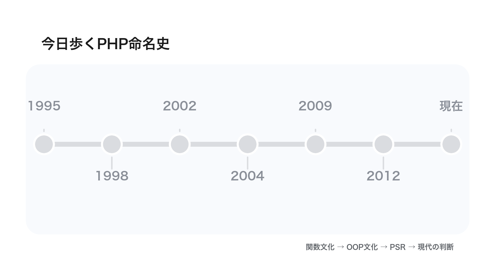
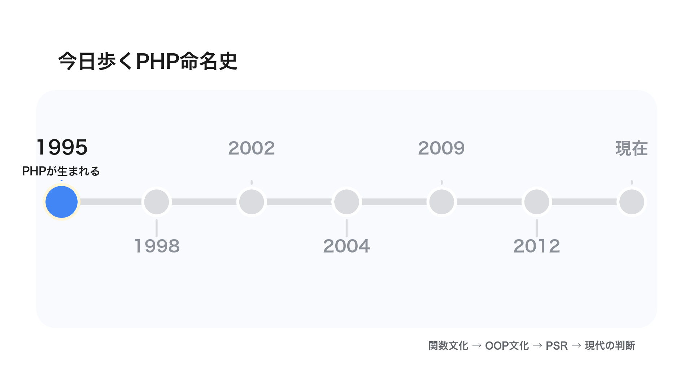
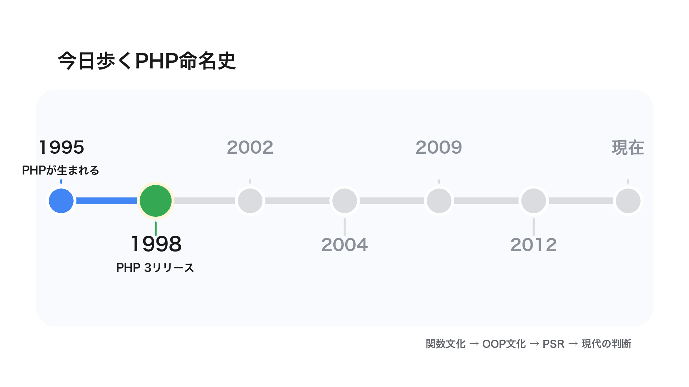
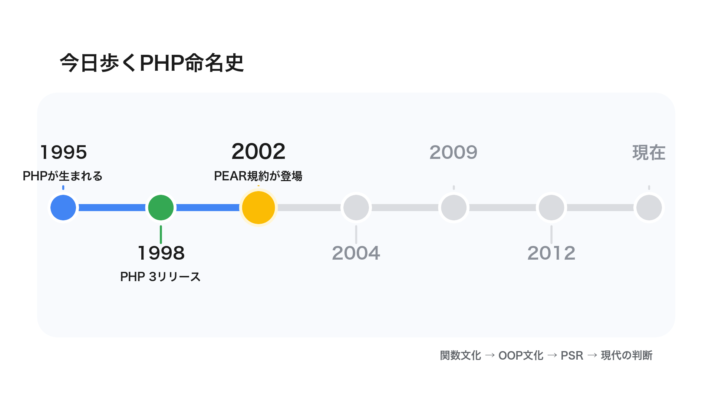
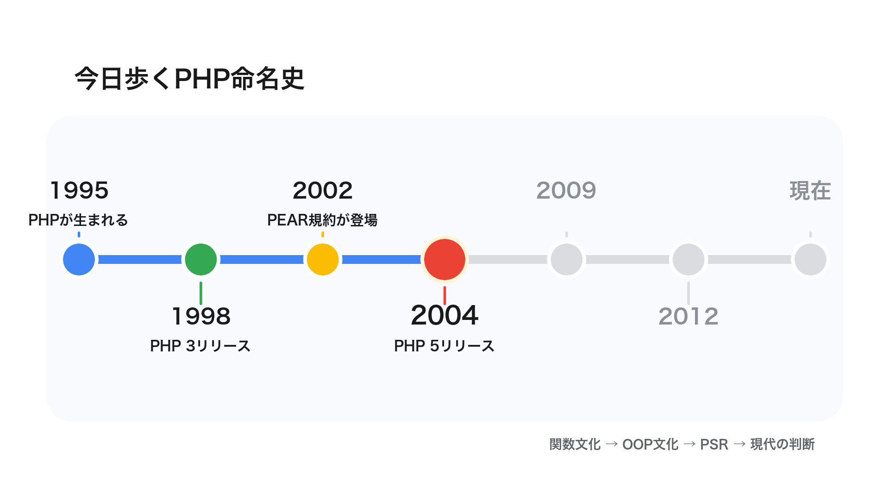
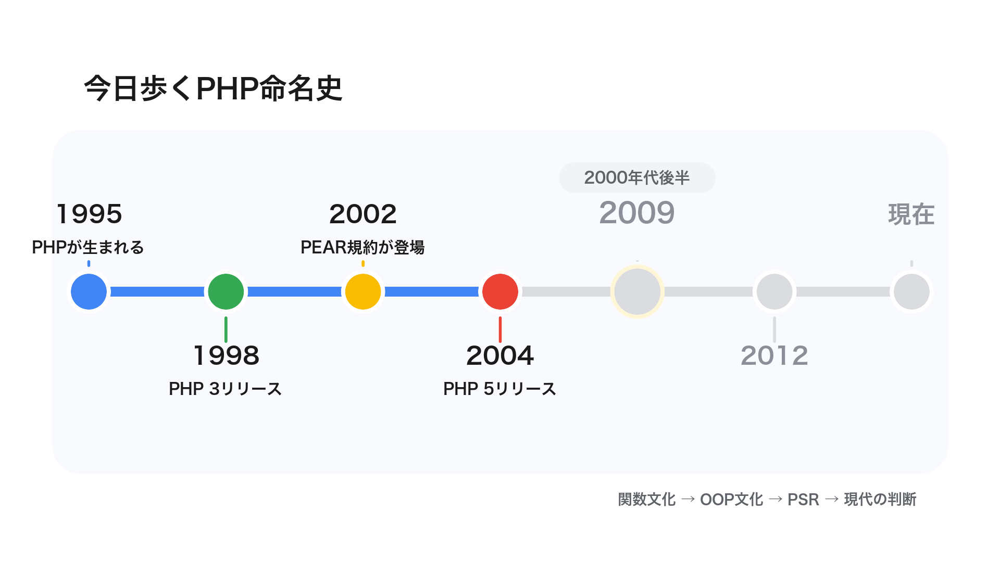
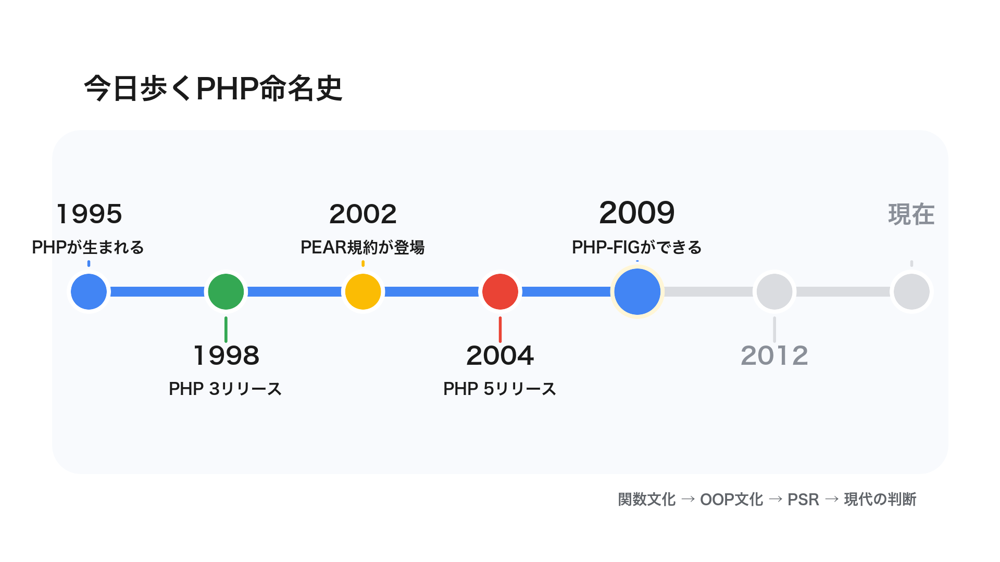
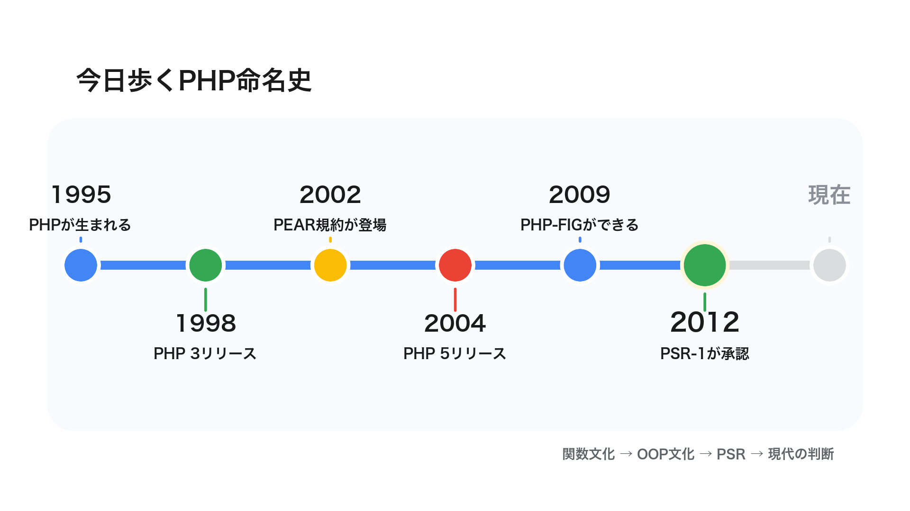
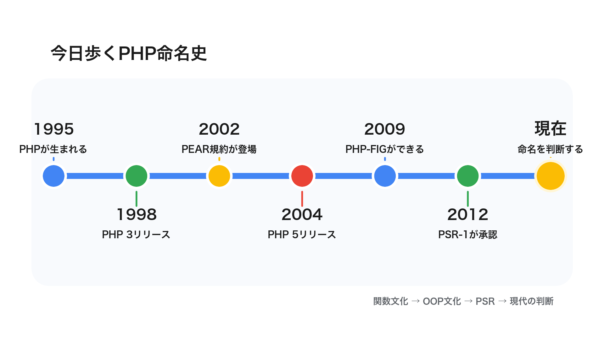
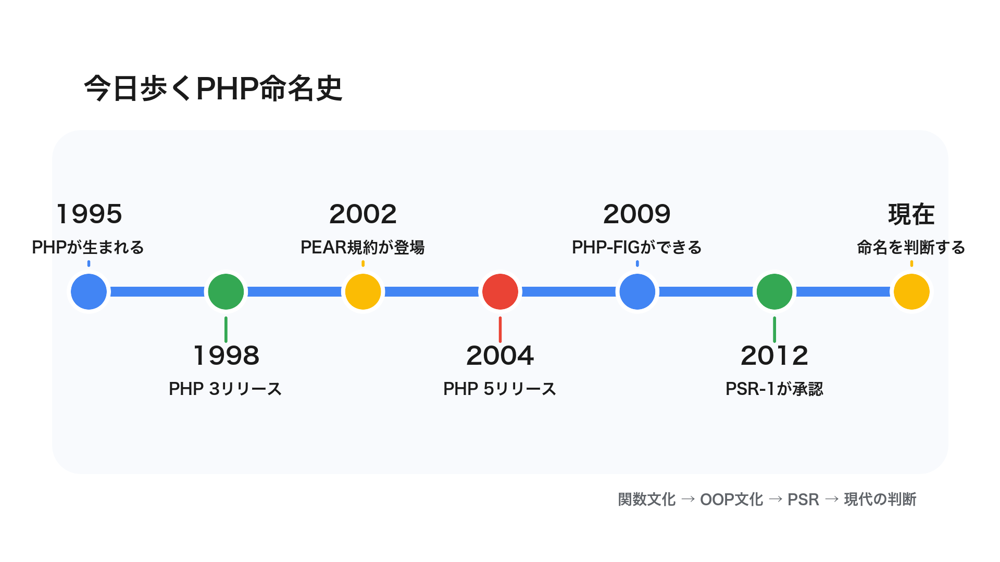

<script>
/* PowerPoint-style auto-shrink: iteratively reduce a slide's font size
   until its content stops overflowing. Also keeps the explicit opt-in
   <div class="fit">…</div> wrapper for finer-grained scaling. */
(() => {
  const MIN_FONT_PX = 12;
  const CODE_MIN_FONT_PX = 9;
  const STEP = 0.96;
  const MAX_ITERS = 40;
  const TOLERANCE = 1;
  let scheduled = false;

  const overflows = (el) =>
    el.scrollHeight > el.clientHeight + TOLERANCE ||
    el.scrollWidth  > el.clientWidth  + TOLERANCE;

  const shrinkElement = (el, minFontPx, shouldShrink = () => overflows(el)) => {
    if (!shouldShrink()) return;
    const base = parseFloat(getComputedStyle(el).fontSize) || 18;
    let size = base;
    for (let i = 0; i < MAX_ITERS && shouldShrink() && size > minFontPx; i++) {
      size *= STEP;
      el.style.fontSize = `${size}px`;
    }
  };

  const shrinkCodeBlocks = (section) => {
    for (const pre of section.querySelectorAll("pre")) {
      shrinkElement(pre, CODE_MIN_FONT_PX, () => overflows(pre) || overflows(section));
    }
  };

  const shrinkSection = (section) => {
    if (section.dataset.autofit === "skip") return;
    shrinkElement(section, MIN_FONT_PX, () => overflows(section));
  };

  const scaleFitBlocks = (root) => {
    for (const fit of root.querySelectorAll(".fit")) {
      if (!fit.scrollHeight) continue;
      const ratio = Math.min(1, fit.clientHeight / fit.scrollHeight);
      fit.style.transformOrigin = "top left";
      fit.style.transform = `scale(${ratio})`;
    }
  };

  const processSection = (section) => {
    if (!section.clientWidth || !section.clientHeight) return;
    scaleFitBlocks(section);
    shrinkCodeBlocks(section);
    shrinkSection(section);
  };

  const processVisibleSections = () => {
    scheduled = false;
    for (const section of document.querySelectorAll("section")) processSection(section);
  };

  const schedule = () => {
    if (scheduled) return;
    scheduled = true;
    requestAnimationFrame(() => requestAnimationFrame(processVisibleSections));
  };

  window.addEventListener("load", schedule);
  window.addEventListener("resize", schedule);
  new MutationObserver(schedule).observe(document.documentElement, {
    subtree: true,
    attributes: true,
    attributeFilter: ["class"],
  });
  schedule();
})();
</script>

<style>
:root { --gdg-university: 'PHP Conference'; }

section {
  letter-spacing: 0;
}

section:not(.title):not(.lead):not(.section):not(.invert):not(.split) {
  padding: 72px 92px !important;
  justify-content: center;
}

section.title {
  text-align: center !important;
  align-items: center !important;
  padding: 88px 96px !important;
}

section.title h1 {
  max-width: 1120px !important;
  font-size: 58px !important;
  line-height: 1.14 !important;
}

section.title p {
  font-size: 24px !important;
}

section.lead h1 {
  font-size: 62px;
  line-height: 1.18;
}

section.lead p {
  font-size: 30px;
  line-height: 1.5;
}

.center {
  display: flex;
  flex-direction: column;
  justify-content: center;
  align-items: center;
  text-align: center;
  gap: 26px;
  min-height: 420px;
}

.big {
  font-size: 54px;
  line-height: 1.25;
  font-weight: 780;
}

.sub {
  font-size: 30px;
  line-height: 1.45;
  color: var(--gdg-muted);
}

.two {
  display: grid;
  grid-template-columns: 1fr 1fr;
  gap: 38px;
  align-items: stretch;
}

.panel {
  border: 4px solid #E8EAED;
  border-radius: 20px;
  background: #fff;
  padding: 34px;
}

.panel.blue { border-color: var(--gdg-blue); }
.panel.green { border-color: var(--gdg-green); }
.panel.red { border-color: var(--gdg-red); }
.panel.yellow { border-color: var(--gdg-yellow); }

.panel h3 {
  margin: 0 0 18px;
  font-size: 34px;
}

.code-big pre {
  font-size: 31px !important;
}

.code-xl pre {
  font-size: 43px !important;
}

img[alt~="timeline"] {
  width: auto;
  max-width: 100%;
  max-height: 430px;
  display: block;
  margin: 0 auto;
  border-radius: 16px;
  object-fit: contain;
}

.tiles {
  display: grid;
  grid-template-columns: repeat(3, 1fr);
  gap: 18px;
}

.tile {
  border-left: 12px solid var(--gdg-blue);
  border-radius: 14px;
  background: #F8FAFD;
  padding: 24px 26px;
  font-size: 30px;
  font-weight: 720;
}

.tile.red { border-color: var(--gdg-red); }
.tile.yellow { border-color: var(--gdg-yellow); }
.tile.green { border-color: var(--gdg-green); }

.mini {
  font-size: 0.72em;
  color: var(--gdg-muted);
}

.flow {
  display: flex;
  gap: 16px;
  align-items: center;
  justify-content: center;
  margin-top: 28px;
}

.flow .box {
  flex: 1;
  min-height: 132px;
  border: 4px solid var(--gdg-blue);
  border-radius: 18px;
  background: #fff;
  padding: 26px 20px;
  display: grid;
  place-items: center;
  text-align: center;
  font-size: 27px;
  font-weight: 720;
}

.flow .arrow {
  color: var(--gdg-blue);
  font-size: 48px;
  font-weight: 900;
}

.decision {
  display: grid;
  grid-template-columns: 1.1fr 0.9fr;
  gap: 28px;
  align-items: center;
}

.code-compare {
  display: grid;
  grid-template-columns: minmax(0, 1fr) 84px minmax(0, 1fr);
  gap: 24px;
  align-items: center;
  margin-top: 30px;
}

.code-card {
  border-radius: 18px;
  background: #fff;
  border: 4px solid #E8EAED;
  padding: 22px;
}

.code-card.blue { border-color: var(--gdg-blue); }
.code-card.green { border-color: var(--gdg-green); }

.code-card h3 {
  font-size: 27px;
  margin: 0 0 14px;
}

.code-card pre {
  font-size: 22px !important;
  margin: 0 !important;
}

.code-compare .big-arrow {
  color: var(--gdg-blue);
  font-size: 62px;
  font-weight: 900;
  text-align: center;
}

.fig-member-table {
  margin-top: 20px;
}

.fig-member-table table {
  width: 100%;
  border-collapse: collapse;
  font-size: 25px;
  line-height: 1.32;
}

.fig-member-table th,
.fig-member-table td {
  border-bottom: 2px solid #E8EAED;
  padding: 15px 18px;
  vertical-align: middle;
}

.fig-member-table th {
  color: #fff;
  font-size: 20px;
  font-weight: 760;
}

.fig-member-table td:first-child {
  width: 45%;
  font-weight: 780;
}

.fig-member-table td:nth-child(2) {
  width: 34%;
  font-weight: 760;
  color: var(--gdg-blue);
}

.fig-member-table td:nth-child(3) {
  color: var(--gdg-muted);
  font-size: 21px;
}

.profile-img {
  width: 430px;
  max-height: 580px;
  object-fit: cover;
  border-radius: 28px;
  border: 6px solid var(--gdg-yellow);
}

.intro {
  display: grid;
  grid-template-columns: 430px minmax(0, 1fr);
  gap: 64px;
  align-items: center;
  min-height: 560px;
}

.intro img {
  width: 430px;
  height: 430px;
  object-fit: cover;
  border-radius: 30px;
  border: 6px solid var(--gdg-yellow);
}

.intro h3 {
  font-size: 38px;
  margin: 0 0 24px;
}

.intro ul {
  font-size: 27px;
  line-height: 1.55;
}

.intro .recent {
  display: block;
  margin-top: 6px;
}
</style>

<!-- _class: title -->
<!-- _paginate: false -->

# PHPの命名規則、結局<br>**camelCase** と **snake_case**<br>どっちなんだ

PHPの歴史から、命名の層を見ていきます

田中博悠 / tanahiro2010

---

## 自己紹介

<div class="intro">


<div>

### 田中博悠 / tanahiro2010

- 三田学園高等学校 1年生
- GDG Greater Kwansai / Alpha+ Project
- 趣味: バンジー / 読書
- 最近:<span class="recent">まだ見ぬスカイダイビングに思いを馳せ中</span>

</div>

</div>

---

## PHPを書いていて思ったこと

<div class="code-xl">

```php
str_replace()
array_map()
json_encode()
file_get_contents()
```

</div>

---

## でも最近のコードはこう見える

<div class="code-big">

```php
$request->getParsedBody();
$response->getStatusCode();
$userRepository->findById($id);
```

</div>

---

<!-- _class: lead -->

# じゃあPHP、<br>どっちなん？

---

## どっちが正しいか、だけでは終われません

<div class="center">

<div class="big">PHPの命名規則が<br>なぜ分かれて見えるのか</div>

<div class="sub">歴史から眺めて、明日からどう命名するかを考えます</div>

</div>

---

## 先に私の結論

<div class="two">

<div class="panel blue">

### 普通の関数

`snake_case` が自然そう

</div>

<div class="panel green">

### メソッド

`camelCase` が自然そう

</div>

</div>

---



---

<!-- _class: section -->

# 1995<br>PHPが生まれる

---



---

## PHPは巨大言語として設計されたわけではない

<div class="tiles">

<div class="tile">Rasmus Lerdorf氏</div>
<div class="tile green">個人用ツール</div>
<div class="tile yellow">Cで書かれたCGI</div>

</div>

<p class="mini">最初から30年後の巨大エコシステムを想定していた、という話ではありません</p>

---

## Personal Home Page Tools

<div class="flow">

<div class="box">オンライン履歴書</div>
<div class="arrow">→</div>
<div class="box">アクセス追跡</div>
<div class="arrow">→</div>
<div class="box">便利なツール群</div>

</div>

---

## ここでまず関数文化が育ちます

<div class="center">

<div class="big">Webで便利な処理を<br>関数として呼び出す</div>

<div class="sub">文字列、配列、ファイル、フォーム、DB</div>

</div>

---

## 標準関数、だいたいsnake_case

<div class="tiles">

<div class="tile">str_replace</div>
<div class="tile green">array_map</div>
<div class="tile yellow">json_encode</div>
<div class="tile red">file_get_contents</div>
<div class="tile">mb_strlen</div>
<div class="tile green">mysqli_connect</div>

</div>

---

## ただし完全には統一されていない

<div class="center">

<div class="big">「PHP標準関数 = すべてsnake_case」<br>ではありません</div>

<div class="sub">でも、関数APIには `snake_case` が多く見える</div>

</div>

---

## 標準機能にもcamelCaseはあります

<div class="code-big">

```php
$reflectionClass->getName();
$reflectionMethod->getParameters();
$dateTime->setTimezone($timezone);
```

</div>

<p class="mini">正確にはグローバル関数ではなく、標準クラスのメソッド側です</p>

---

<!-- _class: section green -->

# 1998<br>PHP 3リリース

---



---

## PHP 3でPHPは今の姿に近づく

<div class="flow">

<div class="box">PHP/FI</div>
<div class="arrow">→</div>
<div class="box">PHP 3</div>
<div class="arrow">→</div>
<div class="box">開発チームと<br>モジュールが広がる</div>

</div>

---

## 拡張される言語、増える関数

- 便利な機能がどんどん追加される
- Web開発で使う処理が関数として増える
- 命名の一貫性だけが主目的ではなかったはず

---

## そして名前は、あとから揃えにくい

<div class="center">

<div class="big">一度広く使われた関数名は<br>簡単には変えられません</div>

<div class="sub">動いているコードを壊さないため、名前も歴史として残っていきます</div>

</div>

---

## 命名は「設計思想」だけでは決まらない

<div class="tiles">

<div class="tile">いつ作られたか</div>
<div class="tile green">誰が作ったか</div>
<div class="tile yellow">どの文化圏か</div>
<div class="tile red">互換性を壊せるか</div>
<div class="tile">使われ方は何か</div>
<div class="tile green">どの層のAPIか</div>

</div>

---

<!-- _class: section yellow -->

# 2002<br>PEAR規約が登場

---



---

## 多分、かなり初期の共通規約...？

<div class="center">

<div class="big">PEAR</div>

<div class="sub">PHP Extension and Application Repository<br>パッケージ配布とライブラリ文化の時代です</div>

</div>

---

## PEARの命名規約

| 対象 | 例 |
| --- | --- |
| クラス | `Net_Finger`, `HTML_Upload_Error` |
| メソッド | `connect()`, `getData()` |
| 定数 | `DB_DATASOURCENAME` |

---

## PEARはちょっと面白い

- クラス名は `_` で階層を表す
- メソッドはcamel系
- グローバル関数もPEAR規約ではcamel系を推奨

<p class="mini">ここで「PHPの歴史、単純じゃないですね」となります</p>

---

## ここで大事なのは「ライブラリの層」

<div class="two">

<div class="panel blue">

### PHP標準関数

言語に最初から近い層

</div>

<div class="panel yellow">

### PEARパッケージ

共有ライブラリの層

</div>

</div>

---

## 命名規則はすでに層で分かれていた

<div class="center">

<div class="big">標準関数<br>ライブラリ<br>クラス / メソッド</div>

<div class="sub">同じPHPでも、見ている層が違います</div>

</div>

---

<!-- _class: section red -->

# 2004<br>PHP 5リリース

---



---

## PHP 5でOOPが本格化します

<div class="tiles">

<div class="tile red">Zend Engine 2.0</div>
<div class="tile">新しい<br>オブジェクトモデル</div>
<div class="tile green">クラスとメソッドを書くPHPへ</div>

</div>

---

## 関数を呼ぶPHPから、メソッドを書くPHPへ

<div class="code-compare">

<div class="code-card blue">

### 関数を呼ぶPHP

```php
array_map($fn, $items);
json_encode($payload);
```

</div>

<div class="big-arrow">→</div>

<div class="code-card green">

### メソッドを書くPHP

```php
$request->getParsedBody();
$response->getStatusCode();
```

</div>

</div>

---

## メソッドにはcamelCaseの居場所があります

<div class="tiles">

<div class="tile">getParsedBody</div>
<div class="tile green">getStatusCode</div>
<div class="tile yellow">findById</div>
<div class="tile red">setCreatedAt</div>
<div class="tile">hasPermission</div>
<div class="tile green">isPublished</div>

</div>

---

<!-- _class: lead -->

# ここで文化が<br>分かれて見えてきます

標準関数の `snake_case`<br>
OOPメソッドの `camelCase`

---

<!-- _class: section -->

# 2000年代後半<br>フレームワーク文化

---



---

## フレームワークがPHPの書き方を育てます

<div class="tiles">

<div class="tile">CakePHP</div>
<div class="tile green">Symfony</div>
<div class="tile yellow">Zend Framework</div>
<div class="tile red">CodeIgniter</div>
<div class="tile">Doctrine</div>
<div class="tile green">Solar / Lithium</div>

</div>

---

## 多くのフレームワークでメソッドはcamelCaseへ

| 周辺 | メソッド命名の印象 |
| --- | --- |
| CakePHP | `camelCase` |
| Symfony | `camelCase` |
| Zend Framework | `camelCase` |
| Doctrine | `camelCase` |
| CodeIgniter | `snake_case` 寄り |

---

## ここは断言しません

<div class="center">

<div class="panel red" style="max-width: 880px;">

一次資料として<br>
**「PSR-1がcamelCaseを選んだ理由」** は<br>
まだ見つけられていません

</div>

<div class="sub">ここからは状況証拠からの考察です</div>

</div>

---

## 仮説: もうみんなcamelCaseだったんじゃね？

<div class="center">

<div class="big">のちの共通規格は<br>突然生まれたわけではないのでは</div>

<div class="sub">ここは状況証拠からの考察です</div>

</div>

---

## Symfony helperの余談

- Symfony 1系では基本的にcamelCase
- でもhelper関数はunderscore形式
- 理由は「helperは関数だから、PHP core functionに合わせた」

---

## 2つの文化はすでに共存していた

<div class="two">

<div class="panel blue">

### 関数文化

PHP標準関数に近い世界

</div>

<div class="panel green">

### OOP文化

フレームワークとメソッドの世界

</div>

</div>

---

<!-- _class: section -->

# 2009<br>PHP-FIGができる

---



---

## PHP-FIGとは

<div class="center">

<div class="big">PHP Framework Interop Group</div>

<div class="sub">フレームワーク開発者たちが<br>相互運用のために集まったグループです</div>

</div>

---

## 相互運用性がキーワード

- 共有されるPHPコード
- フレームワーク間で混ざりやすいコード
- ライブラリとして使いやすいコード

---

## 創設/初期メンバー周辺を見ると

<div class="mini">代表的に関わったフレームワーク/ライブラリ</div>

<div class="fig-member-table">

| 人 | 周辺プロジェクト | ここで見たいこと |
| --- | --- | --- |
| Matthew Weier O'Phinney | Zend Framework | OOPフレームワーク |
| Fabien Potencier | Symfony | OOPフレームワーク |
| Paul M. Jones | Solar / Aura | ライブラリ設計 |
| Jonathan Wage | Doctrine | ORM |
| Nate Abele | Lithium | フレームワーク |

</div>

<div class="mini">※ 厳密な「創設5名の完全対応表」は一次資料でまだ詰め切れていません。ここでは創設/初期メンバー周辺の代表的プロジェクトとして扱います。</div>

---

## その周辺の命名規則を見ると

<div class="mini">フレームワーク/ライブラリとメソッド命名の傾向</div>

<div class="fig-member-table">

| 周辺プロジェクト | メソッド命名の傾向 | 今回の読み |
| --- | --- | --- |
| Zend Framework | **camelCase** | OOP API |
| Symfony | **camelCase** | OOP API |
| Solar / Aura | **camelCase** | ライブラリAPI |
| Doctrine | **camelCase** | ORM API |
| Lithium | **camelCase** | OOP API |

</div>

<div class="mini">※ ここでは主にユーザーランドOOPのメソッド命名として見ています。細部や関数名まで全部同じ、という話ではありません。</div>

---

## しょうもない仮説

<div class="center">

<div class="big">会議室、もうだいぶ<br>camelCaseの香りだった説</div>

<div class="sub">もちろん断言ではありません。<br>状況証拠からの「なんじゃね？（笑）」です</div>

</div>

---

<!-- _class: section green -->

# 2012<br>PSR-1が承認

---



---

## PSR-1: Basic Coding Standard

<div class="center">

<div class="big">共有されるPHPコード間の<br>高い技術的相互運用性</div>

<div class="sub">PSR-1はこの目的で書かれています</div>

</div>

---

## PSR-1はPHP-FIGが作った規格

<div class="center">

<div class="big">作成団体: PHP-FIG</div>

<div class="sub">Meta Documentでは<br>Editor: Paul M. Jones</div>

<div class="mini">さっき出てきた Solar / Aura 周辺の人です</div>

</div>

---

## フレームワーク開発者たちのグループが作った規格

<div class="center">

<div class="big">公式仕様ではない</div>

<div class="sub">でも、PHPエコシステムでは事実上の標準として強いです<br>ぶっちゃけ他の規格もほぼおんなじこと言ってるし</div>

</div>

---

## PSR-1が命名について言っていること

| 対象 | 規則 |
| --- | --- |
| クラス名 | `StudlyCaps` |
| クラス定数 | `UPPER_CASE_WITH_UNDERSCORES` |
| メソッド名 | `camelCase` |

---

## プロパティ名はあえて決めていない

<div class="code-big">

```php
$StudlyCaps
$camelCase
$under_score
```

</div>

<p class="mini">特定の推奨を避け、一貫性を求めています</p>

---

## PSR-1が言っていないこと

<div class="tiles">

<div class="tile red">普通の関数名</div>
<div class="tile yellow">変数名</div>
<div class="tile green">標準関数の改名</div>

</div>

---

## じゃあ標準関数はなぜPSRっぽくないの？

- PSRより前から大量に存在していた
- 後から全部変えると互換性が壊れる
- そもそもPSRは標準関数に従うための規格ではない

---

## じゃあPSRはなぜ標準関数っぽくないの？

<div class="center">

<div class="big">当時のユーザーランドOOP文化を<br>固定したと見るのが自然そう</div>

<div class="sub">もちろん、ここは断言ではなく考察です</div>

</div>

---

<!-- _class: section yellow -->

# 現在<br>命名を判断する

---



---

## PSRを知らなくてもPHPは書けます

<div class="center">

<div class="big">動くコードは書けます</div>

<div class="sub">でも、チームで読むコードになると<br>命名のブレが急に痛くなります</div>

</div>

---

<!-- _class: lead -->

# それはそれとして<br>悶えることはあります

歴史やPSRを知らない人が書いたコードを読むと<br>
命名で悶えることはあります<br>
僕もそうだったので言うんですが

---

## では、現代の私たちはどう判断する？

<div class="tiles">

<div class="tile">標準関数の文化</div>
<div class="tile green">OOPの文化</div>
<div class="tile yellow">PSRの規定</div>
<div class="tile red">プロジェクトの一貫性</div>
<div class="tile">FWの規約</div>
<div class="tile green">互換性</div>

</div>

---

## 普通の関数はsnake_case

<div class="decision">

<div>

### 対象

- グローバル関数
- ヘルパー関数
- 手続き的API

</div>

<div class="panel blue">

PHP標準関数の文化に寄せると自然

</div>

</div>

---

## メソッドはcamelCase

<div class="decision">

<div>

### 対象

- クラスのメソッド
- サービスの操作
- オブジェクトの振る舞い

</div>

<div class="panel green">

OOP PHP文化と、その時点の最新規格に沿う

</div>

</div>

---

## でも既存規約が最優先

- 既に `snake_case` メソッドで統一されているなら合わせる
- Laravel、Symfony、WordPressなどの周辺文化を尊重する
- 公開APIは互換性を壊さない

---

## 判断フローチャート

<div class="flow">

<div class="box">既存規約がある?</div>
<div class="arrow">→</div>
<div class="box">あるなら従う</div>
<div class="arrow">→</div>
<div class="box">ないなら層で判断</div>

</div>

<div class="two" style="margin-top: 28px;">

<div class="panel blue">普通の関数なら `snake_case`</div>
<div class="panel green">メソッドなら `camelCase`</div>

</div>

---



---

## 今日学んだこと

- PHPの命名規則は一枚岩ではない
- 関数文化とOOP文化は別々に育った
- PSRは言語仕様ではないが、事実上の共通規格として強い

---

<!-- _class: lead -->

# 私の結論

普通の関数は `snake_case`<br>
メソッドは `camelCase`<br><br>
絶対ルールではなく、歴史に沿った自然な落としどころ

---

## 出典

- PHP: History of PHP and related projects
- PHP-FIG: PSR-1 Basic Coding Standard
- PHP-FIG: PSR-1 Meta Document
- PEAR Manual: Naming Conventions
- PHP Manual: Userland naming rules
- Symfony 1.x documentation: helper naming discussion

<p class="mini">記事版では各出典URLと補足を詳しく載せます</p>

---

<!-- _class: lead -->

# Thank you!

聞いてくれてありがとうございます<br>
一緒にバンジー飛んでくれる人、探してます
