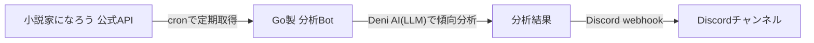
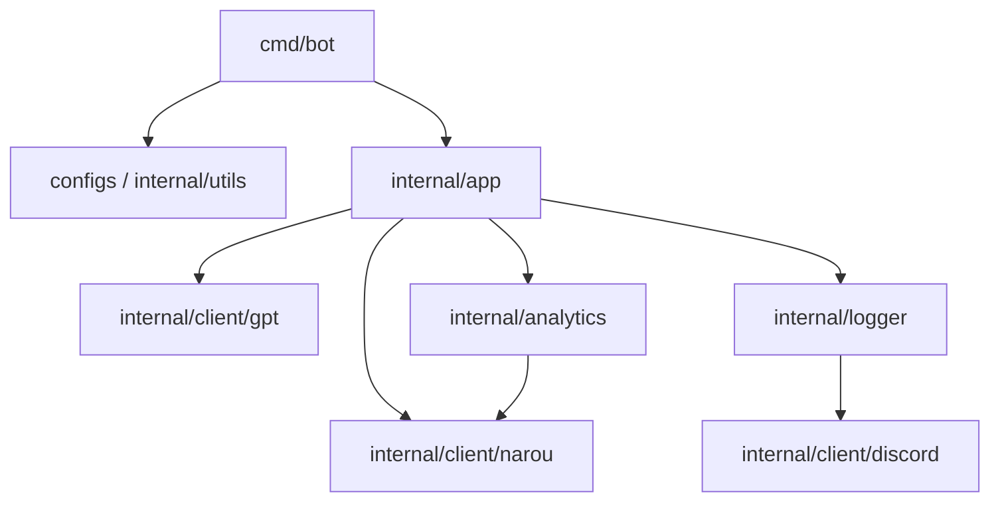
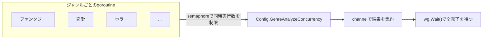
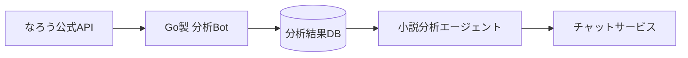

# Q. 底辺作家でも流行に乗れば舞えますか？ A. はい。分析ランキング分析AIを使えば

こんにちは。tanahiro2010です。

この記事は、DemoStageで話した「Q. 底辺作家でも流行に乗れば舞えますか？ A. はい。分析ランキング分析AIを使えば」という登壇内容を、Qiita向けの記事としてまとめたものです。

対象は、趣味で創作をしている人。

そして、データを使って何かを分析するBotに興味がある人です。

## きっかけは、小説愛好会というコミュニティ

僕は「小説愛好会」というコミュニティを、自分で立ち上げました。

小説家さんとワイワイしながら書きたくて作ったコミュニティです。

人見知りが故に、現在は申請制のクローズドサーバーになっています。

ありがたいことに、商業作家さんも在籍していて、学びがかなり多いです。

そして今回開発したプログラムは、そこのメンバーの悩みから着想を得ました。

「もっとランキングの傾向をちゃんと見て書きたい」という話を聞いて、僕は思いました。

> それ、僕も知りたい。

これが、今回の話の出発点です。

## 皆さん、逆張りをしたことってありますか？

僕は、ずっと流行に逆張りしてきました。

趣味で小説を書くとき、いつも流行には背を向けてきました。

なぜなら、最近の流行はだいたいこうだからです。

- 大した努力もせずに神様からチート能力をもらってハーレム
  - そしてそのチート能力には代償もない
- もしくは、なんらかの「ざまぁ」が必ずある
- 主人公はほぼ正義
- ハッピーエンド

一方、僕が好きな物語はこうです。

- 主人公はどっちかというと悪
- 個人への「ざまぁ」というより、人類への「ざまぁ」
- ハーレムなんてもってのほか、女性キャラは出てこない
- そしてほぼ、バッドエンド

つまり、流行とは真逆の小説を書いてきました。

自分の癖には刺さります。でも、大衆には刺さりません。

ユニークな小説でウケている人もいます。でもそれは、文章力の化け物か、努力でフォロワーを増やしてきた人たちです。

僕はそのどちらでもありませんでした。

正直、悔しかったです。

自分が本当に書きたいものを書いているのに、誰にも読まれないというのは、地味に堪えます。

でも、多少は僕も、読まれてみたいという気持ちがずっとありました。

ということで、気に入りませんが、売名のために流行に乗ることにしました。

ただし、感覚で「これが流行っぽい」と当てずっぽうに書くのは嫌でした。

せっかく理系寄りの人間として生きているので、ちゃんとデータを見て流行を掴むことにしました。

## 作ったもの――ランキング分析AI Bot

作ったのは、**小説家になろう公式APIを使ったランキング分析AI Bot**です。

「小説家になろう」は、日本最大級の小説投稿サイトです。

このサイトには公式のWeb APIが公開されていて、ランキングやあらすじなどのデータを外部から取得できます。

今回はこのAPIを使って、ランキングデータを定期的に集めて分析するBotを作りました。

構成はこうです。

- Daily / Monthly / Yearly / 四半期のランキングを**cron**で分析
- 結果は**Discord webhook**で指定チャンネルに送信
- 開発言語: **Go**
- 使用LLM: **Deni AI**(友人からの提供)

聞き慣れない言葉が多いと思うので、ここで補足します。

**cron**は、「決まった時間に、決まった処理を自動で実行してくれる仕組み」です。「毎日朝9時にランキングを取りに行く」といった定期実行を、人の手を借りずにやってくれます。今回のBotは、このcronを使って、ランキングの取得と分析を自動化しています。

**webhook**は、「あるサービスの出来事を、別のサービスに自動で通知する仕組み」です。**Discord webhook**は、Discordのチャンネルに対して、外部のプログラムからメッセージを直接送り込める仕組みです。わざわざBotをDiscordサーバーに招待しなくても、「このURLにデータを送るだけで、指定したチャンネルにメッセージが届く」という手軽さがあります。今回は、分析結果をこのwebhook経由でDiscordのチャンネルに流しています。

**LLM**(Large Language Model、大規模言語モデル)は、大量の文章を学習して、人間のような文章を生成したり、内容を要約・分析したりできるAIモデルのことです。ChatGPTなどが有名です。今回使った**Deni AI**は、友人が提供してくれたサービスで、ChatGPT互換のAPIを持っています。「ChatGPT互換API」というのは、OpenAIのChatGPT向けAPIと同じ形式でリクエストを送れば使える、という意味です。Deni AIは、この互換APIを経由して、OpenAIやAnthropicのモデルだけでなく、主要なローカルLLM(自分のPCやサーバー上で動かすLLM)にも幅広く対応しています。個人開発のサービスなので、動作が不安定なのはご愛嬌です。

全体の流れを図にすると、こうなります。



ここまでが、登壇で話した外側の話です。

でも実は、このBotを作るときにもう1つ軸がありました。

「せっかく作るなら、Goのベストプラクティスに則った設計にしたい」という、そこはかとないこだわりです。

分析ロジックそのものと同じくらい、コードの作りにも時間をかけたので、ここから少し技術寄りの話をします。

## 技術的な話――パッケージ構成と依存の向き

まず、パッケージをちゃんと役割ごとに分けました。

```text
cmd/bot         エントリポイント。dotenvを読み、設定とモードを作ってapp.Runを呼ぶだけ
configs         環境変数とデフォルト値をConfigに集約する
internal/app    orchestration。クライアント生成、並列解析、Discord送信をつなぐ
internal/client/narou   なろうAPI client・レスポンスmodel・parser
internal/client/gpt     OpenAI互換APIの薄いwrapper
internal/client/discord Discord WebhookのHTTP client
internal/analytics      集計ロジック + AI prompt生成
internal/logger         分析結果をDiscord embedに整形して送信
internal/utils          dotenv読み込みとCLI引数の解釈
```

依存の向きは、こうなっています。



`cmd/bot` は薄いエントリポイントに徹していて、実際の処理は全部 `internal` 以下に閉じています。

`internal` はGoの言語仕様として、他のモジュールから直接importできないパッケージです。

「外から触られたくない実装の詳細は `internal` に押し込む」という、Goでは定番の構成です。

個人開発だと、つい `main.go` に全部書きたくなる誘惑があります。

でも、あとで「ジャンル分析のロジックだけテストしたい」となったときに、密結合な `main.go` はかなり苦しみます。

最初にちゃんと分けておいたおかげで、後から機能を足すときも迷わずに済みました。

## 技術的な話――なろうAPIの奇妙なレスポンス形式

「小説家になろう」の公式APIは、少しクセがあります。

レスポンスがオブジェクトの配列ではなく、こういう形の配列で返ってきます。

```json
[
  {"allcount": 1},
  {"title": "...", "ncode": "..."}
]
```

先頭の要素だけ、他とは違う「全体件数」を表すメタデータになっています。

普通に `[]Novel` としてデコードしようとすると、この先頭要素のせいで失敗します。

ここでは、Goの `json.Unmarshaler` インターフェースを自前実装して吸収しました。

```go
func (r *Response) UnmarshalJSON(data []byte) error {
    var elements []json.RawMessage
    if err := json.Unmarshal(data, &elements); err != nil {
        return fmt.Errorf("decode response array: %w", err)
    }

    allCount, err := parseResponseMetadata(elements[0])
    // ...
    novels, err := parseNovels(elements[1:])
    // ...
}
```

一度 `[]json.RawMessage` として受け取ってから、先頭とそれ以降で別々にデコードする、という2段構えです。

`Novel` 自体にも、独自の `UnmarshalJSON` を実装しています。

```go
func (n *Novel) UnmarshalJSON(data []byte) error {
    type novelAlias Novel

    var raw struct {
        novelAlias
        NovelType       *NovelType `json:"novel_type"`
        NovelTypeWithOF *NovelType `json:"noveltype"`
    }
    // ...
}
```

`type novelAlias Novel` という書き方は、Goでカスタム `UnmarshalJSON` を書くときの定番テクニックです。

`Novel` に直接 `UnmarshalJSON` を実装すると、内部で `json.Unmarshal(data, n)` を呼んだときに自分自身の `UnmarshalJSON` を再帰的に呼んでしまい、無限ループになります。

エイリアス型を経由することで、フィールドの構造だけ流用しつつ、無限再帰を避けています。

このあたりは、最初「なんで無限ループするんだ」とハマって、あとで定番パターンだと知って「あ、これ知っておくべきやつだったんだ」と反省したところです。

なろうAPI側の `novel_type` / `noveltype` というキー名のブレも、この構造体で吸収しています。

外部APIの気まぐれな仕様と、自分のコードのきれいさを両立させるために、こういう「境界のクッション」を1箇所に集約するのは、地味に効くGoのお作法だと思っています。

## 技術的な話――ジャンル別解析の並列化

なろうのランキングには、ファンタジーや恋愛など、複数のジャンルがあります。

ジャンルごとにAPIを叩いて分析するので、素直に直列でやると結構待たされます。

そこで、goroutineとchannelを使って並列化しました。

```go
concurrency := config.GenreAnalyzeConcurrency
genreAnalyzeResults := make(chan analytics.GenreAnalyzeResult, len(genres))
semaphore := make(chan struct{}, concurrency)
var wg sync.WaitGroup

for _, genre := range genres {
    genre := genre
    wg.Add(1)

    go func() {
        defer wg.Done()

        semaphore <- struct{}{}
        defer func() { <-semaphore }()

        result, ok := analyzeGenre(genre, mode, narouClient, analyzer, log)
        if ok {
            genreAnalyzeResults <- result
        }
    }()
}

wg.Wait()
close(genreAnalyzeResults)
```

ポイントは、ジャンル数ぶん無制限にgoroutineを飛ばすのではなく、`semaphore` で同時実行数に上限をかけているところです。



`GenreAnalyzeConcurrency` は環境変数で調整できるようにしていて、なろうAPIやAI APIに対して同時に何本リクエストを投げていいかを、外から制御できるようにしています。

これをやらずに全ジャンルを無制限並列にすると、なろうAPI側にもAI API側にも一気に負荷をかけてしまいます。

個人開発のBotが、他人のAPIに迷惑をかける存在になってしまうのは避けたかったので、ここは意識して絞りました。

また、1ジャンルの取得や分析が失敗しても、`analyzeGenre` が `ok == false` を返すだけで、他のジャンルの処理は止めない設計にしています。

「1つのジャンルでコケても、全体のBotは死なない」というのは、定期実行するBotとしては地味に大事なポイントだと思っています。

## 技術的な話――AIがなくても壊れない設計

`internal/analytics` は、AIクライアントを `ChatClient` というインターフェースとして受け取ります。

```go
type ChatClient interface {
    Chat(prompts []openai.ChatCompletionMessage) ([]openai.ChatCompletionResponse, error)
}

func NewAnalyzer(openAIClient ChatClient) *Analyzer {
    return &Analyzer{OpenAIClient: openAIClient}
}
```

そして `internal/app` 側では、APIキーが設定されていない場合、このクライアントに `nil` を渡します。

```go
if config.OpenAIApiKey != "" {
    analyzer = analytics.NewAnalyzer(gpt.NewOpenAIClient(...))
} else {
    analyzer = analytics.NewAnalyzer(nil)
}
```

つまり、AIが使えない状態でも、集計処理自体は問題なく動きます。

AI要約の欄だけ「利用不可」という表示になり、他の決定論的な集計値(タイトルの平均文字数、タグ分布、ブックマーク傾向など)はそのまま出ます。

さらに、AIなしでも最低限の助言が出せるように、`buildWritingHints` という決定論的なヒント生成も用意しています。

- 上位タグがある
- ブックマーク寄与が0.5以上
- 完結率が0.5以上
- 平均文字数が0より大きい

こういう単純なルールベースの判定だけで、AIなしでも「一応それっぽいアドバイス」を出せるようにしています。

これは、「AI APIキーがない環境でも動くBotにしたい」という目標から逆算した設計です。

`interface` を介してAIクライアントを差し替え可能にしたこと、そして「AIはあくまで後段の後付け機能で、失敗しても本体機能は落とさない」という方針を最初に決めたことが、地味に効いています。

正直、最初は「AIが本体」くらいの気持ちで設計を始めていました。

でも実装を進めるうちに、「AIはブレるし、たまに落ちるし、レスポンスも遅い」という当たり前の事実に直面しました。

なので途中から、「決定論的な集計が本体、AIはそこに乗るオプション」という優先順位に頭を切り替えました。

この判断は、我ながら正解だったと思っています。

## 技術的な話――テストの厚みと運用

各パッケージには、ほぼ対になる形でテストファイルを置いています。

- APIクライアントが正しいpath/queryでリクエストしているか
- なろうAPIの特殊な配列JSONを正しくdecodeできるか
- 分析指標が期待通りに計算されるか
- AI promptに必要な集計値・ジャンル名が入っているか
- Discord Webhookのpayloadがembedとして正しく組み立てられているか
- 長文のAI分析結果でも、Discordのfield文字数制限を超えないか
- `Run` がジャンル別解析をちゃんと並列実行しているか

GitHub Actionsでも、`push` / `pull_request` のたびに `go test ./...` を回すようにしています。

「LTのネタだから」といって手を抜かず、ここは普段の業務コードを書くときと同じ感覚でテストを書きました。

理由は単純で、定期実行されるBotが、ある日突然しれっと壊れて、誰にも気づかれないまま数週間ランキングを流し続ける、みたいな事故は絶対に避けたかったからです。

エラーハンドリングも、`fmt.Errorf("...: %w", err)` でラップして、どこで何が起きたかを追えるようにしています。

Discord Webhookへの送信部分では、HTTPのステータスコードとレスポンスボディまでちゃんと確認してからエラーを返すようにしていて、「送ったつもりが実は失敗していた」という状態を作らないようにしました。

こういう地味な作り込みは、LTでは話しきれない部分です。

でも、個人開発のBotとはいえ、実際に人に使ってもらっている以上、ちゃんと壊れにくく作りたいという気持ちがありました。

分析ロジックの工夫と同じくらい、こういう「土台」の部分にもこだわれたのは、今回わりと満足しているポイントです。

ノクターン(R18小説)作家の友人からは、「そっちも分析して」と頼まれました。

さすがにチャンネルは分けて、権限制御しています。

こういう「ついでにこれも」が飛んでくるのは、コミュニティで動いているBotならではだなと思いました。

リポジトリはこちらです。

https://github.com/tanahiro2010/analyze_narou

今は20人くらいが、自分のサーバーで利用してくれています。

自分が困って作ったものを、他の人も使ってくれているのは、単純に嬉しいです。

Botが送ってくる分析結果は、流行りのジャンルやキーワードの傾向が一目でわかるようにまとめてあります。

## 実際にこれで小説を書いてみました

このBotの分析結果を参考に、実際に小説を書いてみました。

**「明日、婚約破棄される私が今夜やるべきたった一つのこと」**

https://ncode.syosetu.com/n4387mn/

結果は、投稿後1日で100pt突破でした。

これまでの自分の小説では、ありえない快挙です。

正直、数字を見たときは自分でも笑ってしまいました。

「あれ、データ見るだけでこんなに変わるの?」と。

これまで何年も、感覚だけで書いて、感覚だけで落ち込んでいたのがちょっと馬鹿らしくなるくらいの結果でした。

流行に乗ることの大切さを、身をもって知りました。

## じゃあ、全部流行に乗るのが正義なのか?

ここで、1つ問いを立てます。

「じゃあ、全部流行に乗るのが正義なのか?」

答えはNoです。

書いた小説には、自分の好みの要素をちょっとだけトッピングしました。

したくもない流行にただ乗るだけだと、辛いだけです。書いていて楽しくないものを、無理に量産する未来は見えませんでした。

何事も、妥協できる塩梅が大事だと思っています。

妥協できない、もしくはしたくないという人もいると思います。

それなら、君が流行になればいい。

これは半分開き直りですが、半分は本気で思っています。

## 今後の展望――分析結果を蓄積して、専属のエージェントにしたい

今のBotは、正直まだ「その場限り」です。

分析した結果はDiscordに流れて、JSONとして手元に保存はしていますが、それを横断的に活用できているとは言えません。

日別・週別・四半期別・年別の分析結果は、毎回都度計算されて、都度Discordに流れて終わり。

いわば、記憶を持たないBotです。

なので次にやりたいのは、この分析結果を全部データベースに保存することです。



イメージとしては、社内の情報を全部把握している「社内エージェント」のようなものです。

社内エージェントは、社内のドキュメントやSlackのやり取り、過去の意思決定などを全部知った上で、社員の質問に答えてくれます。

それと同じように、「なろうランキングの過去の傾向を全部知っている小説分析エージェント」を作りたいと思っています。

たとえば、こんなやり取りができるイメージです。

- 「最近のファンタジージャンルで、伸びているタグの傾向は?」
- 「去年の同時期と比べて、恋愛ジャンルのタイトル傾向はどう変わった?」
- 「このあらすじだと、どのジャンルのランキングに近い書き方になっている?」

今は、Discordに流れてくる単発の分析結果を、自分の頭の中で「なんとなく覚えておく」しかありません。

でも、これを全部データベースに蓄積して、そのデータを踏まえて会話できるエージェントにできれば、過去のランキングの流れを踏まえた、もっと踏み込んだ相談ができるはずです。

最終的には、これをチャットサービスとして開発しようと思っています。

今回のBotで作った「決定論的な集計 + AIによる要約」という土台は、そのままエージェントの知識源として使えるはずです。

Discordに流すだけで終わらせず、蓄積したデータを武器にした相談相手にまで育てられたら、次のLTのネタもできそうです。

## まとめ

流行に逆張りし続けてきた僕が、データを使って流行に乗ってみた話でした。

- 小説家になろう公式APIから、ランキングデータを取得できる
- cronで定期実行し、webhookでDiscordに通知する構成にした
- LLMを使って、ランキングの傾向を分析させた
- 実際に分析結果を参考にした小説は、これまでにない伸びを見せた
- ただし、全部流行に合わせるのではなく、妥協できる塩梅を探すのが大事
- コード側も、パッケージ分割・並列処理・エラーラッピング・AI不在時のフォールバックなど、Goのお作法に沿った設計を意識した

「勘」だけに頼らず、データを見て判断するというのは、創作以外の場面でも応用できる考え方だと思っています。

分析ロジックだけでなく、その裏側の設計にもちゃんと向き合えたのは、個人開発として素直に嬉しい収穫でした。

そして何より、逆張りしてきた自分の作品を、少しでも多くの人に届ける方法があったんだ、という発見が一番の収穫でした。

リポジトリはこちらです。

https://github.com/tanahiro2010/analyze_narou
