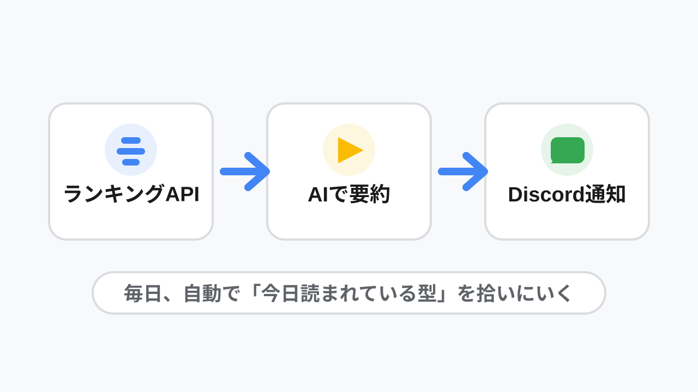
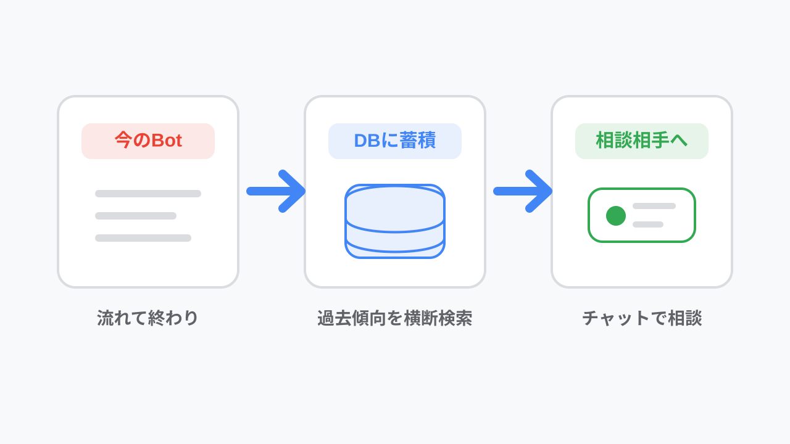

<!-- _class: title -->
<!-- _paginate: false -->

# Q. 底辺作家でも流行に乗れば舞えますか？

## A. **はい**。ランキング分析AIを使えば

DemoStage / 田中博悠 (tanahiro2010) / 2026-07-30

---

## 自己紹介

名前田中博悠（たなかひろひさ） / tanahiro2010

学校三田学園高等学校 1年生

趣味読書 / バンジージャンプ / プログラミング

称号サブカル性癖博士（怪文書執筆で読者から贈呈されました）

最近一緒に バンジー / スカイダイビング 飛んでくれる人を探してます

---

## 小説愛好会について

小説家さんで構成されたコミュニティサーバーです

- メンバーのほとんどは小説を書く人
- エンジニアはほぼいない
- 今回のBotは、そこのメンバーの悩みから着想を得ました

### 今日の話
「好きなものを書く」と「読まれる型を知る」を、AIでどう橋渡しするか

---

<!-- _class: lead -->

# 皆さん、逆張りをしたことってありますか？

---

<!-- _class: lead -->

# 僕はずっと流行に逆張りしてきました

---

## 流行と好きな物語が、だいぶ逆でした

### 最近の流行

- 神様からチート能力
- 代償なしでハーレム
- 女性主人公
- なんらかのざまぁ
- ハッピーエンドに着地しやすい

### 僕が書く物語

- 主人公は人間から見たら悪
- 上位存在による人類の蹂躙とか
- 僕が女性を理解できないせいで女性キャラは出てこない
- メリーバッドエンド / バッドエンド

好きなものは書ける。でも、ランキングの波とはだいぶ遠い

---

<!-- _class: lead accent-blue -->

# でも、多少は僕も読まれてみたい

---

## だから作ったもの

**小説家になろう公式APIを使ったランキング分析AI Bot**

- Daily / Monthly / Yearly / 四半期 のランキングをcronで分析
- 結果はDiscord webhookで指定チャンネルに送信
- 開発言語: **Go**
- 使用LLM: **Deni AI**

Deni AI は友人からの提供。ChatGPT互換API、OpenAI / Anthropic / 主要ローカルLLMまで幅広く対応しています

ノクターン（R18小説）作家の友人から「そっちも分析して」と頼まれ対応。チャンネルを分けて権限制御しています 
リポジトリ: github.com/tanahiro2010/analyze_narou / 今は20人くらいが自分のサーバーで利用中

---

## 実際の分析結果

Botが送ってくる分析結果はこんな感じです

---

## 実際にこれで小説を書いてみました

**「明日、婚約破棄される私が今夜やるべきたった一つのこと」**

ncode.syosetu.com/n4387mn

100pt+

投稿後 **1日で100pt突破**  
これまでの自分の小説ではありえない快挙です

流行に乗ることの大切さを、身をもって知りました

---

## 今後の展望

今のBotは、正直まだ **記憶を持たないBot** です

- 分析結果はDiscordに流れて終わり
- JSON保存はあるけど、横断的には使えていない
- 次は全部DBにためて、過去傾向まで話せるようにしたい

「最近伸びているタグは?」 
「去年の同時期と比べて、タイトル傾向は?」 
「このあらすじは、どのジャンルに近い?」

---

## じゃあ、全部流行に乗るのが正義なのか？

### 答えは No です

したくもない流行にただ乗るだけだと、辛いだけです

### ちょうどいい塩梅

書いた小説には、自分の好みの要素をちょっとだけトッピングしました

何事も、妥協できる塩梅が大事です

妥協できない、もしくはしたくないって？

---

<!-- _class: lead -->

# それなら、君が流行になればいい

---

<!-- _class: lead -->

# Thanks for listening!

github.com/tanahiro2010/analyze_narou

https://zenn.dev/tanahiro2010/articles/fdbebecbd9faa9

