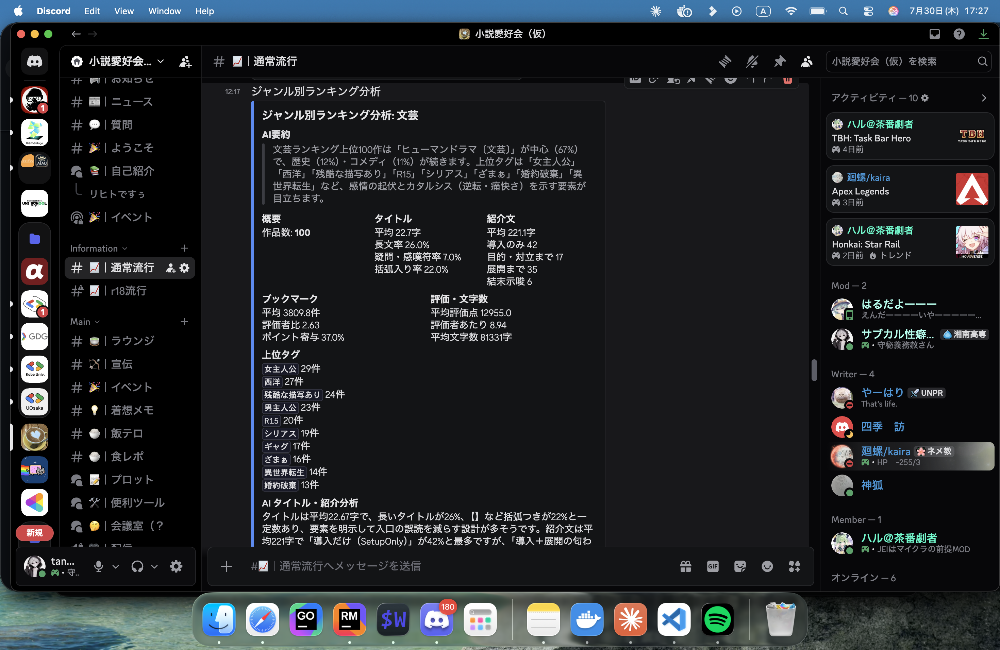

<!-- _class: title -->
<!-- _paginate: false -->

# Q. 底辺作家でも流行に乗れば舞えますか？

## A. **はい**。分析ランキング分析AIを使えば

DemoStage / 田中博悠 (tanahiro2010)

---

## 自己紹介

名前: **田中博悠**（たなかひろひさ） / tanahiro2010
学校: 三田学園高等学校 1年生

趣味: 読書 / バンジージャンプ / プログラミング
称号: **サブカル性癖博士**（怪文書執筆で読者から贈呈されました）

最近: 一緒にバンジー飛んでくれる人を探してます

---

## 所属

- **GDG Greater Kwansai**
  Build with AIというイベントの後、Twitterで「運営参加してみたいな」と言い続けていたら誘われました
- **小説愛好会**
  小説家さんとワイワイ書きたくて、自分で立ち上げたコミュニティ
- **UniSchool**（unischool.jp）
  中高生が立ち上げた、学生の学びと学校を支える事業グループ。CTSとして参加中

---

## 小説愛好会について

小説家さんとワイワイしながら書きたくて、自分で立ち上げたコミュニティです

- 私の人見知り / コミュ障 が故に現在は申請制のクローズドサーバー
- 商業作家さんも在籍していて、学びが多い
- 今回開発したプログラムは、そこのメンバーの悩みから着想を得た

---

<!-- _class: lead -->

# 皆さん、逆張りをしたことってありますか？

---

## ずっと流行に逆張りしてきました

趣味で小説を書くとき、いつも流行には背を向けてきました

---

## なぜなら、最近の流行というのは...

- 大した努力もせずに神様からチート能力もらってハーレム
  - そしてそのチート能力には代償もない
- もしくはなんらかのざまぁが必ずあったり
- 主人公はほぼ正義
- ハッピーエンド

---

## 僕が好きな物語は...

- 主人公はどっちかというと悪
- 個人へのざまぁというより、人類へのざまぁ
- ハーレムなんてもってのほか、女性キャラは出てこない
- そしてほぼ、バッドエンド

---

## つまり、流行とは真逆の小説を書いてきました

- 自分の癖には刺さる、でも大衆には刺さらない
- ユニークな小説でウケている人もいる
- でもそれは文章力の化け物か、努力でフォロワーを増やしてきた人たち

---

## でも、多少は僕も読まれてみたい

ということで、気に入りませんが――**売名のために流行に乗ることにしました**

---

## 作ったもの

**小説家になろう公式APIを使ったランキング分析AI Bot**

- Daily / Monthly / Yearly / 四半期 のランキングをcronで分析
- 結果はDiscord webhookで指定チャンネルに送信
- 開発言語: **Go**
- 使用LLM: **Deni AI**（友人からの提供）
  - ChatGPT互換API、OpenAI / Anthropic / 主要ローカルLLMまで幅広く対応
  - 個人開発なので不安定なのはご愛嬌です

ノクターン（R18小説）作家の友人から「そっちも分析して」と頼まれ対応。チャンネルを分けて権限制御しています 
リポジトリ: github.com/tanahiro2010/analyze_narou / 今は20人くらいが自分のサーバーで利用中

---

## 実際の分析結果

Botが送ってくる分析結果はこんな感じです

---

## 実際にこれで小説を書いてみました

**「明日、婚約破棄される私が今夜やるべきたった一つのこと」**
https://ncode.syosetu.com/n4387mn/

投稿後**1日で100pt突破**
これまでの自分の小説ではありえない快挙です

流行に乗ることの大切さを、身をもって知りました

---

## じゃあ、全部流行に乗るのが正義なのか？

**答えはNoです**

- 書いた小説には、自分の好みの要素をちょっとだけトッピングしました
- したくもない流行にただ乗るだけだと、辛いだけ
- 何事も、妥協できる塩梅が大事です

妥協できない、もしくはしたくないって？

---

<!-- _class: lead -->

# それなら、君が流行になればいい

---

<!-- _class: lead -->

# Thanks for listening!

github.com/tanahiro2010/analyze_narou
