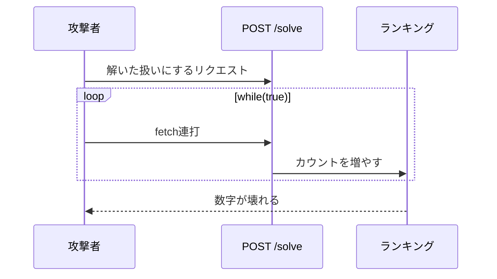
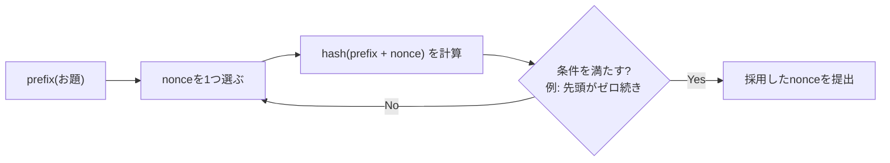
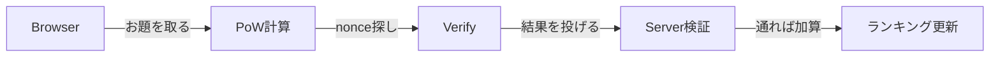
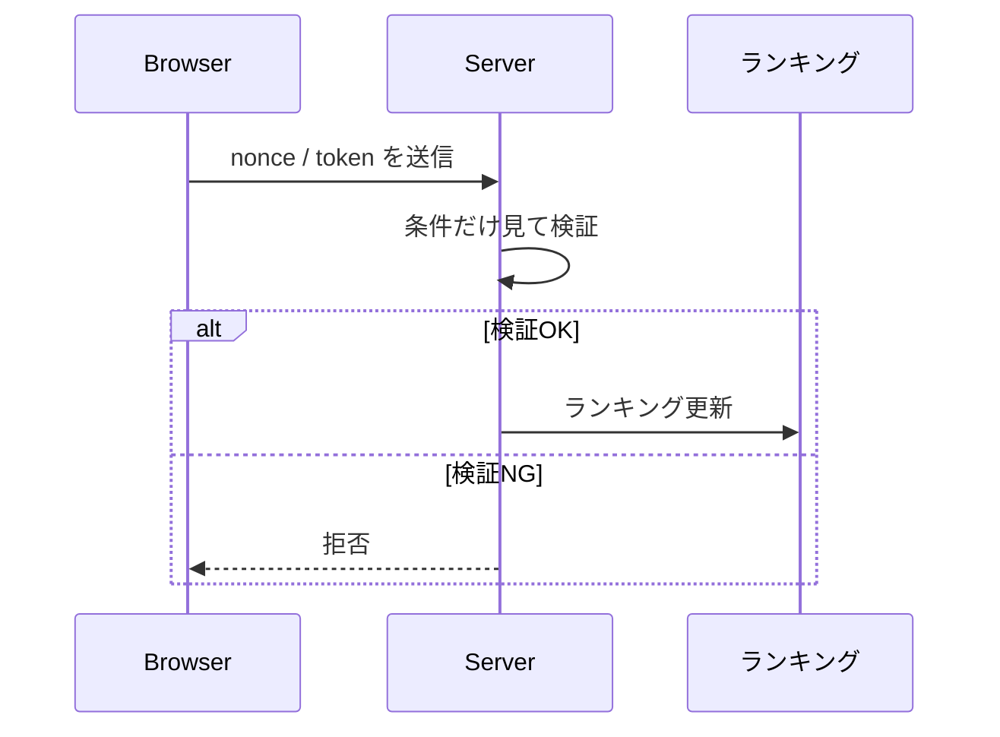

# Serverlessしかなかったので、ブラウザに働いてもらいました――PoWでランキングを守ってみた話

こんにちは。田中博悠です。

普段は `tanahiro2010` という名前で活動しています。三田学園高等学校の高校一年生です。

この記事は、Serverless LTで話した「Serverlessしかなかったので、ブラウザに働いてもらいました」という登壇内容を、Qiita向けの記事としてまとめたものです。

対象は、個人開発でサーバーレス構成を使っている人。

そして、ちょっと変わった不正対策のアイデアに興味がある人です。

## 作ったもの――「なんでも問題集」

僕が作っているのは、「なんでも問題集」というサービスです。

匿名で問題を投げるサイトです。

構成はこうなっています。

|技術|採用|
|---|---|
|Frontend|Next.js|
|Database|Neon(PostgreSQL)|
|Hosting|Vercel|

つまり、全部サーバーレスです。

機能自体はかなり素朴です。

誰でも匿名で、問題を作って投げられます。

- 問題の作成
- 公開
- 解く
- ランキング

このうち、今回力を入れたのは「解く場所」と「ランキング」です。

そしてこれが、今回の本題につながります。

## 問題――解かれた数ランキングを作りたい

やりたかったことは単純です。

「解かれた数」でランキングを作りたい。

でも、素直に実装すると死にます。

流れはこうです。



「解いた」というAPIを叩くだけなら、`while(true)`で連打すればいくらでも増やせます。

APIの形だけを見ていると、これはかなり弱いです。

## どうする？

対策として、よくあるものを考えてみました。

- ログイン
- CAPTCHA
- Turnstile
- Rate Limit

でも、どれも重いです。

理由は、サーバーレスならではの縛りにあります。

## サーバーレスの縛り

サーバーレスには、地味に効いてくる制約があります。

- 重い処理は無理
- CPU時間が怖い
- DB直撃も怖い
- 課金も怖い
- でもログインは嫌

そして現実は、もっと泥臭いです。

- 起動待ちに怯える
- 権限設定で詰む
- ログ追跡がつらい
- 課金グラフを見る
- 夜中に眉間が寄る

個人開発で、こういう運用コストをかけたくありませんでした。

## 結論――ブラウザに働かせる

出した結論はこうです。

**サーバーに頑張らせるのではなく、ブラウザに頑張らせる。**

具体的には、**PoW(Proof of Work)**で殴ることにしました。

以前Discord BotでPoWを書いた記憶が蘇ってきました。

## Proof of Workとは？

ここで、聞き慣れない人向けに解説します。

PoW(Proof of Work)は、直訳すると「作業の証明」です。

もともとはビットコインなどの暗号資産で有名になった仕組みです。

考え方はシンプルです。

> ある条件を満たす答え(nonce)を、力任せに探させる。

「力任せに探す」というのがポイントです。

答えを求める計算には時間がかかります。

でも、答えが合っているかどうかの確認は一瞬でできます。



たとえば、「文字列の先頭に、ハッシュ値の先頭が0000で始まるnonceを探せ」という条件があったとします。

nonceを1つずつ変えながらハッシュ値を計算し、条件に合うものを探すしかありません。

近道はありません。

これが「作業の証明」と呼ばれる理由です。

やった量(計算量)そのものが、証拠になります。

今回は、この性質を悪用ならぬ「善用」しました。

**1回の「解いた」報告にPoWを挟むことで、大量送信そのもののコストを上げる。**

これが今回のアイデアです。

## 全体の流れ

実際の処理の流れは、こうなっています。



サーバー側がやるのは「お題を配ること」と「答えを検証すること」だけです。

一番重い「nonceを探す」計算は、すべてブラウザ側でやってもらいます。

つまり、サーバーレスの弱点である「重い処理」を、クライアントに肩代わりしてもらう構成です。

## Challenge取得

まず、ブラウザは「お題(Challenge)」を取りに行きます。

```
GET /api/works/:id/challenges
```

このAPIが返すものは、こうです。

- prefix(PoWのお題になる文字列)
- token(JWT)

tokenにはJWTを使っています。

JWTは、サーバーが発行した「改ざんされていない証明書」のようなものです。

これによって、後で答えを検証するときに、「本当にこのサーバーが出したお題への回答か」をチェックできます。

また、端末によって難易度も変えています。

- PC
- スマホ

スマホは計算力が弱いことが多いので、難易度を下げています。

## 検証

答えが求まったら、ブラウザはそれをサーバーに投げます。

```
POST /api/works/:id/challenges/:challengeId
```

流れはこうです。



サーバー側は、「nonceが本当に条件を満たしているか」を確認するだけです。

ハッシュ値の再計算は一瞬で終わります。

これは、PoWの「作る(探す)のは大変、確認は一瞬」という性質そのままです。

条件を満たしていた場合だけ、ランキングに反映します。

## 完璧？

もちろん、この仕組みに穴がないわけではありません。

- UA偽装
- Bot突破
- 端末判定は雑
- 本気の攻撃は無理

本気で攻撃してくる相手を完全に防げるとは思っていません。

でも、今回の狙いはそこではありません。

> **大量送信のコストを上げる**

これだけです。

「片手間で連打したら簡単に不正できる」状態を防げれば、個人開発のランキングとしては十分だと考えました。

## 実は……PoWを書きたかった

正直なことを言うと、これが理由の半分くらいです。

「PoWって面白そうだから書いてみたい」

これが、動機のかなりの部分を占めています。

個人開発だからこそ、「面白そう」で突っ込めるのが最高だと思っています。

## まとめ

サーバーレスだから、「できない」で終わらせるのではなく、「どう実現するか」を考える。

今回は、その一例として、ブラウザにPoWを解かせることで、サーバーレスのままランキングの不正を抑える構成を紹介しました。

- サーバーレスは重い処理を苦手とする
- でも、その重い処理をブラウザに肩代わりしてもらえばいい
- PoWは「探すのは大変、確認は一瞬」という性質を持つ
- この性質を使って、大量送信のコストだけを上げる

完璧な防御ではありません。

でも、制約の中でどう戦うかを考えるのは、個人開発の醍醐味だと思っています。

GitHub・質問などぜひ。
