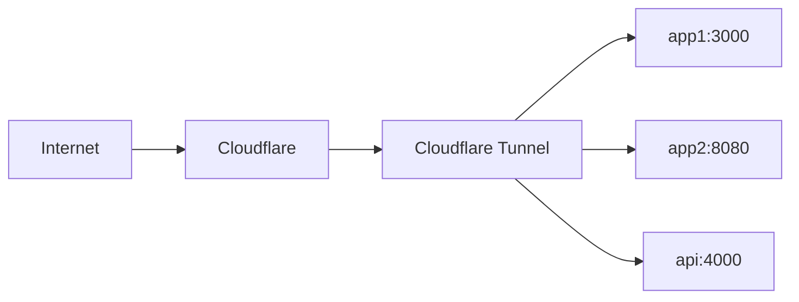
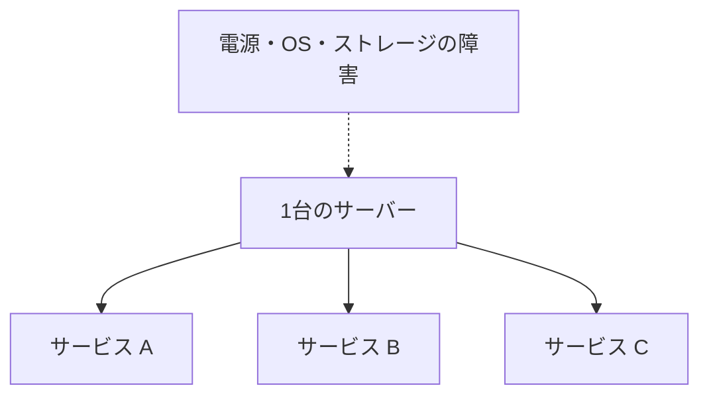

# Serverlessのすゝめ――自分でサーバーを運用して分かった「管理からの自由」

こんにちは。

普段は `tanahiro2010` という名前で活動しています。

皆さんは、自宅サーバーとか自宅鯖と呼ばれるものを見て、こう思ったことはないでしょうか。

> Serverlessの方が楽なのに、どうしてわざわざ自分でサーバーを管理するの？

その疑問は正しいです。

実際、サービスを作って公開するだけなら、Serverlessはかなり楽です。

それでも僕が自分でサーバーを運用し始めた理由は、すごく単純です。

**面白そうだったから。**

Serverlessしか使っていなかった頃、僕はOS更新や再起動、デプロイ基盤の面倒をほとんど意識していませんでした。

自分のサーバーを持ってから、Serverlessがどれだけ面倒を肩代わりしていたのか、ようやく実感しました。

この記事は、その落差の話です。

自宅サーバーという言葉に少しでもロマンを感じる人には、たぶん分かってもらえると思います。

> **この記事でいう「オンプレ」**
>
> 企業の大規模なデータセンターではなく、僕が自分で管理している物理サーバーを指します。

## Serverlessとは何か

Serverlessとは、サーバーが存在しない仕組みではありません。

サーバーは当然どこかで動いています。

ただし、OSの更新、物理マシンの故障、プロセスの再起動、アクセス量に応じたスケールなどを、アプリケーション開発者が直接面倒を見る場面が減ります。

僕はServerlessを、こう理解しています。

> **サーバーを考える範囲を減らす仕組み**

AWS LambdaやCloud Run functionsのようなFunction as a ServiceだけがServerlessではありません。

VercelやCloud Runのように、アプリやコンテナをデプロイすると実行環境やスケーリングを管理してくれるサービスも、広い意味でServerlessとして扱われます。

## 今回比べる環境

実際に僕が使っている環境は、こうです。

| | 自分のサーバー | Serverless |
| --- | --- | --- |
| 実行環境 | Xeon E3-1200 v2 / 32GB RAM | Vercelの無料枠 |
| データ | SSD 1TB + HDDたくさん | Neon / Supabaseの無料枠 |
| 管理 | Ubuntu Server 20.04から自分で管理 | 各プラットフォームに任せる |

なお、Ubuntu 20.04 LTSの標準セキュリティメンテナンスは、2025年5月に終了しています。

2026年現在も使い続けるなら、Ubuntu ProのESMを有効にするか、サポート中のLTSへ移行する必要があります。

参考: [Ubuntu release cycle](https://ubuntu.com/about/release-cycle)

これは性能ベンチマークではありません。

物理サーバー1台と複数のマネージドサービスでは、そもそも比較する単位が違います。

ここで比べたいのは、「どこまで自分が管理するのか」です。

また、無料枠の内容は変更されることがあります。

実際に構成を選ぶときは、各サービスの最新の料金・制限を確認してください。

## 実例は「やすみ？」

ここからは、僕が実際に運用している「やすみ？」を例に考えます。

「やすみ？」はDockerコンテナとして自分のサーバー上で動いています。

構成を単純化すると、こうです。


アプリのコードだけでなく、Docker、Ubuntu、ネットワーク、ストレージ、物理マシンまでが僕の管理範囲です。

ここからが、Serverlessと大きく違うところです。

## CI/CDの前に路線を引く

コードをGitHubにpushしたら自動でデプロイされる。

結果だけ見ると、オンプレでもServerlessでも同じです。

ただし、オンプレでそこに辿り着くまでには、先に「路線」を引かなければなりません。

正直、オンプレでCI/CD環境を整えるのはかなり面倒です。


僕はGitHub ActionsのSelf-hosted Runnerを使っています。

ワークフローを単純化すると、こうです。

```yaml
name: deploy

on:
  push:
    branches: [main]

jobs:
  deploy:
    runs-on: [self-hosted, linux, x64]
    steps:
      - uses: actions/checkout@v4
      - run: docker compose build
      - run: docker compose up -d --remove-orphans
```

ただし、このYAMLだけで完成ではありません。

実際には、次のものを管理する必要があります。

- Runnerアプリの導入と更新
- Runnerを動かすユーザーの権限
- Dockerソケットへのアクセス
- Secretsの保管
- Runner自体の死活監視
- 失敗したデプロイのロールバック

特にSelf-hosted Runnerは、GitHubから受け取ったコードを自分のマシン上で実行します。

そのため、実行を許可するリポジトリやワークフローを絞る必要があります。

GitHubも、Self-hosted Runnerは非公開リポジトリで使うことを推奨しています。

公開リポジトリのforkから、危険なコードが実行される可能性があるためです。

参考: [Managing access to self-hosted runners using groups - GitHub Docs](https://docs.github.com/en/actions/how-tos/manage-runners/self-hosted-runners/manage-access)

さらに、RunnerからDockerを操作できるようにすると、Runnerは非常に強い権限を持ちます。

Docker公式ドキュメントでは、`docker`グループへの所属はrootレベルの権限を与えると警告しています。

参考: [Linux post-installation steps for Docker Engine - Docker Docs](https://docs.docker.com/engine/install/linux-postinstall/)

少なくとも、実行可能なリポジトリの制限、mainブランチの保護、デプロイ用Secretsの最小権限化は考えたいところです。

もっと強く分けたいなら、デプロイ専用マシンや使い捨てRunnerという選択肢もあります。

ここまで作れば、pushだけでデプロイできるのでとても便利です。

一度作れば便利です。

でも、そこまでの路線を引くのが大変です。

そして、その面倒な路線を引いたのも、壊れたときに直すのも自分です。

VercelなどのGitHub連携が充実したプラットフォームでは、この路線の多くが最初から用意されています。

Serverlessの良さは、GitHub連携を簡単に設定できることだけではありません。

**CI/CDを支えるマシンやプロセスも含めて、自分で管理するレイヤーが少ない。**

これが大きいです。

## 「再起動するだけ」が結構重い

オンプレでは、OS更新などでサーバーの再起動が必要になります。

再起動すると、そのサーバー上のサービスはまとめて止まります。

そして再起動後には、少なくとも次を確認します。

- Dockerコンテナは正常に戻ったか
- `cloudflared` は起動したか
- DBは応答するか
- サイトは外部から開けるか
- ログに異常がないか
- ダウンタイムはどれくらいだったか

Docker Composeの`restart: unless-stopped`、ヘルスチェック、外形監視などを組み合わせれば、多くの確認は自動化できます。

たぶん、あれもこれももっと自動化できます。

でも、やっぱり面倒です。

その自動化を作って、動作を確認して、壊れたら直すのも自分だからです。

自分でサーバーを運用すると、「自動化すれば解決」の後ろにも運用があることがよくわかります。

Serverlessでもプラットフォーム側の障害は起きます。

ただし、少なくとも物理マシンやホストOSの再起動を、利用者が直接操作することはほぼありません。

## コストは無料枠だけで決まらない

Serverlessは、小規模なら無料枠に収まるサービスも多く、個人開発の最初の一歩と相性が良いです。

一方で、アクセス、実行時間、データ転送量、ストレージなどが増えると、使用量に応じて費用が発生します。

オンプレは逆です。

最初に本体、ストレージ、必要ならUPSなどを購入します。

その後も、電気代、回線費用、故障時の交換費用がかかります。

電力の概算は次の式で出せます。

```text
消費電力[W] × 24時間 × 30日 ÷ 1000 = 1か月の消費電力[kWh]
```

たとえば60Wで動き続けた場合は、約43.2kWh/月です。

これに契約している電力料金の単価を掛けると、電気代の目安になります。

なお、僕のサーバーは学校に置かせてもらっているため、僕自身は電気代を直接払っていません。

もちろん、オンプレの電気代が無料という意味ではありません。

そのため、電気代の実感については、正直なところ僕はあまり語れません。

また、自分の作業時間も忘れやすいコストです。

数十分の障害対応や更新作業も、積み上がれば大きくなります。

## ServerlessでもDockerは使える

この記事のドラフトに、僕は「ServerlessでDockerを使えるサービスを見たことがない」と書いていました。

僕の中では、それくらい「Dockerを好きに使えること」がオンプレの強みとして大きかったからです。

ただ、調べてみると、その書き方は正確ではありませんでした。

「Dockerを使いたいからオンプレ」という言い方は、半分正しくて、半分間違っています。

たとえばGoogle Cloud Runは、コンテナイメージをデプロイできるServerlessプラットフォームです。

公式ドキュメントでも、インフラ管理を抽象化するServerlessなサービスとして説明されています。

参考: [What is Cloud Run - Google Cloud Documentation](https://docs.cloud.google.com/run/docs/overview/what-is-cloud-run)

違いは、Dockerイメージを使えるかどうかだけではありません。

| | コンテナ実行型のServerless | 自分のサーバー |
| --- | --- | --- |
| コンテナイメージ | デプロイできる | 実行できる |
| ホストOS | 触れない | 触れる |
| Dockerデーモン | プラットフォームが管理 | 自分で管理 |
| 任意のCompose構成 | 制約がある | 自由に組める |
| 特権操作 | 原則できない | 自分次第 |
| 常駐プロセス | サービス仕様に依存 | 自由に動かせる |

つまり、オンプレの強みは「Dockerが使える」ことより、**Dockerの下にあるOSやネットワークまで自分で触れること**です。

自分のサーバーであれば、デプロイ基盤やジョブキューを組み合わせて、Vercelのような「コードを送れば動くプラットフォーム」自体を作ることもできます。

一方、一般的なPaaSでは、そのPaaSを支える下の層には触れません。

ここは、アプリを作るときには嬉しい制約です。

プラットフォームそのものを作りたいときには、越えられない壁になります。

## SSHで今が見える

自分のサーバーには、SSHで入れます。

```bash
docker ps
htop
journalctl -u docker
psql yasumi
```

コンテナは生きているか。

CPUやメモリは足りているか。

サービスのログに異常はないか。

データベースは応答するか。

気になったことをその場で確認できるのは、とても楽しいです。

Serverlessでは普段触れないような低いレイヤーまで降りて、自分で状態を見て、自分で考えられます。

これが面白いです。

オンプレならVercelのようなサービスそのものを作れますが、Vercelの上でVercelを作ろうとすると、できたとしてもかなり面倒です。

もちろん、本番環境の設定ファイルをその場で直す運用は、変更履歴が残らず再現性も失われます。

触れることと、触ってよいことは別です。

トラブルシュートはSSHで行い、永続的な修正はコードや構成管理に戻すのが理想です。

## Docker + Cloudflare Tunnel

僕の構成では、`cloudflared`もDockerコンテナとして動かしています。

Cloudflare Tunnelは、サーバー側の`cloudflared`からCloudflareに向けてアウトバウンド接続を作ります。



これにより、各アプリのポートをルーターから直接インターネットへ開放せずに公開できます。

Cloudflareの公式ドキュメントでも、TunnelはオリジンからCloudflareへ作るアウトバウンドの経路として説明されています。

ファイアウォールでインバウンド通信を閉じ、`cloudflared`のアウトバウンド通信だけを許可する構成も取れます。

現在の公式ドキュメントでは、Tunnelの運用にTCP/UDPの送信ポート`7844`を許可するよう案内されています。

参考:

- [Tunnel with firewall - Cloudflare One docs](https://developers.cloudflare.com/cloudflare-one/networks/connectors/cloudflare-tunnel/configure-tunnels/tunnel-with-firewall/)
- [Downloads - Cloudflare One docs](https://developers.cloudflare.com/cloudflare-one/networks/connectors/cloudflare-tunnel/downloads/)

ただし、Tunnelを使えばセキュリティ対策が終わるわけではありません。

- 公開するホスト名とサービスの範囲
- Tunnelトークンの保管
- アプリ側の認証・認可
- Cloudflare Accessなどのアクセス制御
- オリジンと`cloudflared`の更新

こうした運用は、依然として自分の責任です。

## 1台に集約する強さと弱さ

CPU、RAM、ストレージ、回線に余裕があれば、1台のサーバーに複数のサービスを載せられます。

個人開発では、「とりあえずこのサーバーに載せる」ができるのはとても便利です。

まるでサイトをいくらでも生やせるような感覚があります。

しかし、物理的には1台です。



サーバーが落ちれば、その上のサービスがまとめて落ちます。

再起動やメンテナンスの影響も、全サービスに広がります。

CPUやRAMも共有するため、1つのサービスの負荷が他に影響することもあります。

「たくさん載せられる」と「障害の影響範囲が大きい」は、同じ構成の表裏です。

## 責任まで全部持つのはしんどい

最近は、オンプレからクラウドへ移行する企業が多くあります。

クラウドを使えば、物理ハードウェアやデータセンター、マネージドサービスのOSなどは、クラウド事業者の管理範囲に移ります。

ドラフトを書いたとき、僕は「クラウド側に責任を押し付けられるのもメリットなのでは」と考えました。

サービスが落ちたときに、ハードウェアもOSもすべて自分の責任になる状態は、正直しんどいです。

「ここから下はクラウド側が見てくれる」と言えるのは、利用者からすればとても気が楽です。

この感覚自体は、今も間違っていないと思います。

ただし、「障害や情報漏洩が起きてもクラウド側の責任にできる」とまで考えるのは危険です。

クラウドでは、一般に**共同責任モデル**で責任範囲を分けます。

AWSの説明では、クラウド基盤のハードウェア、ネットワーク、施設などはAWSが保護します。

一方、顧客は利用するサービスに応じて、データ、IAM、暗号化、アプリケーション、設定などに責任を持ちます。

参考: [Shared responsibility - AWS Well-Architected Framework](https://docs.aws.amazon.com/wellarchitected/latest/security-pillar/shared-responsibility.html)

| 管理対象 | Serverless / マネージドサービス | 自分のサーバー |
| --- | --- | --- |
| 物理ハードウェア | 事業者が管理 | 自分が管理 |
| ホストOS | 事業者が管理 | 自分が管理 |
| アプリと依存関係 | 利用者が管理 | 利用者が管理 |
| IAM / Secrets / 設定 | 利用者が管理 | 利用者が管理 |
| データの分類・保護 | 利用者が管理 | 利用者が管理 |

感情としては、「クラウド側に押し付けたい」です。

ただ、仕組みとして正確に言うなら、クラウド移行の利点は責任の押し付けではありません。

**事業者が引き受ける管理範囲を契約と仕様で明確にし、自分たちが担う範囲を減らすこと**です。

オンプレにはロマンがあります。

セキュリティも法律も運用責任も完全に無視してよい架空の世界なら、僕は顧客情報すら自分のサーバーで持ちたいくらいです。

それくらい、自分のマシンで全部を動かすことに魅力を感じます。

もちろん、現実で顧客情報や機密情報を扱うなら、「ロマンがある」だけで構成を選んではいけません。

自分で運用するにしてもクラウドを使うにしても、脅威モデル、アクセス制御、暗号化、バックアップ、復旧手順、運用体制まで考える必要があります。

## 結局どちらを選ぶのか

Serverlessは万能ではありません。

逆に、オンプレやVPSにすればすべてが幸せになるわけでもありません。

| Serverlessを選びやすい | オンプレ / VPSを選びやすい |
| --- | --- |
| Webアプリ・Web API | 長時間実行する処理 |
| Bot・イベント駆動処理 | 常駐プロセス |
| Cron処理 | 大容量ストレージ |
| アクセス量が読めないサービス | 特殊なミドルウェアが必要な構成 |
| インフラ運用よりアプリ開発に集中したい | OSやネットワークを自由に触りたい |

なお、これらは傾向です。

たとえばCloud Runにはジョブやワーカープールがあり、Serverlessでも長時間処理やバックグラウンド処理に対応できる場合があります。

「Serverlessだから」「オンプレだから」だけで決めず、実行時間、ストレージ、スケール、ネットワーク、データ保護の要件から選ぶべきです。

## 2つの自由

実際に両方を使ってみて、Serverlessとオンプレは、異なる自由をくれるものだと思うようになりました。

### Serverlessは「管理からの自由」

Serverlessでは、OS、物理ハードウェア、実行プロセス、スケーリングなどの多くを任せられます。

つまり、管理から自由になれます。

サービスを作りたいだけなら、この自由はとても大きいです。

### オンプレは「制約からの自由」

オンプレでは、OSからネットワークまで好きなように構成できます。

つまり、プラットフォームの制約から自由になれます。

ただし、自由にしたものは、すべて自分で面倒を見る必要があります。

その面倒は、本当に面倒です。

でも、サーバーを触ること自体が目的なら、その面倒さえも楽しさになります。

## まとめ

Serverlessを使えば、サーバーの面倒を見る範囲を減らして、サービス作りに集中できます。

オンプレを使えば、サーバーの面倒を見ることそのものを楽しめます。

やっぱりオンプレは面倒です。

それでも面白いので、やめられません。

最後に、最初の疑問に戻ります。

> Q. こんなに面倒なのに、なぜオンプレを使うの？
>
> A. 面白いから。

そして、僕はこれからも両方を使います。

Serverlessでサービスを作り、オンプレでサーバーを楽しみます。
