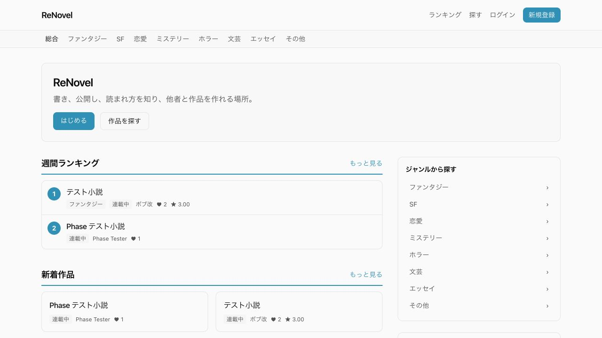

<!-- _class: title -->
<!-- _paginate: false -->

<div class="circle"></div>
<div class="square"></div>
<div class="accent-line"></div>

<div class="top-meta">
  <span class="event">Hono Conference 2026</span>
  <span>30 min session</span>
</div>

<div class="title-wrap">

# 個人開発者よ、<br><span class="outline">Honoを</span><span class="accent">使え。</span>

</div>

<div class="title-footer">
  <div class="speaker"><strong>田中 博悠 / Hirohisa Tanaka</strong><br><span>@tanahiro2010</span></div>
  <div class="hono-mark">H.</div>
</div>

---

## 田中博悠です

<div class="panel intro-panel">

### 高校1年生です

- 三田学園高等学校生
- Hono Conference 2026 コアスタッフ
- GDG Greater Kwansai
- Alpha+ Project 4期生
- 個人開発 / インターン / 競プロ
- 音楽 / バンジージャンプ

</div>


<div class="type-ghost stats-word">STUDENT / BUILDER / SPEAKER</div>

---

## 好きな <span class="red">フレームワーク</span> ありますか？

<div class="feature-grid favorite-frameworks-grid" style="margin-top: 18px; gap: 28px;">


  <div class="mini-panel"><b>Hono</b><span>今日の主役です</span></div>
  <div class="mini-panel"><b>React</b><span>UIを作るならこれ</span></div>
  <div class="mini-panel"><b>Ruby on Rails</b><span>育てながら作る</span></div>

</div>

<div class="big-statement favorite-message">でも技術選定には<br><em>何度も失敗</em>しました</div>

---

## 個人開発、何を使いますか？

<div class="choice-grid">
  <div class="mini-panel"><b>Next.js</b><span>大きなReactエコシステム</span></div>
  <div class="mini-panel"><b>Nuxt</b><span>Vueのフルスタック体験</span></div>
  <div class="mini-panel"><b>TanStack Start</b><span>型付きルートとServer Functions</span></div>
  <div class="mini-panel"><b>React SPA</b><span>自由なクライアント構成</span></div>
  <div class="mini-panel"><b>Rails</b><span>成熟した一体型の開発体験</span></div>
  <div class="mini-panel"><b>Hono</b><span>Web標準に近い小さな入口</span></div>
</div>

---

<!-- _class: lead -->

<div class="geo ring chapter-ring"></div>

# 個人開発の敵は、<br><strong>複雑さ</strong>です

---

## 「あとで必要かも」を、最初から背負っていました

<div class="type-ghost stats-word">STATE / CACHE / HYDRATION</div>

<div class="feature-grid">
  <div class="mini-panel"><b>境界</b><span>フロントエンドとAPI</span></div>
  <div class="mini-panel"><b>同期</b><span>状態とデータ取得</span></div>
  <div class="mini-panel"><b>実行</b><span>hydrationとブラウザJS</span></div>
  <div class="mini-panel"><b>性能</b><span>キャッシュ戦略</span></div>
  <div class="mini-panel"><b>配備</b><span>複数のデプロイ先</span></div>
  <div class="mini-panel"><b>運用</b><span>増えていく手数</span></div>
</div>

---

## 小説投稿サイトを、没にしました

<div class="flow">
  <div class="flow-step"><b>01 / FETCH</b><span> `useEffect` から大量のAPI Routesを呼ぶ</span></div>
  <div class="flow-arrow">→</div>
  <div class="flow-step"><b>02 / WAIT</b><span>VercelとNeonのリージョンも未整理</span></div>
  <div class="flow-arrow">→</div>
  <div class="flow-step"><b>03 / DROP</b><span>待たせる設計のまま開発中止</span></div>
</div>

> Next.jsが悪い、という話ではありません

---

<!-- _class: lead -->

<div class="geo solid-square closing-square"></div>

# 初期表示、<br><strong>最悪で約1分。</strong>

---

<!-- _class: lead -->

# 必要になる前から、<br><strong>SPAの複雑さ</strong>を<br>背負っていました

---

## ただの単位計算機なのに

<div class="big-statement">技術スタックは、<br><em>Next.js</em></div>

<br />

<div class="feature-grid">
  <div class="mini-panel"><b>計算する</b><span>ブラウザで十分</span></div>
  <div class="mini-panel"><b>送る</b><span>値をいちいちバックエンドへ</span></div>
  <div class="mini-panel"><b>結果</b><span>ロードが重い</span></div>
  <div class="mini-panel"><b>収益化</b><span>忍者 AdMaxなる広告収益化サービスで...</span></div>
  <div class="mini-panel"><b>デプロイ</b><span>Vercelにてホスト。収益化しているのでおそらくVercel有料プラン</span></div>
</div>

---

## LPなのに、React SPA

<div class="big-statement">ページは複数。ブログもある。<br>でも<em>metaはいつも同じ</em></div>

<div class="type-ghost stats-word">SEO / TITLE / DESCRIPTION</div>

---

<!-- _class: lead -->

<div class="geo ring chapter-ring"></div>

<div class="big-statement">それ、<em>Honoでいいじゃん</em></div>

---

## そこで、Renovelを作り直しました

<div class="screen-frame">
  
</div>

---

## この見た目、Honoで動いています

<div class="measure-grid">
  <div class="measure"><b>9,956</b><span>TypeScript / TSX 行数</span></div>
  <div class="measure"><b>27</b><span>JSX View</span></div>
  <div class="measure"><b>9</b><span>route module</span></div>
  <div class="measure"><b>0</b><span>React / Next.js</span></div>
</div>

---

## 構成も、まずはこれだけ

<div class="choice-grid">
  <div class="mini-panel"><b>Bun + Hono</b><span>Runtime / Web</span></div>
  <div class="mini-panel"><b>PostgreSQL</b><span>Drizzle ORM</span></div>
  <div class="mini-panel"><b>Hono JSX</b><span>SSR + Kiwa UI</span></div>
</div>

---

<!-- _class: section -->
<!-- _paginate: false -->

<div class="chapter-label">Chapter 02 / Pay complexity later</div>
<div class="chapter-number">02</div>
<div class="geo ring chapter-ring"></div>

# 複雑さは、<br>あとで払う

---

## Honoなら、まずHTMLを返せます

<div class="flow">
  <div class="flow-step"><b>GET /novel</b><span>URL + HTTP</span></div>
  <div class="flow-arrow">→</div>
  <div class="flow-step"><b>APPLICATION</b><span>Use case</span></div>
  <div class="flow-arrow">→</div>
  <div class="flow-step"><b>HONO JSX</b><span>HTML</span></div>
  <div class="flow-arrow">→</div>
  <div class="flow-step"><b>BROWSER</b><span>HTML</span></div>
</div>

---

<!-- _class: lead -->

<div class="geo ring chapter-ring"></div>

<div class="big-statement">初期表示のためだけに<br><em>JSON API</em>を作らなくていい</div>

---

## `hono/jsx`は、HTMLを返す

<div class="big-statement">JSXを書いて、<br><em>サーバーでHTML</em>を作る</div>

```tsx
/** @jsxImportSource hono/jsx */

app.get('/novel', (c) => c.html(
  <NovelPage novel={novel} />
))
```

---

## アプリは一つ。設計は分ける

<div class="layers">
  <div class="layer"><b>Presentation</b><span>Hono route / controller / JSX view</span></div>
  <div class="layer"><b>Application</b><span>use case / query / service</span></div>
  <div class="layer"><b>Domain</b><span>entity / value object / policy</span></div>
  <div class="layer"><b>Infrastructure</b><span>Drizzle / PostgreSQL / repository</span></div>
</div>

<div class="type-ghost stats-word">ONE APP / CLEAR BOUNDARIES</div>

---

## SSRはページ全体。islandは一部分

<div class="feature-grid">
  <div class="mini-panel"><b>SSR</b><span>ページ全体をHTMLで返す</span></div>
  <div class="mini-panel"><b>Forms</b><span>リンクとHTMLフォームで動かす</span></div>
  <div class="mini-panel"><b>Island</b><span>操作する部分だけJSを足す</span></div>
</div>

---

## islandって、何？

<!--  -->
<div class="big-statement">HTMLの海に浮かぶ、<br><em>小さなインタラクション</em></div>

<div class="type-ghost stats-word">SERVER HTML / LOCAL JS</div>

---

## `hono/jsx/dom`は、そこだけ動かす

<div class="big-statement">ページ全体を動かさない。<br><em>必要な部分だけ</em>動かす</div>

```tsx
/** @jsxImportSource hono/jsx/dom */
export function LikeButton() {
  return <button onClick={toggle}>♥</button>
}
```

---

## JSを足したのは、ここだけ

<div class="type-ghost stats-word">LIKE / FOLLOW / RATE / BOOKSHELF</div>

<div class="big-statement">動かしたい場所だけ、<br><em>island</em>にする</div>

いいね　/　フォロー　/　評価　/　本棚追加　/　本棚削除

---

<!-- _class: small-code -->

## まず、JavaScriptなしで動くようにする

<div class="vertical-type">No-JS fallback / Server HTML</div>

```tsx
<span
  data-island="like"
  data-props={JSON.stringify({ action, liked, count })}
>
  <form method="post" action={action}>
    <button type="submit">♥ {count}</button>
  </form>
</span>
```

---

<!-- _class: small-code -->

## 動かしたい部分だけ、ブラウザで強化する

```tsx
/** @jsxImportSource hono/jsx/dom */
import { useState } from 'hono/jsx'

export function LikeButton({ action, liked: initial, count: initialCount }) {
  const [liked, setLiked] = useState(initial)
  const [count, setCount] = useState(initialCount)

  async function toggle() {
    const next = !liked
    setLiked(next)
    setCount((value) => value + (next ? 1 : -1))
    await fetch(action, { method: 'POST' })
  }

  return <button onClick={toggle}>♥ {count}</button>
}
```

---

## 送るJSは、このくらいです

<div class="measure-grid">
  <div class="measure"><b>34750B</b><span>islands bundle<br>圧縮前</span></div>
  <div class="measure"><b>13301B</b><span>islands bundle<br>gzip</span></div>
</div>

<div class="type-ghost stats-word">SHIP ONLY WHAT MOVES</div>

---

## サーバー側も、測ってみました

<div class="measure-grid">
  <div class="measure"><b>0.33MB</b><span>server bundle<br>Bun minify</span></div>
  <div class="measure"><b>3.2ms</b><span>home TTFB<br>ウォーム中央値</span></div>
</div>

<div class="note">2026-09-23 ローカル開発環境で計測 / 初回home TTFB 117.7ms / 数値は登壇直前に再計測します</div>

---

<!-- _class: lead -->

<div class="geo ring chapter-ring"></div>

## SEOは、フレームワーク名で決まらない

<div class="big-statement">各URLの情報が、<em>最初のHTML</em>に入っているか</div>

---

## 最初のHTMLに、何を入れる？

<div class="choice-grid">
  <div class="mini-panel"><b>Content</b><span>本文 / title / description</span></div>
  <div class="mini-panel"><b>Identity</b><span>canonical / OGP</span></div>
  <div class="mini-panel"><b>Delivery</b><span>JS実行を待たずに返す</span></div>
</div>

ReactやNext.jsでもSSRで実現できます。Honoではページ全体のhydrationを前提にせず選べます

---

## 公開までの手数も、減らせます

<div class="flow">
  <div class="flow-step"><b>APP</b><span>Hono appをexport</span></div>
  <div class="flow-arrow">→</div>
  <div class="flow-step"><b>DATA</b><span>D1をbindingで参照</span></div>
  <div class="flow-arrow">→</div>
  <div class="flow-step"><b>SHIP</b><span>`wrangler deploy`</span></div>
</div>

> Renovel本体はBun + PostgreSQLです。Workers + D1は持ち帰り用の小さな別サンプルで扱います

---

## デプロイ先、どうしますか？

<div class="flow">
  <div class="flow-step"><b>Next.js</b><span>Vercel / AWS など</span></div>
  <div class="flow-arrow">→</div>
  <div class="flow-step"><b>Hono</b><span>Cloudflare Workers</span></div>
</div>

<div class="big-statement">小さく始めて、<br><em>収益化の余地</em>も残す</div>

<div class="note">Vercel Hobbyは商用利用に制限があります。Cloudflare Workersには無料枠があります。プランと利用条件は公開前に確認します。</div>

---

## 個人開発の基盤として、Cloudflare

<div class="measure-grid">
  <div class="measure"><b>FREE</b><span>Workers Free<br>無料枠から始める</span></div>
  <div class="measure"><b>100K</b><span>requests / day<br>Workers Freeの上限</span></div>
  <div class="measure"><b>$5</b><span>Workers Paid<br>有料プランの入口</span></div>
  <div class="measure"><b>EDGE</b><span>世界のエッジで<br>アプリを動かす</span></div>
</div>

<div class="big-statement">だから、Honoは<br><em>Cloudflareと相性がいい</em></div>

---

## どれが上か、ではなく何が必要か

| Choice | 向いている場面 |
| --- | --- |
| Next.js | Reactの大きなエコシステム、RSC、Server Actions、画像最適化を使いたい |
| TanStack Start | 型付きroute tree、loader、client navigation、Server Functionsが欲しい |
| Hono | SSR中心、局所的な操作、Web標準とランタイムを近い距離で扱いたい |

---

## Honoが合う個人開発

<div class="panel">

### 合いやすい

- CRUDが中心で画面の動きは局所的
- APIとSSRを同じ言語・同じアプリで書きたい
- Reactの巨大なエコシステムは必須ではない
- 運用コストと認知負荷を抑えたい

</div>

<div class="type-ghost stats-word">LOCAL INTERACTION / SIMPLE OPS</div>

---

## もちろん、別の選択肢もあります

<div class="panel">

### 別の選択肢も考える

- FigmaやCanvaのように画面全体が動く
- 大規模なクライアント状態が中心
- チームが別のフレームワークへ習熟している
- その機能群自体がプロダクトの強みになる

</div>

---

<!-- _class: section -->
<!-- _paginate: false -->

<div class="chapter-label">Chapter 03 / Take it home</div>
<div class="chapter-number">03</div>

# まず小さく作る。<br>必要な分だけ育てる

---

## まず、サーバーだけで動かす

<div class="steps">
  <div class="step"><b>01</b><span>まずHTMLを返す</span></div>
  <div class="step"><b>02</b><span>まずフォームで動かす</span></div>
</div>

<div class="type-ghost stats-word">HTML FIRST</div>

---

## 必要になったら、足していく

<div class="steps">
  <div class="step"><b>03</b><span>必要な場所だけJSを足す</span></div>
  <div class="step"><b>04</b><span>そのまま公開する</span></div>
</div>

<div class="type-ghost stats-word">START SMALL / GROW WHEN NEEDED</div>

---

<!-- _class: lead -->
<!-- _paginate: false -->

<div class="geo solid-square closing-square"></div>

# Honoを盲目的に使え、<br>という話ではありません

---

<!-- _class: lead -->
<!-- _paginate: false -->

<div class="geo ring chapter-ring"></div>

# 個人開発者よ、<br><strong>複雑さをあとで払える<br>道具として</strong><br>Honoを使え。
