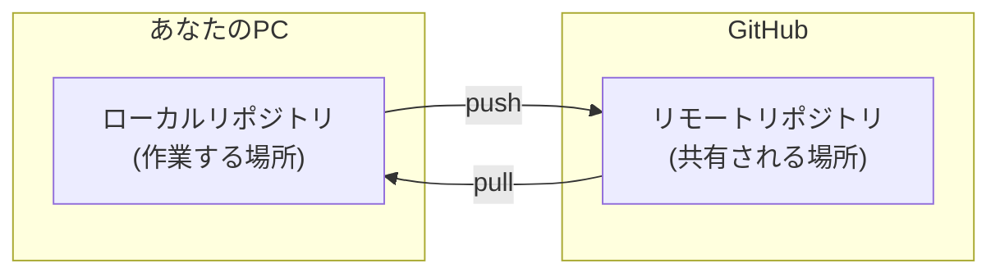
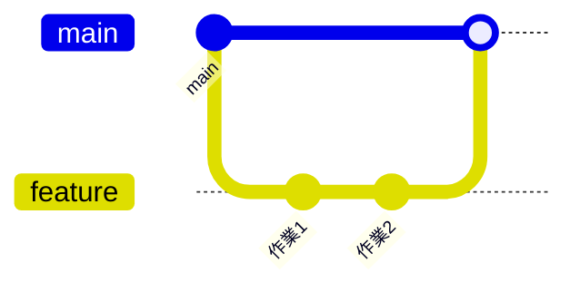
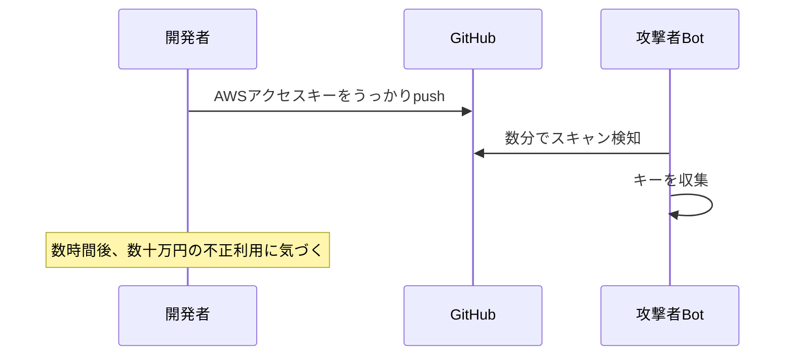
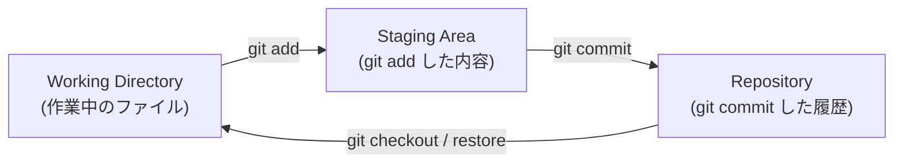

# 初心者でも簡単理解。GitHub講座――チーム開発のセキュリティと運用

こんにちは。

普段は tanahiro2010 という名前で活動しています。

この記事は、学生団体向けに開催した「GitHub 活用セミナー――チーム開発のセキュリティと運用」の登壇内容を、Qiita向けにまとめたものです。

対象は、Gitはなんとなく使えるけど、チーム開発のルールまでは自信がないという人。

そして、「なんとなく動いてるからOK」で運用してるチームの人です。

## きっかけ――「なんとなくGit」で事故る人が多すぎる

セミナーをやろうと思ったきっかけは単純です。

「個人でGitを使ったことはあるけど、チームで使ったことはない」という人が、周りに結構いました。

`git commit` と `git push` はできる。

でも、ブランチ運用やシークレット管理になると急に自信がなくなる。

そういう人が、`main`に直接pushして事故ったり、うっかりAPIキーをpushしたりするのを何回か見てきました。
というか私自身、最近もやらかしてきました。

なので今回は、「個人のGit」から「チームのGitHub」に頭を切り替えるための話をしました。

## そもそもGitって何?

まず前提を揃えておきます。

Gitは、ファイルの**変更履歴をすべて記録する**バージョン管理システムです。

いつ・誰が・何を変えたかを追跡できて、過去の任意の状態に戻せます。

主要な概念はこの4つです。

|用語|意味|
|---|---|
|`add`|前回のバージョンからの変更をステージ|
|`commit`|変更を記録するスナップショット|
|`push`|ローカルの変更をリモートへ送る|
|`pull`|リモートの変更をローカルへ取り込む|
|`clone`|リモートリポジトリをローカルへ複製|

> **用語: リポジトリ(repository)**
> ファイルとその変更履歴をまとめて管理する「入れ物」のことです。プロジェクトのフォルダ全体に、変更履歴という付加情報がくっついているものだとイメージしてください。よく「リポジトリ」と「フォルダ」を混同しがちですが、履歴を持っているかどうかが違いです。

ローカルとリモートの関係は、こういうイメージです。



ローカルは自分のPCの中にある作業スペースで、リモートはGitHubなどのサーバー上にある共有リポジトリです。

オフラインでも作業できて、あとでpushできる。

このくらいは知っている人も多いと思います。

問題は、ここから先の「チームで使うとき」です。

## なぜチーム開発でGitが必要か

Gitが無いチームで、よく見る光景があります。

> ❌ `最終版.zip` `最終版_修正.zip` `最終版_本当に最後.zip`

これ、正直かなり見てきました。

Gitがあれば、こういうファイル名で戦う必要はなくなります。

Gitがチーム開発にもたらすメリットは、大きく3つです。

- **上書き事故がなくなる**: 「誰かの変更が消えた」が起きない
- **変更履歴が追える**: 「誰がこのバグを入れた?」が`git blame`でわかる。「なぜこう書いたか」はコミットメッセージで残せる
- **並行作業ができる**: 複数人が同時に別々の機能を開発して、最終的に安全にマージできる

個人的に一番効くと思っているのは、「なぜこう書いたか」が残ることです。

半年後の自分は他人なので、コミットメッセージを書いていない過去の自分にはよく裏切られます。

## ブランチ戦略

ブランチは、コードの**分岐した作業ライン**です。

本流(`main`)を壊さずに作業できます。



> **用語: マージ(merge) / コンフリクト(conflict)**
> マージは、別々に進んだブランチの変更を1つにまとめる操作です。同じファイルの同じ箇所を、両方のブランチで別々に変更していると、Gitはどちらを採用すればいいか自動で判断できません。この「判断できない状態」をコンフリクトと呼びます。コンフリクトが起きたら、人間がファイルを開いてどちらを残すか決める必要があります。

ここで、鉄則を1つだけ挙げます。

**`main`ブランチに直接pushしない。**

これだけは、譲れません。

理由は単純で、`main`は常にデプロイ可能な状態を保つ必要があるからです。

> **用語: デプロイ(deploy)**
> 書いたコードを、実際にユーザーが使える本番環境へ反映することです。`main`が壊れていると、それをそのまま公開してしまう危険があるので、「`main`は常に動く状態」というルールが重要になります。

多くのチームで使われているシンプルな戦略が、GitHub Flowです。

1. `main`からfeatureブランチを切る
2. ブランチ上で作業・commit
3. Pull Requestを作成
4. コードレビューを受ける
5. 承認されたら`main`へmerge
6. ブランチを削除

ブランチ名は、`feature/add-login`や`fix/typo-readme`のように、何をするか明確にしておくと後で自分が助かります。

## `.gitignore`とシークレット管理

ここからが、今回のセミナーで一番力を入れた話です。

絶対にリポジトリに入れてはいけないものがあります。

- APIキー・アクセストークン
- `.env`ファイル
- 秘密鍵(`*.pem`, `*.key`)
- パスワードを含む設定ファイル

`.gitignore`に書いたパターンは、Gitが無視してくれます。

```gitignore
# 環境変数
.env
.env.local
.env.*.local

# 秘密鍵
*.pem
*.key

# 依存関係(大量ファイルをpushしない)
node_modules/
__pycache__/

# IDEの設定ファイル
.vscode/
.idea/
```

ここで、実際によくあるインシデントのパターンを紹介します。



GitHubには**Secret Scanning**という機能があって、既知のトークン形式を検知してくれます。

ただ、これは正直「気休め」だと思っています。

**検知される前に、既にBotが収集済み**というケースが多いからです。

つまり、pushしてから消しても遅い。

コミット履歴に残っている限り、`git rebase`で消したつもりでもforkされていたら手遅れです。

> **用語: rebase / fork**
> `rebase`は、commitの履歴を後から並び替えたり書き換えたりする操作です。ローカルでの整理には便利ですが、すでに他の人と共有した履歴に対して使うと、後述するように過去のcommitを丸ごと書き換えてしまいます。
> `fork`は、あるリポジトリを丸ごと自分のアカウントにコピーする、GitHubの機能です。元のリポジトリとは独立してコピーが残るので、履歴を書き換えたつもりでも、fork先にはpush時点の内容がそのまま残ってしまいます。

結論はこうです。

**最初からpushしないのが、唯一の正解です。**

`.gitignore`は「後から足すもの」ではなく、リポジトリを作った瞬間に用意しておくものだと思っています。

## Branch Protection Rules

「ルールを決める」だけでは、正直足りません。

人間はミスをします。

だから僕は、ルールは口頭やREADMEで伝えるだけじゃなくて、GitHubの機能で**強制**するべきだと思っています。

設定できることは、たとえばこれくらいあります。

|設定|効果|
|---|---|
|Require pull request reviews|PRなしのmergeを禁止|
|Require status checks|CI通過しないとmerge不可|
|Restrict who can push|直pushできる人を制限|
|Require signed commits|署名なしcommitを拒否|

> **用語: CI(継続的インテグレーション)**
> コードがpushされるたびに、テストやビルドを自動で実行してくれる仕組みです。「テスト通ってる?」を毎回手動で確認する代わりに、GitHub Actionsのようなサービスが自動でチェックしてくれます。「CIが通る」は、この自動チェックにパスした状態を指します。

`Settings → Branches → Add branch ruleset`から設定できます。

「うちのチームは小規模だから大丈夫」と思っている人ほど、`main`直pushで事故りがちだと感じています。

小規模だからこそ、レビューする人が少なくて、事故に気づくのも遅れます。

## PRとコードレビュー

Pull Requestは、「この変更を`main`に取り込んでください」という**提案 + 議論の場**です。

PRを出すときに意識してほしいポイントはこの3つです。

- **小さく出す**: レビューしやすいサイズに分ける
- **説明を書く**: 何を・なぜ変えたか
- **スクリーンショット**: UIの変更があれば添付する

良いPRの説明は、だいたいこういう形になります。

```markdown
## 概要
ログイン機能にバリデーションを追加した。

## 変更内容
- メールアドレスの形式チェックを追加
- 空白送信を防止

## 確認方法
1. ログインページへ移動
2. 不正なメールアドレスを入力
3. エラーメッセージが表示されることを確認

## 関連 Issue
closes #42
```

> **用語: Issue**
> GitHubリポジトリ上で、バグ報告や機能要望などを1件ずつ管理するチケットのことです。誰でも(公開リポジトリなら)閲覧できます。`closes #42`のようにPRからIssue番号を参照すると、そのPRがmergeされたタイミングでIssueが自動的にクローズ(解決済み)扱いになります。

コードレビューの目的は、バグの早期発見・セキュリティ上の問題の指摘・知識の共有とチームの品質統一です。

レビュアーとして意識してほしいのは、「なぜこう書いたか」を理解しようとすることです。

指摘は**コード**に対して行うもので、人格攻撃ではありません。

良い点も、ちゃんと伝えたほうがいいです。

逆にレビューを受ける側は、指摘を**改善のチャンス**だと捉えてほしいです。

説明できない実装は、正直自分でも疑ったほうがいいです。

「なんとなく動いてるから」で通したコードは、大体あとで自分の首を絞めます。

## Sign Commit

Gitの`user.name`と`user.email`は、実は**自由に設定できます**。

```bash
git config user.email "someone@example.com"
# 他人になりすましてcommitできてしまう
```

つまり、コミットログは改ざん・なりすましが可能です。

これを知ったとき、正直ちょっとゾッとしました。

Sign Commitは、**GPGキーで署名**することで「本当に自分が書いた」ことを証明する仕組みです。

GitHubでは、署名済みコミットに`Verified`バッジが付きます。

> **用語: GPG**
> GNU Privacy Guardの略で、公開鍵暗号を使った署名・暗号化の仕組みです。「秘密鍵」で署名し、対になる「公開鍵」を使えば誰でもその署名を検証できます。秘密鍵は自分だけが持ち、公開鍵はGitHubに登録して公開する、という使い分けです。

設定手順はこうです。

```bash
# 1. GPGキーを生成
gpg --full-generate-key

# 2. キーIDを確認
gpg --list-secret-keys --keyid-format=long

# 3. GitにGPGキーを設定
git config --global user.signingkey <KEY_ID>

# 4. 常に署名する設定
git config --global commit.gpgsign true

# 5. 公開鍵をGitHubに登録
gpg --armor --export <KEY_ID>
# → GitHub Settings → SSH and GPG keys → New GPG key
```

正直、最初にこれを設定するときは面倒に感じました。

でも一度設定してしまえば、あとは`commit.gpgsign true`が勝手にやってくれるので、コストは最初の数分だけです。

チームで開発するなら、この数分をケチる理由はないと思っています。

## 脆弱性を見つけたら

これは、セミナーの中で一番強調したかった話です。

脆弱性を見つけたとき、絶対にやってはいけないことがあります。

**Issueに詳細を書くこと。**

理由は単純で、Issueは公開されています。

脆弱性の詳細をIssueに書くということは、世界中に公開するのと同じです。

修正前に、攻撃者に悪用されます。

代わりに使うのが、GitHubの**Security Advisory**機能です。

`Security → Report a vulnerability`から、非公開で報告できます。

報告すべき内容は、脆弱性の種類(XSS、SQLインジェクションなど)・再現手順(PoC)・影響範囲・可能であれば修正案です。

流れはこうなります。


> **用語: CVE**
> Common Vulnerabilities and Exposuresの略で、世界共通で脆弱性1件ごとに振られる識別番号です(例: `CVE-2026-xxxxx`)。この番号があることで、いろんなセキュリティツールやニュースが「どの脆弱性の話か」を一意に指し示せます。

これを**Coordinated Disclosure(協調的開示)**と呼びます。

「見つけたらすぐ公開して自慢したい」という気持ちはわからなくもないですが、それをやると被害に遭うのは無関係なユーザーです。

脆弱性を見つけたときの正しい振る舞いは、地味だけど遠回りに見えて一番早い解決策だと思っています。

## まとめ

今回話した内容を、表にまとめておきます。

|テーマ|要点|
|---|---|
|Gitの基本|commit / push / pullでチーム開発を安全に|
|ブランチ戦略|`main`への直push禁止・GitHub Flow|
|`.gitignore`|シークレットは絶対にpushしない|
|Branch Protection|ルールは機能で強制する|
|PR・レビュー|小さく出して・丁寧に議論する|
|Sign Commit|GPG署名でなりすましを防ぐ|
|脆弱性報告|Issueではなく Security Report へ|

## 個人的に一番伝えたかったこと

セミナー全体を通して、一番伝えたかったのはこれです。

**ルールは「気をつける」ではなく「仕組みで強制する」もの。**

`.gitignore`も、Branch Protection Rulesも、Sign Commitも、全部「人間がうっかりミスをする前提」で作られています。

「うちのチームはちゃんとしてるから大丈夫」というチームほど、僕は危ないと思っています。

ちゃんとしているチームは、たぶん「気をつける」ではなく、最初から仕組みで縛っています。

セミナーをやる前は、「こんな基本的な話、需要あるのかな」と正直不安でした。

でも実際に話してみると、質問が一番多かったのが`.gitignore`とSecret Scanningの話でした。

知っている人にとっては当たり前でも、知らない人にはまったく当たり前じゃない。

そういう話ほど、ちゃんと言葉にして伝える価値があると感じています。

## おまけ――ここまで読んでくれた人へ

ここまで読んでくれてありがとうございます。

最後に、セミナー本編では話しきれなかった、個人的に「知っておくと地味に効く」と思っているGitのTIPSを置いておきます。

### ステージという概念

`git add`って、何をしているか説明できますか?

Gitには、実は3つの領域があります。



**Working Directory**は、今エディタで触っているファイルそのものです。

**Staging Area**(ステージ、index とも呼ばれます)は、「次のcommitに含める変更」を仮置きする場所です。

**Repository**は、実際にcommitされた履歴です。

`git add`は、ファイルをcommitするのではなく、「このファイルの今の状態を、次のcommitに含めますよ」とステージに乗せているだけです。

ここを理解していないと、「`git add`したのに`git commit`し忘れて、翌日ステージに変な差分が残ってる」みたいな事故が起きます。実際、僕は何度もやりました。

### unstageする方法

ステージに乗せたけど、やっぱり今回のcommitには含めたくない。

そういうときは、unstage(ステージから外す)します。

```bash
# 特定のファイルをunstage
git restore --staged <file>

# 全部unstage
git restore --staged .
```

`git restore`は比較的新しいコマンドです。

昔ながらのやり方だと、こう書きます。

```bash
git reset HEAD <file>
```

> **用語: HEAD**
> 今、自分がいるブランチの「一番新しいcommit」を指すポインタです。「今ここにいます」という現在地だと思ってください。`HEAD^`や`HEAD~1`と書くと、そこから1つ前のcommitを指します。

どちらも中身は同じで、「ステージから外すだけで、ファイルの変更内容自体は消えません」。

初めて見ると`reset`という単語に身構えますが、`HEAD`を指定している限りファイルは無事です。

### コミットの取り消し方

ここは、個人的に一番「知らないと詰む」ところだと思っています。

状況によって、使うべきコマンドが変わります。

**まだpushしていない、直前のcommitを直したいだけ**

```bash
git commit --amend
```

メッセージだけ直したいときも、ファイルを1個足し忘れたときも、これで直前のcommitを上書きできます。

**まだpushしていない、commit自体を無かったことにしたい**

```bash
# 変更はステージに残す
git reset --soft HEAD^

# 変更はワーキングディレクトリに残す(ステージは解除、デフォルト)
git reset --mixed HEAD^

# 変更ごと全部消す(かなり危険)
git reset --hard HEAD^
```

`--hard`は変更内容そのものが消えるので、正直あまり使うことをおすすめしません。

僕は`--soft`か`--mixed`しか使わないようにしています。

**すでにpushして、他の人がpullしているかもしれない**

このケースで`git reset`を使うのは基本NGです。

履歴を書き換えてしまうと、他の人のリポジトリと食い違ってしまいます。

代わりに使うのが`git revert`です。

```bash
git revert <commit-hash>
```

> **用語: コミットハッシュ(commit hash)**
> 各commitに割り振られる、`a1b2c3d...`のような英数字の識別子です。`git log`を実行すると、commitごとにこの文字列が表示されます。Gitの世界では、commitはこのハッシュ値で一意に特定されます。全部書かなくても、先頭の7文字程度あれば大抵はそのcommitを指定できます。

`revert`は過去のcommitを消すのではなく、「そのcommitを打ち消す、新しいcommit」を追加します。

履歴は残るので安全ですが、ゴミが残るというデメリットもあります。

一言でまとめると、**「pushしてなければreset、pushした後ならrevert」**です。

### 個人的に便利だと思っているGit TIPS

ここからは完全に趣味の話ですが、知っておくと地味に効くコマンドを紹介します。

**`git add -p` で、ファイルの一部だけステージする**

```bash
git add -p
```

> **用語: hunk(ハンク)**
> 1つのファイルの差分を、変更箇所ごとに区切った塊のことです。1つのファイルに複数の変更が混ざっていても、`git add -p`を使うとhunk単位で「これはステージする」「これはまだしない」を選べます。

1つのファイルに「今回のcommitに入れたい変更」と「まだ入れたくない変更」が混ざっているとき、差分をhunk単位で選びながらステージできます。

「1つのcommitには1つの意味を持たせる」を実践したいなら、これが一番効きます。

**`git stash` で、作業を一時的に退避する**

```bash
# 退避
git stash

# 戻す
git stash pop
```

作業途中で急に別のブランチに切り替えないといけなくなったとき、`commit`するほどでもない変更を一旦しまっておけます。

急なバグ報告や割り込みタスクが多い環境では、ほぼ毎日使っています。

**`git log --oneline --graph --all` で、履歴を俯瞰する**

```bash
git log --oneline --graph --all
```

ブランチがどう分岐してmergeされたかを、1行1commitでツリー表示してくれます。

「なんかブランチがぐちゃぐちゃになった」ときの状況把握に、まずこれを叩く癖をつけています。

**エイリアスを設定して、タイプ量を減らす**

```bash
git config --global alias.st status
git config --global alias.co checkout
git config --global alias.br branch
git config --global alias.lg "log --oneline --graph --all"
```

`git status`を1日に何十回も打つなら、`git st`で済ませたほうが正直気が楽です。

**`git switch` / `git restore` で、`checkout`を卒業する**

```bash
# ブランチ切り替え(旧: git checkout <branch>)
git switch <branch>

# ファイルを元に戻す(旧: git checkout -- <file>)
git restore <file>
```

昔の`git checkout`は「ブランチ切り替え」も「ファイルを元に戻す」も同じコマンドでやっていて、正直分かりにくかったです。

`switch`と`restore`は役割が分かれているので、コマンドを見ただけで何をしているか判断しやすくなります。

まだ新しめのコマンドですが、個人的には既にこちらに乗り換えています。

参考リンクはこちらです。

- [GitHub Docs](https://docs.github.com/ja)
- [GitHub Flow](https://docs.github.com/ja/get-started/using-github/github-flow)
- [About secret scanning](https://docs.github.com/ja/code-security/secret-scanning/about-secret-scanning)
- [Managing GPG keys](https://docs.github.com/ja/authentication/managing-commit-signature-verification)
- [Private security advisories](https://docs.github.com/ja/code-security/security-advisories/working-with-repository-security-advisories/about-repository-security-advisories)

質問などぜひ。
