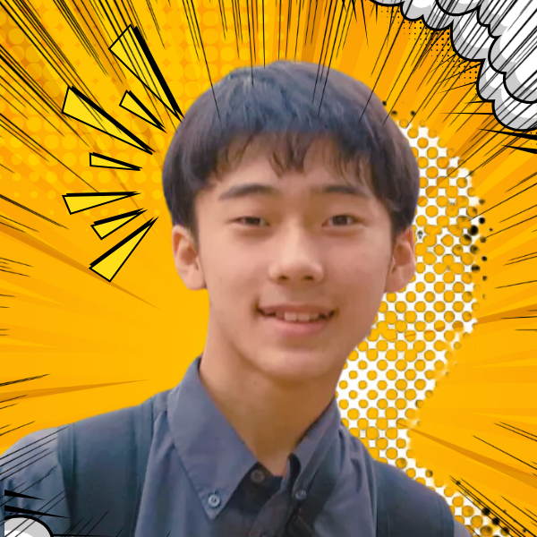

<script>
/* PowerPoint-style auto-shrink: iteratively reduce a slide's font size
   until its content stops overflowing. Also keeps the explicit opt-in
   <div class="fit">…</div> wrapper for finer-grained scaling. */
(() => {
  const MIN_FONT_PX = 12;
  const CODE_MIN_FONT_PX = 9;
  const STEP = 0.96;
  const MAX_ITERS = 40;
  const TOLERANCE = 1;
  let scheduled = false;

  const overflows = (el) =>
    el.scrollHeight > el.clientHeight + TOLERANCE ||
    el.scrollWidth  > el.clientWidth  + TOLERANCE;

  const shrinkElement = (el, minFontPx, shouldShrink = () => overflows(el)) => {
    if (!shouldShrink()) return;
    const base = parseFloat(getComputedStyle(el).fontSize) || 18;
    let size = base;
    for (let i = 0; i < MAX_ITERS && shouldShrink() && size > minFontPx; i++) {
      size *= STEP;
      el.style.fontSize = `${size}px`;
    }
  };

  const shrinkCodeBlocks = (section) => {
    for (const pre of section.querySelectorAll("pre")) {
      shrinkElement(pre, CODE_MIN_FONT_PX, () => overflows(pre) || overflows(section));
    }
  };

  const shrinkSection = (section) => {
    if (section.dataset.autofit === "skip") return;
    shrinkElement(section, MIN_FONT_PX, () => overflows(section));
  };

  const scaleFitBlocks = (root) => {
    for (const fit of root.querySelectorAll(".fit")) {
      if (!fit.scrollHeight) continue;
      const ratio = Math.min(1, fit.clientHeight / fit.scrollHeight);
      fit.style.transformOrigin = "top left";
      fit.style.transform = `scale(${ratio})`;
    }
  };

  const processSection = (section) => {
    if (!section.clientWidth || !section.clientHeight) return;
    scaleFitBlocks(section);
    shrinkCodeBlocks(section);
    shrinkSection(section);
  };

  const processVisibleSections = () => {
    scheduled = false;
    for (const section of document.querySelectorAll("section")) processSection(section);
  };

  const schedule = () => {
    if (scheduled) return;
    scheduled = true;
    requestAnimationFrame(() => requestAnimationFrame(processVisibleSections));
  };

  window.addEventListener("load", schedule);
  window.addEventListener("resize", schedule);
  new MutationObserver(schedule).observe(document.documentElement, {
    subtree: true,
    attributes: true,
    attributeFilter: ["class"],
  });
  schedule();
})();
</script>

<style>
:root { --gdg-university: ''; }

section {
  justify-content: center;
  text-align: center;
  padding: 74px 108px;
  font-size: 34px;
  line-height: 1.42;
  background-color: #f8f9fa;
}

section::before,
section.title::before,
section.section::before,
section.lead::before {
  content: none !important;
  background-image: none !important;
}

section::after,
section.title::after,
section.section::after,
section.lead::after {
  color: rgba(32, 33, 36, 0.45);
}

section:not(.title):not(.lead):not(.section):not(.invert):not(.split) {
  background-image: none;
  padding-right: 108px;
}

h1, h2, h3 {
  border-bottom: none;
  display: block;
  margin-left: auto;
  margin-right: auto;
  text-align: center;
}

h1 {
  font-size: 64px;
  line-height: 1.12;
}

h2 {
  font-size: 52px;
}

p {
  margin: 0.32em 0;
}

strong {
  color: var(--gdg-blue);
}

section.title {
  background-image: none;
  padding: 86px 104px;
  text-align: center;
}

section.title h1 {
  max-width: 1080px;
  font-size: 76px;
  line-height: 1.08;
}

section.title p {
  font-size: 30px;
  font-weight: 600;
  margin-top: 30px;
  color: var(--gdg-muted);
}

section.title img {
  width: 146px;
  margin: 0 auto 28px;
}

section.lead {
  background-image: none;
  padding: 90px 112px;
}

section.lead h1 {
  max-width: 1120px;
  font-size: 76px;
  line-height: 1.12;
}

section.lead p {
  font-size: 36px;
  font-weight: 700;
  color: var(--gdg-muted);
}

section.statement h1 {
  font-size: 82px;
}

section.profile {
  display: grid;
  grid-template-columns: 340px minmax(0, 610px);
  gap: 60px;
  align-items: center;
  justify-content: center;
  text-align: left;
}

section.profile img {
  width: 320px;
  height: 320px;
  border-radius: 50%;
  object-fit: cover;
}

section.profile h1 {
  font-size: 58px;
  margin-left: 0;
  margin-bottom: 18px;
}

section.profile ul {
  font-size: 30px;
  margin-top: 18px;
}

.cards {
  width: min(1040px, 100%);
  display: grid;
  grid-template-columns: repeat(3, minmax(0, 1fr));
  gap: 26px;
  margin: 42px auto 0;
}

.card {
  min-height: 220px;
  display: flex;
  flex-direction: column;
  align-items: center;
  justify-content: center;
  padding: 30px 24px;
  border-radius: 14px;
  background: #fff;
  border-top: 10px solid var(--gdg-blue);
  box-shadow: 0 16px 34px rgba(60, 64, 67, 0.08);
}

.card:nth-child(2) { border-top-color: var(--gdg-yellow); }
.card:nth-child(3) { border-top-color: var(--gdg-green); }

.card .icon {
  font-size: 58px;
  line-height: 1;
  margin-bottom: 18px;
}

.card .label {
  font-size: 44px;
  font-weight: 800;
  line-height: 1.1;
}

.card .caption {
  margin-top: 18px;
  font-size: 24px;
  font-weight: 700;
  color: var(--gdg-muted);
  line-height: 1.35;
}

.code-panel {
  width: min(920px, 100%);
  margin: 40px auto 0;
  text-align: left;
}

.code-panel pre {
  font-size: 32px;
  line-height: 1.35;
  border-radius: 16px;
  padding: 34px 42px;
  box-shadow: 0 16px 34px rgba(60, 64, 67, 0.08);
}

.role-grid {
  width: min(1080px, 100%);
  display: grid;
  grid-template-columns: repeat(2, minmax(0, 1fr));
  gap: 28px;
  margin: 42px auto 0;
}

.role {
  min-height: 174px;
  border-radius: 14px;
  background: #fff;
  padding: 26px 30px;
  border-left: 12px solid var(--gdg-blue);
  text-align: center;
  box-shadow: 0 16px 34px rgba(60, 64, 67, 0.08);
}

.role:nth-child(2) { border-left-color: var(--gdg-green); }
.role:nth-child(3) { border-left-color: var(--gdg-yellow); }
.role:nth-child(4) { border-left-color: var(--gdg-red); }

.role .label {
  font-size: 25px;
  font-weight: 800;
  color: var(--gdg-muted);
  margin-bottom: 14px;
}

.role .main {
  font-size: 35px;
  font-weight: 800;
  line-height: 1.22;
}

.duo {
  width: min(1040px, 100%);
  display: grid;
  grid-template-columns: repeat(2, minmax(0, 1fr));
  gap: 34px;
  margin: 42px auto 0;
}

.duo > div {
  min-height: 330px;
  border-radius: 16px;
  background: #fff;
  border-top: 10px solid var(--gdg-green);
  padding: 34px 38px;
  box-shadow: 0 16px 34px rgba(60, 64, 67, 0.08);
}

.duo > div:nth-child(2) {
  border-top-color: var(--gdg-red);
}

.duo h2 {
  font-size: 46px;
  margin: 0 0 12px;
}

.duo .summary {
  font-size: 28px;
  font-weight: 800;
  color: var(--gdg-muted);
  margin-bottom: 28px;
}

.duo ul {
  font-size: 29px;
  text-align: left;
  margin: 0;
}

.duo li {
  margin: 0.26em 0;
}

.duo .next {
  margin-top: 24px;
  padding-top: 18px;
  border-top: 2px solid rgba(60, 64, 67, 0.12);
  font-size: 26px;
  font-weight: 800;
  color: var(--gdg-ink);
}

.detail-grid {
  width: min(1060px, 100%);
  display: grid;
  grid-template-columns: 0.92fr 1.08fr;
  gap: 34px;
  align-items: stretch;
  margin: 28px auto 0;
}

.detail-card {
  min-height: 305px;
  border-radius: 16px;
  background: #fff;
  padding: 28px 34px;
  border-top: 10px solid var(--gdg-blue);
  box-shadow: 0 16px 34px rgba(60, 64, 67, 0.08);
  text-align: left;
}

.detail-card.good {
  border-top-color: var(--gdg-green);
}

.detail-card.warn {
  border-top-color: var(--gdg-red);
}

.detail-card h2 {
  font-size: 36px;
  text-align: left;
  margin: 0 0 14px;
}

.detail-card p {
  font-size: 27px;
  font-weight: 700;
  color: var(--gdg-muted);
  line-height: 1.42;
}

.detail-card ul {
  font-size: 26px;
  margin: 0;
}

.detail-card li {
  margin: 0.4em 0;
}

.big-takeaway {
  width: min(1060px, 100%);
  margin: 24px auto 0;
  border-radius: 16px;
  background: #fff;
  border-left: 14px solid var(--gdg-yellow);
  padding: 22px 38px;
  font-size: 31px;
  font-weight: 800;
  line-height: 1.35;
  box-shadow: 0 16px 34px rgba(60, 64, 67, 0.08);
}

.plain-note {
  width: min(980px, 100%);
  margin: 30px auto 0;
  font-size: 34px;
  font-weight: 700;
  line-height: 1.42;
  color: var(--gdg-muted);
}

.plain-takeaway {
  width: min(980px, 100%);
  margin: 38px auto 0;
  font-size: 34px;
  font-weight: 800;
  line-height: 1.35;
  color: var(--gdg-ink);
}

.hero-row {
  width: min(980px, 100%);
  display: grid;
  grid-template-columns: 260px minmax(0, 1fr);
  gap: 56px;
  align-items: center;
  justify-content: center;
  margin: 0 auto;
  text-align: left;
}

.hero-row img {
  width: 250px;
}

.hero-row h1 {
  font-size: 64px;
  margin-left: 0;
}

.hero-row p {
  font-size: 31px;
  font-weight: 700;
  color: var(--gdg-muted);
}
</style>

<!-- _class: title -->
<!-- _paginate: false -->

<!--  -->

# 記事・ユーザー管理を効率化する<br>**React CMS フロントエンド**

フェンリル株式会社インターンシップ 2026 / フロントエンド

---

<!-- _class: profile -->



<div>

<h1>田中博悠</h1>

<ul>
  <li>三田学園高等学校 1年生</li>
  <li>参加コース: フロントエンド</li>
  <li>React SPA を 5 日間で開発</li>
  <li>趣味: バンジージャンプ</li>
</ul>

</div>

---

<!-- _class: lead -->

# 画面より先に、<br>扱いやすい設計を作る

API 呼び出し / 共通 UI / loader / useEffect を減らす

---

# API 呼び出しを CMS クライアントへ

<div class="code-panel">

```ts
await cms.auth.login({ email, password });
await cms.articles.getArticles();
await cms.users.getUser(userId);
```

</div>

---

# 責務を分けて、画面を薄くする

<div class="role-grid">

<div class="role">
  <div class="label">データ取得</div>
  <div class="main">TanStack Router loader</div>
</div>

<div class="role">
  <div class="label">ソート</div>
  <div class="main">useArticleSort / useUserSort</div>
</div>

<div class="role">
  <div class="label">UI</div>
  <div class="main">Pagination / SearchInput / Button</div>
</div>

<div class="role">
  <div class="label">認証切れ</div>
  <div class="main">401 でトークン削除、ログインへ戻す</div>
</div>

</div>

---

<div class="hero-row">


<div>

# useEffect は<br>なるべく使わない

ページ表示前の取得は loader に寄せて、副作用の置き場所を減らしました

</div>

</div>

---

# 5 日間の振り返り

<div class="duo">

<div>
  <h2>よくできた</h2>
  <div class="summary">再利用できる形にできた</div>
  <ul>
    <li>libs への分離</li>
    <li>共通コンポーネント化</li>
    <li>loader の理解</li>
  </ul>
  <div class="next">設計で迷う時間が減りました</div>
</div>

<div>
  <h2>あと一歩</h2>
  <div class="summary">手を動かす速さを上げたい</div>
  <ul>
    <li>開発速度</li>
    <li>git 操作</li>
    <li>事前調査</li>
  </ul>
  <div class="next">次はもっと早く形にします</div>
</div>

</div>

---

# よくできたこと

<div class="detail-grid">

<div class="detail-card good">
  <h2>設計を分けて画面を薄くした</h2>
  <p>処理を役割ごとに分けて、画面側の責務を減らしました</p>
</div>

<div class="detail-card good">
  <h2>似た UI を使い回す</h2>
  <ul>
    <li>Pagination</li>
    <li>SearchInput</li>
    <li>SortDropdown</li>
    <li>Button</li>
  </ul>
</div>

</div>

<div class="big-takeaway">短い期間でも、あとから直しやすい形を意識できました</div>

---

# あと一歩 1

## 一日、<br>コンフリクト解消作業に費やしました

<div class="plain-note">適当な場所からブランチを切りすぎて、push 時にコンフリクトが多発しました</div>

<div class="plain-takeaway">次はコードを書く前に、ブランチの切り方から整えます</div>

---

# あと一歩 2

## OpenAPI generator を見落としました

<div class="plain-note">自力で API クライアントを書いたあとに、生成ツールがあると知りました</div>

<div class="plain-takeaway">次はコードを書く前に、使えるツールを確認します</div>

---

<!-- _class: lead -->

# レビューで、<br>実装の見方が変わりました

ライブラリの使い方だけでなく、どこに責務を置くかを学べました

---

<!-- _class: lead -->

# フロントエンド開発で<br>AI に頼りすぎていました

これからは、自分でも書けるように練習していきます

メンターの方々、ありがとうございました!
